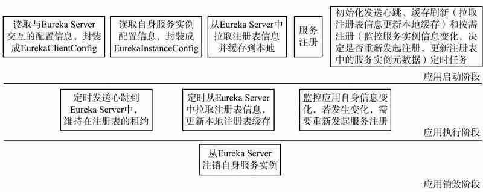
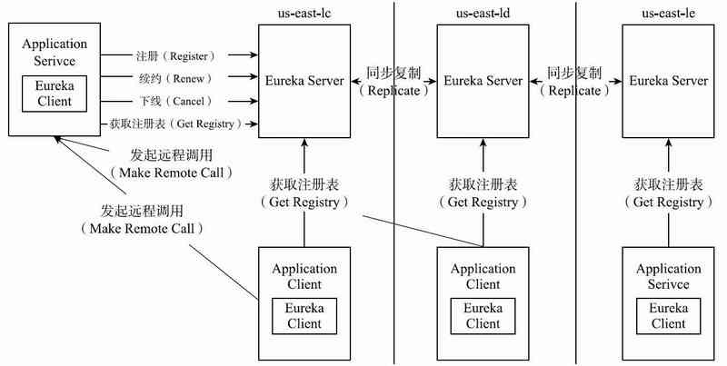

# Eureka客户端源码解析

Eureka Client为了简化开发人员的开发工作，将很多与Eureka Server交互的工作隐藏起来，自主完成。在应用的不同运行阶段在后台完成工作如图4-4所示。

## 架构图

## 源码分析步骤

#### 客户端

- [读取应用自身的配置信息](020-读取应用自身的配置信息.md) 

- 服务发现客户端
- 拉取注册信息
- 将服务注册到服务端
- 初始化定时任务
- 服务下线

#### 服务端

- 服务实例注册表
- 服务注册
- 接受服务心跳
- 服务剔除
- 服务下线
- 集群同步
- 获取注册表中的服务实例信息

## 