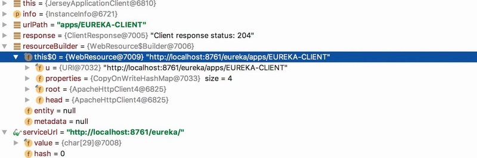

# 源码分析-服务注册

在拉取完Eureka Server中的注册表信息并将其缓存在本地后，Eureka Client将向Eureka Server注册自身服务实例元数据，主要逻辑位于Discovery#register方法中。register方法代码如下所示：

```java
boolean register() throws Throwable {
    EurekaHttpResponse〈Void〉 httpResponse;
    try {
        httpResponse = eurekaTransport.registrationClient.register(instanceInfo);
    } catch (Exception e) {
        throw e;
    }
    ...
    // 注册成功
    return httpResponse.getStatusCode() == 204;
}
```

Eureka Client会将自身服务实例元数据(封装在InstanceInfo中)发送到Eureka Server中请求服务注册，当Eureka Server返回204状态码时，说明服务注册成功。
跟踪到AbstractJerseyEurekaHttpClient#register方法中，可以发现服务注册调用的接口以及传递的参数，如图4-10所示。




注册接口地址为`apps/${APP_NAME}`，传递参数为InstanceInfo，如果服务器返回204状态，则表明注册成功。

