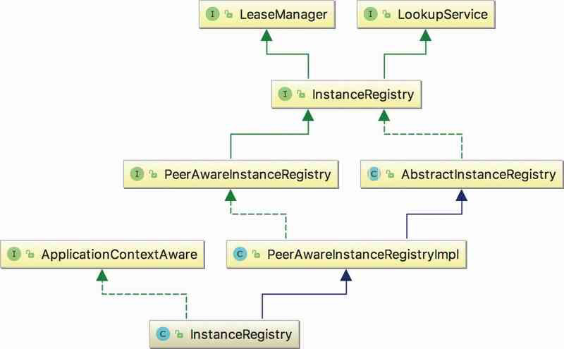

# 030-Eureka服务端-实例注册表

[TOC]

## 一言蔽之

实例注册的核心类时

- com.netflix.eureka.registry.InstanceRegistry

- org.springframework.cloud.netflix.eureka.server.InstanceRegistry

封装了服务查找, 服务注册, 服务剔除 等核心操作

## InstanceRegistry的架构图

InstanceRegistry是Eureka Server中注册表管理的核心接口。InstanceRegistry分别继承了LeaseManager和LookupService接口。





图中出现了两个InstanceRegistry，

- 上层的InstanceRegistry是Eureka Server注册表的最核心接口，其职责是在内存中管理注册到Eureka Server中的服务实例信息。

- 最下面的InstanceRegistry对Eureka Server的注册表实现类PeerAwareInstanceRegistryImpl进行了继承和扩展，使其适配Spring Cloud的使用环境，主要实现由PeerAwareInstanceRegistryImpl提供

## InstanceRegistry接口

InstanceRegistry分别继承了LeaseManager和LookupService接口

- LeaseManager接口的功能是对注册到Eureka Server中的服务实例租约进行管理

- LookupService提供对服务实例进行检索的功能

#### LookupService提供对服务实例进行检索的功能

```java
//com.netflix.discovery.shared.LookupService.java
public interface LookupService<T> {
    //根据服务实例注册的appName来获取封装有相同appName的服务实例信息容器
    Application getApplication(String appName);
    //返回当前注册表中所有的服务实例信息
    Applications getApplications();
    //根据服务实例的id获取服务实例信息
    List<InstanceInfo> getInstancesById(String id);
    ...
}
```

## LeaseManager接口

LeaseManager接口的功能是对注册到Eureka Server中的服务实例租约进行管理

```java
public interface LeaseManager<T> {
	//用于注册服务实例信息
    void register(T r, int leaseDuration, boolean isReplication);

  	//用于删除服务实例信息
    boolean cancel(String appName, String id, boolean isReplication);

	//用于与 Eureka Server 进行心跳操作,持续租约
    boolean renew(String appName, String id, boolean isReplication);

	// Server端的一个方法,用于剔除租约过期的服务实例信息
    void evict();
}
```

- LeaseManager接口作用是对注册到Eureka Server中的服务实例租约进行管理，分别有服务注册、服务下线、服务租约更新以及服务剔除等操作。

- LeaseManager中管理的对象是InstanceInfo，InstanceInfo代表一个Eureka Client服务实例信息的租约，它提供了对其内持有的类的时间有效性操作。
  - InstanceInfo中定义了租约的操作类型，分别是注册、下线、更新，同时提供了对租约中时间属性的各项操作。租约默认有效时长(duration)为90秒。

InstanceRegistry在继承LeaseManager和LookupService接口的基础上，还添加了一些特有的方法，可以更为简单地管理服务实例租约和查询注册表中的服务实例信息。可以通过AbstractInstanceRegistry查看InstanceRegistry接口方法的具体实现。

PeerAwareInstanceRegistry继承了InstanceRegistry接口，在其基础上添加了Eureka Server集群同步的操作，

- 其实现类PeerAwareInstanceRegistryImpl继承了AbstractInstanceRegistry的实现，在对本地注册表操作的基础上添加了对其peer节点的同步复制操作，使得Eureka Server集群中的注册表信息保持一致。

## InstanceInfo:注册信息

```java
public class InstanceInfo {
		//应用的ID
    private volatile String instanceId;
		//应用的名称
    private volatile String appName;
  	//应用所属群组
    private volatile String appGroupName;
		//ip地址
    private volatile String ipAddr;
    @Deprecated
    private volatile String sid = SID_DEFAULT;
  	//端口号
    private volatile int port = DEFAULT_PORT;
  	//https端口号
    private volatile int securePort = DEFAULT_SECURE_PORT;
  	//应用实例的首页
    private volatile String homePageUrl;
    //应用实例的状态页
    private volatile String statusPageUrl;
    //应用实例健康检查的url
    private volatile String healthCheckUrl;
    //应用实例健康检查的https的url
    private volatile String secureHealthCheckUrl;
    //虚拟ip地址
    private volatile String vipAddress;
    //https的虚拟ip地址
  	//数据中心信息 , Netlix 或者Amazon 或者 MyOwn
    private volatile DataCenterInfo dataCenterInfo;
  	//主机名称
    private volatile String hostName;
  	//外界需要强制覆盖的状态值, 默认为unknown
    private volatile InstanceStatus overriddenStatus = InstanceStatus.UNKNOWN;
  	//租约信息
    private volatile LeaseInfo leaseInfo;
    //首先标识是否是discoveryServer, 其实标识改discoverServer是否影响你请求的实例
    private volatile Boolean isCoordinatingDiscoveryServer = Boolean.FALSE;
    //应用程序的元数据信息
    private volatile Map<String, String> metadata;
    @Auto
    private volatile Long lastUpdatedTimestamp;
    //实例信息最新的过期时间, 在Client端用于标识改实例
    private volatile Long lastDirtyTimestamp;
    //标识EurekaServer对该实例的操作, ADDED/MODIFIED/DELETED
    private volatile ActionType actionType;
  	//在AWS的 autoscaling group的名称
    private volatile String asgName;
}
```

## LeaseInfo

Eureka 使用 `LeaseInfo` 来标识应用实例的租约信息,字段如下:


这些参数主要用于标识应用实例的心跳情况,比如约定的心跳周期,租约有效期,最近一次续约时间等