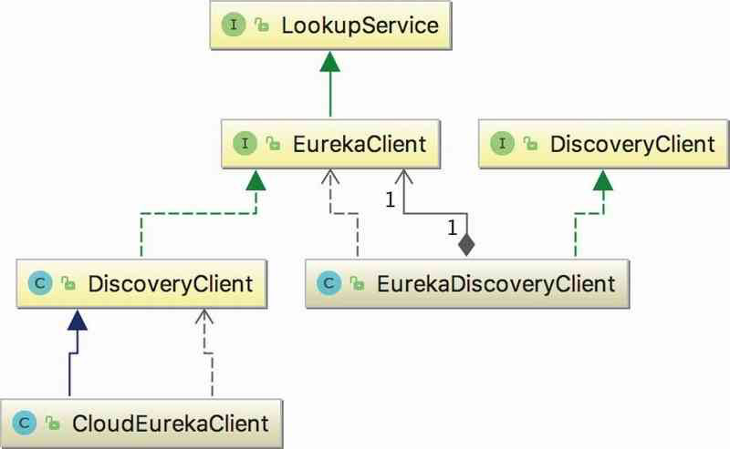

# 031-Eureka服务发现客户端源码

[TOC]

## DiscoveryClient的构造函数总结

在DiscoveryClient的构造函数中，主要依次做了以下的事情：

1. 相关配置的赋值，类似ApplicationInfoManager、EurekaClientConfig等
2. 备份注册中心的初始化，默认没有实现。
3. 拉取Eureka Server注册表中的信息。
4. 注册前的预处理。
5. 向Eureka Server注册自身。
6. 初始化心跳定时任务、缓存刷新和按需注册等定时任务。

## DiscoveryClient的UML



## DiscoveryClient构造函数

在DiscoveryClient构造函数中，Eureka Client会执行从Eureka Server中拉取注册表信息、服务注册、初始化发送心跳、缓存刷新(重新拉取注册表信息)和按需注册定时任务等操作，可以说DiscoveryClient的构造函数贯穿了Eureka Client启动阶段的各项工作。DiscoveryClient的构造函数传入的参数如下所示：

```java
//DiscoveryClient.java
DiscoveryClient(
  ApplicationInfoManager applicationInfoManager, 
  EurekaClientConfig config, 
  AbstractDiscoveryClientOptionalArgs args, 
  Provider〈BackupRegistry〉 backupRegistryProvider)
```

- ApplicationInfoManager 应用信息管理器
- EurekaClientConfig 封装了Client 与 Server 交互配置信息的类
- AbstractDiscoveryClientOptionalArgs 是用于注入一些可选参数,以及一些jersey1和jersey2通用的过滤器
- BackupRegistry充当了备份注册中心的职责，当Eureka Client无法从任何一个Eureka Server中获取注册表信息时，BackupRegistry将被调用以获取注册表信息。默认的实现是 NotImplementedRegistryImpl ，即没有实现。

## DiscoveryClient构造函数详情

在构造方法中，忽略掉构造方法中大部分的赋值操作，我们逐步了解了配置类中的属性会对DiscoveryClient的行为造成什么影响。

DiscoveryClient构造函数中的部分代码如下所示：

```java
// DiscoveryClient.java
if (config.shouldFetchRegistry()) {
    this.registryStalenessMonitor = new ThresholdLevelsMetric(this, METRIC_REGISTRY_PREFIX + "lastUpdateSec_", new long[]{15L, 30L, 60L, 120L, 240L, 480L});
} else {
    this.registryStalenessMonitor = ThresholdLevelsMetric.NO_OP_METRIC;
}
if (config.shouldRegisterWithEureka()) {
    this.heartbeatStalenessMonitor = new ThresholdLevelsMetric(this, METRIC_REGISTRATION_PREFIX + "lastHeartbeatSec_", new long[]{15L, 30L, 60L, 120L, 240L, 480L});
} else {
    this.heartbeatStalenessMonitor = ThresholdLevelsMetric.NO_OP_METRIC;
}
```

- config#shouldFetchRegistry(对应配置为eureka.client.fetch-register)为true表示Eureka Client将从Eureka Server中拉取注册表信息。
- config#shouldRegisterWithEureka(对应配置为eureka.client.register-with-eureka)为true表示Eureka Client将注册到Eureka Server中。

如果上述的两个配置均为false，那么Discovery的初始化将直接结束，表示该客户端既不进行服务注册也不进行服务发现。

## 定时器线程池

接着定义一个基于线程池的定时器线程池ScheduledExecutorService，线程池大小为2，

- 一个线程用于发送心跳
- 一个线程用于缓存刷新

同时定义了发送心跳和缓存刷新线程池，代码如下所示：

```java
//DiscoveryClient.java
scheduler = Executors.newScheduledThreadPool(2, new ThreadFactoryBuilder()
            .setNameFormat("DiscoveryClient-%d").setDaemon(true).build());
    heartbeatExecutor = new ThreadPoolExecutor(...);
    cacheRefreshExecutor = new ThreadPoolExecutor(...);
```

## 初始化HTTP交互客户端Jersry

之后，**初始化Eureka Client与Eureka Server**进行HTTP交互的Jersey客户端，将AbstractDiscoveryClientOptionalArgs中的属性用来构建EurekaTransport，如下所示：

```java
// DiscoveryClient.java
eurekaTransport = new EurekaTransport();
scheduleServerEndpointTask(eurekaTransport, args);
```

EurekaTransport是DiscoveryClient中的一个内部类，其内封装了DiscoveryClient与Eureka Server进行HTTP调用的Jersey客户端。
再接着从Eureka Server中拉取注册表信息，代码如下所示：

```java
// DiscoveryClient.java
if (clientConfig.shouldFetchRegistry() && !fetchRegistry(false)) {
    fetchRegistryFromBackup();
}
```

- 如果EurekaClientConfig#shouldFetchRegistry为true时，fetchRegistry方法将会被调用。
- 在Eureka Client向Eureka Server注册前，需要先从Eureka Server拉取注册表中的信息，这是服务发现的前提。

通过将Eureka Server中的注册表信息缓存到本地，就可以就近获取其他服务的相关信息，减少与Eureka Server的网络通信。
拉取完Eureka Server中的注册表信息后，将对服务实例进行注册，代码如下所示：

```java
// DiscoveryClient.java
if (this.preRegistrationHandler != null) {
    this.preRegistrationHandler.beforeRegistration();
}
if (clientConfig.shouldRegisterWithEureka() &amp;&amp; clientConfig.shouldEnforceRegistrationAtInit()) {
    try {
        // 发起服务注册
        if (!register() ) {
            // 注册失败，抛出异常
            throw new IllegalStateException("Registration error at startup. Invalid server response.");
        }
    } catch (Throwable th) {
        throw new IllegalStateException(th);
    }
}
initScheduledTasks(); // 初始化定时任务
```

在服务注册之前会进行注册预处理，Eureka没有对此提供默认实现。

**构造函数的最后将初始化并启动发送心跳、缓存刷新和按需注册等定时任务。**
