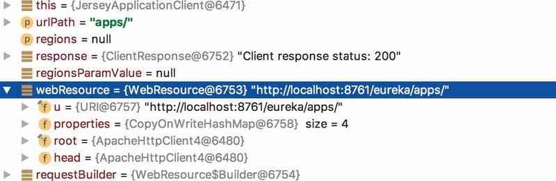

# 040-Eureka客户端-拉取注册表信息

[TOC]

## 一言蔽之

Eureka客户端在构造的时候就会进行注册表信息的拉取, 分为两种 

- 全量拉取
- 增量拉取

使用内置的 Jersey 客户端发送, 维护一个 AtomicLong fetchRegistryGeneration 字段作为同步字段

## fetch注册中心-fetchRegistry

在DiscoveryClient的构造函数中，调用了DiscoveryClient#fetchRegistry方法从Eureka Server中拉取注册表信息，方法执行如下所示：

```java
//org.springframework.cloud.client.discovery.DiscoveryClient.java
private boolean fetchRegistry(boolean forceFullRegistryFetch) {
  Stopwatch tracer = FETCH_REGISTRY_TIMER.start();
  try {
    // 如果增量式拉取被禁止，或者Applications为null，进行全量拉取
    Applications applications = getApplications();
    if (clientConfig.shouldDisableDelta()
        || (!Strings.isNullOrEmpty(clientConfig.getRegistryRefreshSingleVipAddress()))
        || forceFullRegistryFetch
        || (applications == null)
        || (applications.getRegisteredApplications().size() == 0)
        || (applications.getVersion() == -1))
    {
      ...
        // 全量拉取注册表信息
        getAndStoreFullRegistry();
    } else {
      // 增量拉取注册表信息
      getAndUpdateDelta(applications);
    }
    // 计算应用集合一致性哈希码
    applications.setAppsHashCode(applications.getReconcileHashCode());
    // 打印注册表上所有服务实例的总数量
    logTotalInstances();
  } catch (Throwable e) {
    return false;
  } finally {
    if (tracer != null) {
      tracer.stop();
    }
  }
  // 在更新远程实例状态之前推送缓存刷新事件，但是Eureka中并没有提供默认的事件监听器
  onCacheRefreshed();
  // 基于缓存中被刷新的数据更新远程实例状态
  updateInstanceRemoteStatus();
  // 注册表拉取成功，返回true
  return true;
}
```

一般来讲，在Eureka客户端，除了第一次拉取注册表信息，之后的信息拉取都会尝试只进行增量拉取(第一次拉取注册表信息为全量拉取)，下面将分别介绍拉取注册表信息的两种实现，

- 全量拉取注册表信息DiscoveryClient#getAndStoreFullRegistry
- 增量式拉取注册表信息DiscoveryClient#getAndUpdateDelta。

## 全量拉取注册表信息DiscoveryClient#getAndStoreFullRegistry

一般只有在第一次拉取的时候，才会进行注册表信息的全量拉取，主要在DiscoveryClient#getAndStoreFullRegistry方法中进行。代码如下所示：

```java
// DiscoveryClient.java
private void getAndStoreFullRegistry() throws Throwable {
    // 获取拉取的注册表的版本，防止拉取版本落后(由其他的线程引起)
    long currentUpdateGeneration = fetchRegistryGeneration.get();
    Applications apps = null;
    EurekaHttpResponse〈Applications〉 httpResponse = clientConfig.getRegistryRefreshSingleVipAddress() == null
    ? eurekaTransport.queryClient.getApplications(remoteRegionsRef.get()):
    eurekaTransport.queryClient.getVip(clientConfig.getRegistryRefreshSingleVipAddress(), remoteRegionsRef.get());
    // 获取成功
    if (httpResponse.getStatusCode() == Status.OK.getStatusCode()) {
        apps = httpResponse.getEntity();
    }
    if (apps == null) {
        // 日志
        // 检查fetchRegistryGeneration的更新版本是否发生改变，无改变的话说明本次拉取是最新的
    } else if (fetchRegistryGeneration.compareAndSet(currentUpdateGeneration, currentUpdateGeneration + 1)) {
        // 从apps中筛选出状态为UP的实例，同时打乱实例的顺序，防止同一个服务的不同实例在启动时
                接受流量
        localRegionApps.set(this.filterAndShuffle(apps));
    } else {
        // 日志
    }
}
```

全量拉取将从Eureka Server中拉取注册表中所有的服务实例信息(封装在Applications中)，并经过处理后替换掉本地注册表缓存Applications。

通过跟踪调用链，在AbstractJerseyEurekaHttpClient#getApplicationsInternal方法中发现了相关的请求url，接口地址为/eureka/apps，如图所示。该接口位于Eureka Server中，可以直接访问，用于获取当前Eureka Server中持有的所有注册表信息。




#### getAndStoreFullRegistry线程安全问题

getAndStoreFullRegistry方法可能被多个线程同时调用，导致新拉取的注册表被旧的注册表覆盖(有可能出现先拉取注册表信息的线程在覆盖apps时被阻塞，被后拉取注册表信息的线程抢先设置了apps，被阻塞的线程恢复后再次设置了apps，导致apps数据版本落后)，产生脏数据，对此，Eureka通过类型为AtomicLong的currentUpdateGeneration对apps的更新版本进行跟踪。

- 如果更新版本不一致，说明本次拉取注册表信息已过时，不需要缓存到本地。拉取到注册表信息之后会对获取到的apps进行筛选，只保留状态为UP的服务实例信息。

## 增量式拉取注册表信息DiscoveryClient#getAndUpdateDelta。

增量式的拉取方式，一般发生在第一次拉取注册表信息之后，拉取的信息定义为从某一段时间之后发生的所有变更信息，通常来讲是3分钟之内注册表的信息变化。

在获取到更新的delta后，会根据delta中的增量更新对本地的数据进行更新。与getAndStoreFullRegistry方法一样，也通过fetchRegistryGeneration对更新的版本进行控制。

- 增量式拉取是为了维护Eureka Client本地的注册表信息与Eureka Server注册表信息的一致性，防止数据过久而失效
- 采用增量式拉取的方式减少了拉取注册表信息的通信量。

Client中有一个注册表缓存刷新定时器专门负责维护两者之间信息的同步性。但是当增量式拉取出现意外时，定时器将执行全量拉取以更新本地缓存的注册表信息。具体代码如下所示：

```java
// DiscoveryClient.java
private void getAndUpdateDelta(Applications applications) throws Throwable {
    long currentUpdateGeneration = fetchRegistryGeneration.get();
    Applications delta = null;
    EurekaHttpResponse〈Applications〉 httpResponse = eurekaTransport.queryClient.getDelta(remoteRegionsRef.get());
    if (httpResponse.getStatusCode() == Status.OK.getStatusCode()) {
        delta = httpResponse.getEntity();
    }
    // 获取增量拉取失败
    if (delta == null) {
        // 进行全量拉取
        getAndStoreFullRegistry();
    } else if (fetchRegistryGeneration.compareAndSet(currentUpdateGeneration, currentUpdateGeneration + 1)) {
        String reconcileHashCode = "";
            if (fetchRegistryUpdateLock.tryLock()) {
                try {
                    // 更新本地缓存
                    updateDelta(delta);
                    // 计算应用集合一致性哈希码
                    reconcileHashCode = getReconcileHashCode(applications);
                    } finally {
                        fetchRegistryUpdateLock.unlock();
                    }
                }
            // 比较应用集合一致性哈希码，如果不一致将认为本次增量式拉取数据已脏，将发起全量拉
                    取更新本地注册表信息
            if (!reconcileHashCode.equals(delta.getAppsHashCode()) || clientConfig. shouldLogDeltaDiff()) {
                reconcileAndLogDifference(delta, reconcileHashCode);
          }
    }
    ...
}
```

同理，在相同的位置也发现了增量式更新的url，/eureka/app/delta，可以直接访问，如图


由于更新的过程过于漫长，时间成本为O(N^2)，所以通过同步代码块防止多个线程同时进行更新，污染数据。
在根据从Eureka Server拉取的delta信息更新本地缓存的时候，Eureka定义了ActionType来标记变更状态，代码位于InstanceInfo类中，如下所示：

```java
// InstanceInfo.java
public enum ActionType {
    ADDED,　　// 添加Eureka Server
    MODIFIED, // 在Euerka Server中的信息发生改变
    DELETED　 // 被从Eureka Server中剔除
}
```

根据InstanceInfo#ActionType的不同，对delta中的InstanceInfo采取不同的操作，其中ADDED和MODIFIED状态变更的服务实例信息将添加到本地注册表，DELETED

状态变更的服务实例将从本地注册表中删除。具体代码如下所示：

```java
// DiscoveryClient.java
// 变更类型为ADDED
if (ActionType.ADDED.equals(instance.getActionType())) {
    Application existingApp = applications.getRegisteredApplications(instance.getAppName());
    if (existingApp == null) {
        applications.addApplication(app);
    }
    // 添加到本地注册表中
    applications.getRegisteredApplications(instance.getAppName()).addInstance(instance);
// 变更类型为MODIFIED
} else if (ActionType.MODIFIED.equals(instance.getActionType())) {
    Application existingApp = applications.getRegisteredApplications(instance.getAppName());
    if (existingApp == null) {
        applications.addApplication(app);
    }
    // 添加到本地注册表中
    applications.getRegisteredApplications(instance.getAppName()).addInstance(instance);
// 变更类型为DELETE
} else if (ActionType.DELETED.equals(instance.getActionType())) {
    Application existingApp = applications.getRegisteredApplications(instance.getAppName());
    if (existingApp == null) {
        applications.addApplication(app);
    }
    // 从本地注册表中删除
    applications.getRegisteredApplications(instance.getAppName()).removeInstance(instance);
}
```

更新本地注册表缓存之后，Eureka Client会通过#getReconcileHashCode计算合并后的Applications的appsHashCode(应用集合一致性哈希码)，和Eureka Server传递的delta上的appsHashCode进行比较(delta中携带的appsHashCode通过Eureka Server的全量注册表计算得出)，比对客户端和服务端上注册表的差异。如果哈希值不一致的话将再调用一次getAndStoreFullRegistry获取全量数据保证Eureka Client与Eureka Server之间注册表数据的一致。代码如下所示：

```java
// DiscoveryClient.java

if (!reconcileHashCode.equals(delta.getAppsHashCode()) || clientConfig.shouldLogDeltaDiff()) {
    reconcileAndLogDifference(delta, reconcileHashCode);
}
```

reconcileAndLogDifference方法中将会执行拉取全量注册表信息操作。
appsHashCode的一般表示方式为：

```
appsHashCode = ${status}_${count}_
```

它通过将应用状态和数量拼接成字符串，表示了当前注册表中服务实例状态的统计信息。举个简单的例子，有10个应用实例的状态为UP，有5个应用实例状态为DOWN，其他状态的数量为0(不进行表示)，那么appsHashCode的形式将是：

```
appsHashCode = UP_10_DOWN_5_
```

## 发送Spring事件

 [README.md](../../../../02-spring-framework-documentation/016-Spring事件/README.md) 

```java
//org.springframework.cloud.netflix.eureka.CloudEurekaClient#onCacheRefreshed
@Override
	protected void onCacheRefreshed() {
		super.onCacheRefreshed();
		if (this.cacheRefreshedCount != null) { // might be called during construction and
			// will be null
			long newCount = this.cacheRefreshedCount.incrementAndGet();
			log.trace("onCacheRefreshed called with count: " + newCount);
			this.publisher.publishEvent(new HeartbeatEvent(this, newCount)); // 使用Spring事件机制
		}
	}
```

## 


