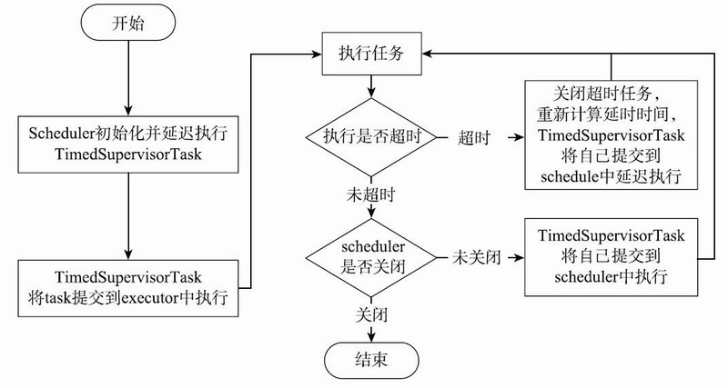

# 061-Eureka客户端-初始化拉取注册表信息定时器

[TOC]

## 一言蔽之

Eureka客户端在启动时会定时拉取注册表信息, 并且刷新本地缓存

## 图示



## 初始化刷新线程

在DiscoveryClient#initScheduledTasks方法中，通过ScheduledExecutorService#schedule的方式提交缓存刷新任务和发送心跳任务，任务执行的方式为延时执行并且不循环，这两个任务的定时循环逻辑由TimedSupervisorTask提供实现。TimedSupervisorTask继承了TimerTask，提供执行定时任务的功能。它在run方法中定义执行定时任务的逻辑。具体代码如下所示：

```java
//com.netflix.discovery.TimedSupervisorTask#TimedSupervisorTask
public class TimedSupervisorTask extends TimerTask {
    ...
    public void run() {
        Future future = null;
        try {
            // 执行任务
            future = executor.submit(task);
						threadPoolLevelGauge.set((long) executor.getActiveCount());
            // 等待任务执行结果
            future.get(timeoutMillis, TimeUnit.MILLISECONDS);
            // 执行完成，设置下次任务执行频率(时间间隔)
            delay.set(timeoutMillis);
            threadPoolLevelGauge.set((long) executor.getActiveCount());
        } catch (TimeoutException e) {
            // 执行任务超时
            timeoutCounter.increment();
            // 设置下次任务执行频率(时间间隔)
            long currentDelay = delay.get();
            long newDelay = Math.min(maxDelay, currentDelay * 2);
            delay.compareAndSet(currentDelay, newDelay);
        } catch (RejectedExecutionException e) {
            // 执行任务被拒绝
            // 统计被拒绝次数
            rejectedCounter.increment();
        } catch (Throwable e) {
            // 其他的异常
            // 统计异常次数
            throwableCounter.increment();
        } finally {
            // 取消未结束的任务
            if (future != null) {
                future.cancel(true);
            }
            // 如果定时任务服务未关闭，定义下一次任务
            if (!scheduler.isShutdown()) {
                scheduler.schedule(this, delay.get(), TimeUnit.MILLISECONDS);
            }
        }
    }
}
```

run方法中存在以下的任务调度过程：

- scheduler初始化并延迟执行TimedSupervisorTask；
- TimedSupervisorTask将task提交executor中执行，task和executor在初始化TimedSupervisorTask时传入：
  - 若task正常执行，TimedSupervisorTask将自己提交到scheduler，延迟delay时间后再次执行；
  - 若task执行超时，计算新的delay时间(不超过maxDelay)，TimedSupervisorTask将自己提交到scheduler，延迟delay时间后再次执行；

## 刷新拉取注册表具体的线程

TimedSupervisorTask通过这种不断循环提交任务的方式，完成定时执行任务的要求。

在DiscoveryClient#initScheduledTasks方法中，提交缓存刷新定时任务的线程任务为CacheRefreshThread，提交发送心跳定时任务的线程为HeartbeatThread。

CacheRefreshThread继承了Runnable接口，代码如下所示：

```java
// DiscoveryClient.java
class CacheRefreshThread implements Runnable {
    public void run() {
        refreshRegistry();
    }
}
void refreshRegistry(){
    ...//判断远程Region是否改变（即Eureka Server地址是否发生变化），决定进行全量拉取还是增量式拉取
    boolean success = fetchRegistry(remoteRegionsModified);
    ...//打印更新注册表缓存后的变化
}
```

CacheRefreshThread线程任务将委托DiscoveryClient#fetchRegistry方法进行缓存刷新的具体操作。
