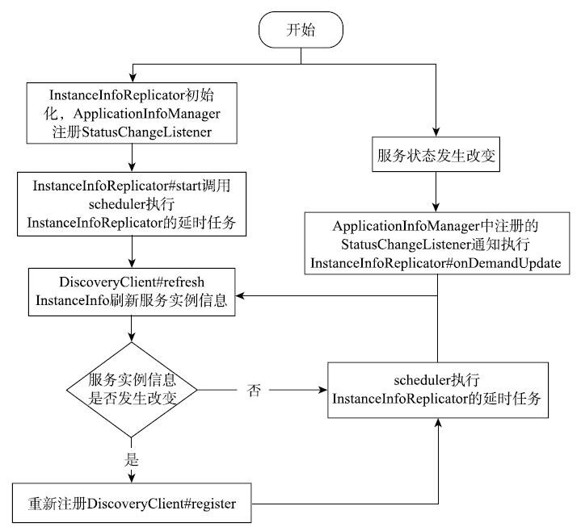

# 063-Eureka客户端-初始化按需注册定时器

[TOC]

## 一言蔽之

按需注册定时器任务, StatusChangeListener监听器会监听服务状态的变化,实时更新状态并发送给服务端

## 按需注册定时任务的处理流程



## 按需注册定时器具体实现

按需注册定时任务的作用是当Eureka Client中的InstanceInfo或者status发生变化时，重新向Eureka Server发起注册请求，更新注册表中的服务实例信息，保证Eureka Server注册表中服务实例信息有效和可用。

按需注册定时任务的代码如下：

```java
// DiscoveryClient.java
// 定时检查刷新服务实例信息，检查是否有变化，是否需要重新注册
instanceInfoReplicator = new InstanceInfoReplicator(
        this, instanceInfo, clientConfig.getInstanceInfoReplicationIntervalSeconds(), 2);
    // 监控应用的status变化，发生变化即可发起重新注册
				statusChangeListener = new ApplicationInfoManager.StatusChangeListener() {
        @Override
        public String getId() {
            return "statusChangeListener";
        }
        @Override
        public void notify(StatusChangeEvent statusChangeEvent) {
            ...
            instanceInfoReplicator.onDemandUpdate();
        }
    };
    if (clientConfig.shouldOnDemandUpdateStatusChange()) {
        // 注册应用状态改变监控器
        applicationInfoManager.registerStatusChangeListener(statusChangeListener);
    }
    // 启动定时按需注册定时任务
    instanceInfoReplicator.start(clientConfig.
        getInitialInstanceInfoReplicationIntervalSeconds());
}
```

按需注册分为两部分，

- 一部分是定义了一个定时任务，定时刷新服务实例的信息和检查应用状态的变化，在服务实例信息发生改变的情况下向Eureka Server重新发起注册操作；
- 另一部分是注册了状态改变监控器，在应用状态发生变化时，刷新服务实例信息，在服务实例信息发生改变的情况下向Eureka Server重新发起注册操作。

InstanceInfoReplicator中的定时任务逻辑位于#run方法中，如下所示：

```java
// InstanceInfoReplicator.java
public void run() {
    try {
        // 刷新了InstanceInfo中的服务实例信息
        discoveryClient.refreshInstanceInfo();
        // 如果数据发生更改，则返回数据更新时间
        Long dirtyTimestamp = instanceInfo.isDirtyWithTime();
        if (dirtyTimestamp != null) {
            // 注册服务实例
						discoveryClient.register();
            // 重置更新状态
            instanceInfo.unsetIsDirty(dirtyTimestamp);
        }
    } catch (Throwable t) {
        logger.warn("There was a problem with the instance info replicator", t);
    } finally {
        // 执行下一个延时任务
        Future next = scheduler.schedule(this, replicationIntervalSeconds, TimeUnit.SECONDS);
        scheduledPeriodicRef.set(next);
    }
}
```

DiscoveryClient中刷新本地服务实例信息和检查服务状态变化的代码如下：

```java
// DiscoveryClient.java
void refreshInstanceInfo() {
    // 刷新服务实例信息
    applicationInfoManager.refreshDataCenterInfoIfRequired();
    // 更新租约信息
    applicationInfoManager.refreshLeaseInfoIfRequired();
    InstanceStatus status;
    try {
        // 调用healthCheckHandler检查服务实例的状态变化
        status = getHealthCheckHandler().getStatus(instanceInfo.getStatus());
    } catch (Exception e) {
        status = InstanceStatus.DOWN;
    }
    if (null != status) {
        applicationInfoManager.setInstanceStatus(status);
    }
}
```

run方法首先调用了discoveryClient#refreshInstanceInfo方法刷新当前的服务实例信息，查看当前服务实例信息和服务状态是否发生变化，如果当前服务实例信息或者服务状态发生变化将向Eureka Server重新发起服务注册操作。

最后声明了下一个延时任务，用于再次调用run方法，继续检查服务实例信息和服务状态的变化，在服务实例信息发生变化的情况下重新发起注册。

如果Eureka Client的状态发生变化(在Spring Boot通过Actuator对服务状态进行监控，具体实现为EurekaHealthCheckHandler)，注册在ApplicationInfoManager的状态改变监控器将会被触发，从而调用InstanceInfoReplicator#onDemandUpdate方法，检查服务实例信息和服务状态的变化，可能会引发按需注册任务。代码如下所示：

```java
//InstanceInfoReplicator.java
public boolean onDemandUpdate() {
    // 控制流量，当超过限制时，不能进行按需更新
    if (rateLimiter.acquire(burstSize, allowedRatePerMinute)) {
        scheduler.submit(new Runnable() {
            @Override
            public void run() {
                Future latestPeriodic = scheduledPeriodicRef.get();
                // 取消上次#run任务
                if (latestPeriodic != null &amp;&amp; !latestPeriodic.isDone()) {
                    latestPeriodic.cancel(false);
                }
                InstanceInfoReplicator.this.run();
            }
        });
        return true;
    } else {
        return false;
    }
}
```

InstanceInfoReplicator#onDemandUpdate方法调用InstanceInfoReplicator#run方法检查服务实例信息和服务状态的变化，并在服务实例信息发生变化的情况下向Eureka Server发起重新注册的请求。

为了防止重复执行run方法，onDemandUpdate方法还会取消执行上次已提交且未完成的run方法，执行最新的按需注册任务。

