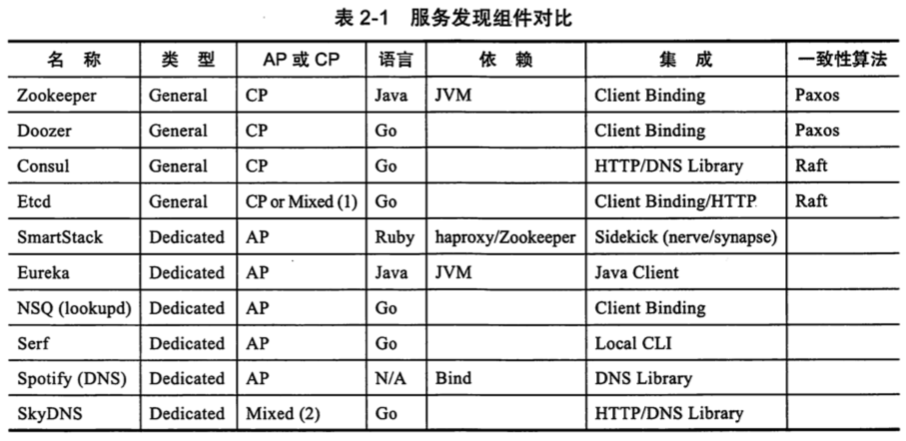

# 服务治理中间件比较

# Eureka 和 Consul 的比较

#### Consul强一致性(C)带来的是：

服务注册相比Eureka会稍慢一些。因为Consul的raft协议要求必须过半数的节点都写入成功才认为注册成功
Leader挂掉时，重新选举期间整个consul不可用。保证了强一致性但牺牲了可用性。

#### Eureka保证高可用(A)和最终一致性：

服务注册相对要快，因为不需要等注册信息replicate到其他节点，也不保证注册信息是否replicate成功
当数据出现不一致时，虽然A, B上的注册信息不完全相同，但每个Eureka节点依然能够正常对外提供服务，这会出现查询服务信息时如果请求A查不到，但请求B就能查到。如此保证了可用性但牺牲了一致性。
