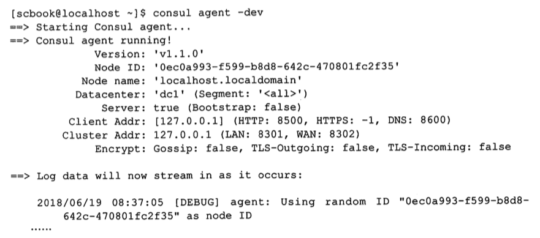

# Consul

## 是什么

Consul 是一个分布式高可用的服务网格(Service Mesh)解决方案.提供包括服务发现,配置和分段功能在内的全功能控制平面

每个功能都可以单独使用,也可以一起使用构建完整的服务网格

**Consul**是一个分布式高可用的系统服务发现与配置工具,简单来说,它跟 Eureka 的核心功能一样,但是略有不同:

- Consul 使用 go 语言开发,以 HTTP 方式对外提供服务
- Consul 支持多数据中心,
- Consul 一致性协议使用的是 Raft

## 能做什么

**Consul 是服务治理组件和配置中心**

Consul 提供了以服务治理为核心的多种功能以满足分布式系统的需要,主要功能如下:

- 服务发现

> 有了 Consul , 服务可以通过 DNS 或者 HTTP 直接找到它依赖的服务

- 健康检查

> consul 提供了健康检查的机制,从简单的服务端是否返回 200 的响应代码到较为复杂的内存使用率是否低于 90%

- k/v 存储

> 应用程序可以通过需要使用 consul 的 key/value 存储,Consul 提供简单易用的 httpJIE口来满足用户的动态配置,特征标记,协调和 leader 选举等需求

- 多数据中心

> Consul 原生支持多数据中心,意味着用户不用为了多数据中心自己去抽象

## Consul 实用接口

Consul 对外提供了丰富的 API, 有运维人员喜欢的命令行接口,也有开发人员喜欢的 http接口

- consul members , 查看当前 consul 代理中的成员信息以及他们的状态,存活,历险,启动失败
- consul monitor 持续打印当前 Consul 日志 , 当 Consul 访问量比较大,所以生产环境一般不会保存日志,如果想看实时日志,可以使用该命令
- consul leave, 退出集群, 使用它而不是直接杀掉进程

#### Http 接口

- /v1/agent/menbers: 列出集群所有成员以及信息
- /v1/status/leader: 显示当前集群的 leader
- /v1/catalog/services : 显示,目前注册的服务
- /v1/kv/key:显示当前 key对应的 value

#### 列出集群中的所有成员信息


#### 显示集群的 leader


## 开启 consul

默认情况下,集群需要至少三台 Consul 启动,本地开发可以使用开发者模式启动

> consul agent -dev



#### 开启 UI

```
consul agent -dev -ui
```

> http://localhost:8500/ 访问


#### 