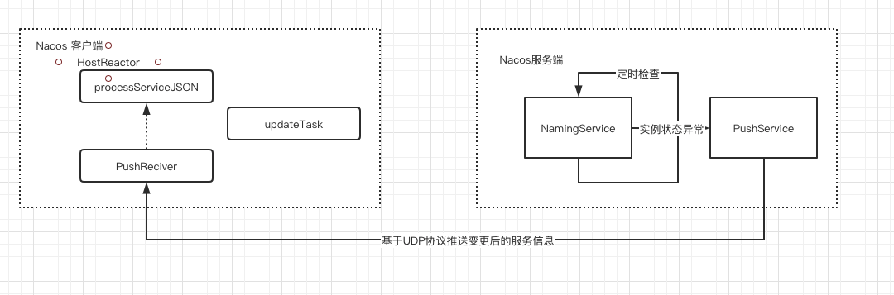

# 010-Nacos服务地址动态感知原理

[TOC]

## 简介

消费者不仅需要获取服务提供者的地址列表, 还需要在服务实例出现异常的时候监听地址的变化

- 可以通过subcribe方法来实现监听

```java
package com.alibaba.nacos.api.naming;


public interface NamingService {
    

    void subscribe(String serviceName, String groupName, EventListener listener) throws NacosException;
    
    /**
     * Subscribe service to receive events of instances alteration.
     *
     * @param serviceName name of service
     * @param clusters    list of cluster
     * @param listener    event listener
     * @throws NacosException nacos exception
     */


    /**
     * unsubscribe event listener of service.
     *
     * @param serviceName name of service
     * @param groupName   group of service
     * @param listener    event listener
     * @throws NacosException nacos exception
     */
    void unsubscribe(String serviceName, String groupName, EventListener listener) throws NacosException;
    
}

```

## 服务动态感知原理

客户端有一个HostReactor类, 它的功能是实现服务的动态更新, 基本原理是

- 客户端发起时间订阅后, 在 HostReactor中有一个UpdateTask线程, 每隔10s发送一个pull请求, 获取服务端的最新的地址列表

- 对于服务端, 它和服务提供者的实例之间维持了心跳检测, 一旦服务提供者出现了异常, 则会发送一个Push消息给Nacos客户端, 也牛市服务的消费者

- 服务消费者收到消息之后, 使用HostReactor中提供的processServiceJSON方法解析消息, 并更新本地服务地址列表

  

  