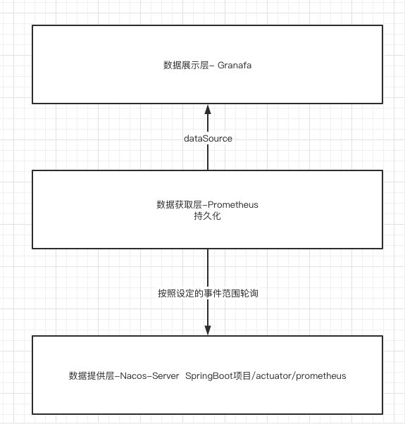

# 030-SpringCloudNacos

[TOC]

## 什么是Alibaba Nacos

https://nacos.io/zh-cn/docs/what-is-nacos.html

Nacos致力于解决微服务中的 **统一配置**、 **服务注册与发现**等问题, 提供了一个简单易用的特性集, 帮助开发者快速实现动态服务发现, 服务配置, 服务元数据以及流量管理

- 服务发现和服务健康监测
- 动态配置服务
- 动态DNS服务
- 服务以及元数据管理

## 特性1: 服务发现和服务健康监测

- Nacos 支持基于 DNS 和基于 RPC 的服务发现。服务提供者使用 [原生SDK](https://nacos.io/zh-cn/docs/sdk.html)、[OpenAPI](https://nacos.io/zh-cn/docs/open-api.html)、或一个[独立的Agent TODO](https://nacos.io/zh-cn/docs/other-language.html)注册 Service 后，服务消费者可以使用[DNS TODO](https://nacos.io/zh-cn/docs/xx) 或[HTTP&API](https://nacos.io/zh-cn/docs/open-api.html)查找和发现服务。
- Nacos 提供对服务的实时的健康检查，阻止向不健康的主机或服务实例发送请求。Nacos 支持传输层 (PING 或 TCP)和应用层 (如 HTTP、MySQL、用户自定义）的健康检查。 对于复杂的云环境和网络拓扑环境中（如 VPC、边缘网络等）服务的健康检查，Nacos 提供了 agent 上报模式和服务端主动检测2种健康检查模式。Nacos 还提供了统一的健康检查仪表盘，帮助开发者根据健康状态管理服务的可用性及流量。

## 特性2: 动态配置服务

- 动态配置服务可以让开发者以中心化、外部化和动态化的方式管理所有环境的应用配置和服务配置。

- 动态配置消除了配置变更时重新部署应用和服务的需要，让配置管理变得更加高效和敏捷。

- 配置中心化管理让实现无状态服务变得更简单，让服务按需弹性扩展变得更容易。

- Nacos 提供了一个简洁易用的UI ([控制台样例 Demo](http://console.nacos.io/nacos/index.html)) 帮助开发者管理所有的服务和应用的配置。Nacos 还提供包括配置版本跟踪、金丝雀发布、一键回滚配置以及客户端配置更新状态跟踪在内的一系列开箱即用的配置管理特性，帮助开发者更安全地在生产环境中管理配置变更和降低配置变更带来的风险。

## 特性3: 动态DNS服务

- **动态 DNS 服务支持权重路由**，让开发者更容易地实现中间层负载均衡、更灵活的路由策略、流量控制以及数据中心内网的简单DNS解析服务。动态DNS服务还能让开发者更容易地实现以 DNS 协议为基础的服务发现，以帮助开发者消除耦合到厂商私有服务发现 API 上的风险。

- Nacos 提供了一些简单的 [DNS APIs TODO](https://nacos.io/zh-cn/docs/xx) 帮助开发者管理服务的关联域名和可用的 IP:PORT 列表.

## 特性4: 服务及其元数据管理

Nacos 能让您从微服务平台建设的视角管理数据中心的所有服务及元数据，包括管理服务的描述、生命周期、服务的静态依赖分析、服务的健康状态、服务的流量管理、路由及安全策略、服务的 SLA 以及最首要的 metrics 统计数据。

> 值得注意的是, 这里的metrics可以使用 Prometheus 进行数据采集, 使用Grafana进行可视化  

