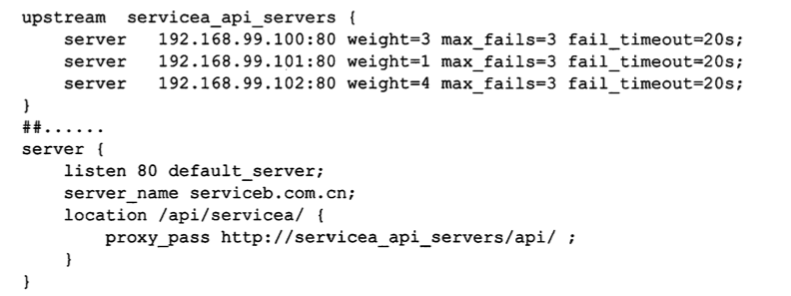

# 服务发现

## 为什么要有服务发现

这个要从软件架构的发展过程说起, 

- 单体架构时代,一般来说会依赖少量的外部服务,会采用域名配置的方式去访问
- SOA 架构时代,服务主键被拆分为粗粒度的服务化架构,使用 nginx还是其他方式做负载均衡,都要在客户端维护一个服务器列表,在拓展时非常麻烦
- 微服务架构时代,大量微服务以及 容器化部署的前提下,手动维护 ip 地址是不可能实现的,所以要有专门的服务来维护微服务的相关信息

### 单体架构时代

早期的互联网开发,使用到的是单体架构,服务自成一体,对于依赖的少量外部服务,会采用配置域名的方式访问

比如使用外部短信供应商的短信发送接口,会使用 appID 和 appkey 去调用接口

### SOA 架构时代

随着 SOA 架构的流行,公司的内部服务开始从单体架构拆分为粒度较粗的服务化架构

这个时候, 内部的服务会比较多,服务之间互相调用通常情况下

 **以 HTTP 形式暴露服务为例**, B 服务为消费端, A服务(3 个实例)为提供端

### **方式1**

- B : 维护 3 个内网 ip 到 nginx , 负载均衡
- A 不变

缺点: B服务耦合了 A服务的实现细节,当 A服务扩充或者 ip 地址发生变化的时候,其下游的消费者都需要去修改 ip

### 方式 2

- B: 访问 A 的内网域名
- A: 维护自己 ip 实例,只暴露一个内网域名给消费者

## 微服务时代

将服务注册中心作为一个标配的分布式服务组件,网关等都从服务注册中心去获取相关服务的实例信息,实现动态路由

比如 consul-template +nginx 的方案,通过 consul 监听服务实例的变化,然后更新 nginx

