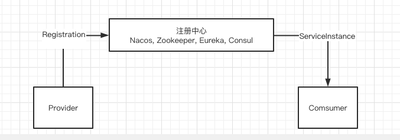

# 030-ServiceInstance和Registration

[TOC]

## 简介

服务信息在每个服务注册中心的内部数据存储结构都有各自的模型

- Zookeeper注册中心内部的数据模型是一种树状结构 , 用类 ServiceInstance表示
- Eureka注册中心的数据模型都是一个InstanceInfo对象实例
- Nacos注册中心的服务信息由3元组组成 ,  用类 Instance表示
  - namespace 命名空间用于数据隔离
  - group用于分组
  - serviceName 服务名

## 图示

SpringCloud 提供的ServiceInstance和 Registration的作用是抽象实例在各种注册中心的数据模型, 无论是

- Zookeeper 的 ServiceInstance
- Eureka 的InstanceInfo
- Nacos 的 Instance

在Spring Cloud 体系中全部使抽象 ServiceInstance 和 Registration 表示

| 类全路径                                                     | 描述                                     |
| ------------------------------------------------------------ | ---------------------------------------- |
| org.springframework.cloud.client.ServiceInstance             | 表示客户端从注册中心获取到的实例数据结构 |
| org.springframework.cloud.client.serviceregistry.Registration | 表示客户端注册到注册中心的实例数据结构   |
|                                                              |                                          |



## ServiceInstance源码

```java
/**
 * Represents an instance of a service in a discovery system.
 *
 */
public interface ServiceInstance {

   /**
    * @return The unique instance ID as registered. 实例ID, 唯一标识
    */
   default String getInstanceId() {
      return null;
   }

   /**
    * @return The service ID as registered. 注册的服务ID
    */
   String getServiceId();

   /**
    * @return The hostname of the registered service instance. 
    服务实例的hostname
    */
   String getHost();

   /**
    * @return The port of the registered service instance.
    服务实例的端口
    */
   int getPort();

   /**
    * @return Whether the port of the registered service instance uses HTTPS.
    是否使用https
    */
   boolean isSecure();

   /**
    * @return The service URI address.
    服务实例的URI地址
    */
   URI getUri();

   /**
    * @return The key / value pair metadata associated with the service instance.
    获取服务实例的key/value 键值对形式的metadata信息
    */
   Map<String, String> getMetadata();

   /**
    * @return The scheme of the service instance.
    */
   default String getScheme() {
      return null;
   }

}
```

使用 DiscoveryClient 可以基于服务名获取到这个服务下的所有 ServiceInstance 集合

## Registration

找个借口继承了ServiceInstance, 并没有额外的方法定义,因为从注册中心获取实例信息和把实例信息注册到注册中心这链各个活成中, 实例信息的存储结构完全可以相同,

- 这个接口有可能会在未来新增一些方法

```java
/**
 * A marker interface used by a {@link ServiceRegistry}.
 *
 * @author Spencer Gibb
 * @since 1.2.0
 */
public interface Registration extends ServiceInstance {

}
```

