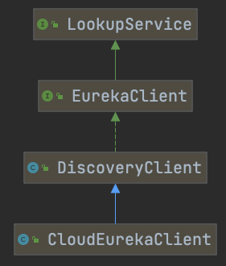

# 030-Eureka服务发现客户端-EurekaDiscoveryClient

[TOC]

## EurekaDiscoveryClient的继承结构

EurekaDiscoveryClient 是 commons 包中 DiscoveryClient的具体实现

 [020-DiscoveryClient和ReactiveDiscoveryClient.md](../../005-SpringCloud服务治理编程模型/020-DiscoveryClient和ReactiveDiscoveryClient.md) 

## 类图


可以看出

- EurekaDiscoveryClient 使用类适配器的形式 维护了一个 EurekaClient 作为其核心实现
- CloudEurekaClient 是 Eureka 中 EurekaClient  的核心实现

## com.netflix.discover.DiscoveryClient

为了对Eureka Client的执行原理进行讲解，首先需要对服务发现客户端`com.netflix.discover.DiscoveryClient`职能以及相关类进行讲解，它负责了与Eureka Server交互的关键逻辑。

## DiscoveryClient职责

DiscoveryClient是Eureka Client的核心类，包括与Eureka Server交互的关键逻辑，具备了以下职能：

- 注册服务实例到Eureka Server中
- 发送心跳更新与Eureka Server的租约
- 在服务关闭时从Eureka Server中取消租约，服务下线
- 查询在Eureka Server中注册的服务实例列表

## DiscoveryClient的继承结构



### 顶层接口LookupService

DiscoveryClient继承了LookupService接口，LookupService作用是发现活跃的服务实例，主要方法如下：

```java
//com.netflix.discovery.shared.LookupService.java
public interface LookupService〈T〉 {
    //根据服务实例注册的appName来获取封装有相同appName的服务实例信息容器
    Application getApplication(String appName);
    //返回当前注册表中所有的服务实例信息
    Applications getApplications();
    //根据服务实例的id获取服务实例信息
    List〈InstanceInfo〉 getInstancesById(String id);
    ...
}
```

Application持有服务实例信息列表，它可以理解成同一个服务的集群信息，这些服务实例都挂在同一个服务名appName下。InstanceInfo代表一个服务实例信息。

Application部分代码如下：

```java
//Application.java
public class Application {
    private static Random shuffleRandom = new Random();
    //服务名
    private String name;
    @XStreamOmitField
  private volatile boolean isDirty = false;
    @XStreamImplicit
    private final Set〈InstanceInfo〉 instances;
    private final AtomicReference〈List〈InstanceInfo〉〉 shuffledInstances;
    private final Map〈String, InstanceInfo〉 instancesMap;
    ...
}
```

为了保证原子性操作，

- Application中对InstanceInfo的操作都是同步操作。

- Applications是注册表中所有服务实例信息的集合，里面的操作大多也是同步操作。

EurekaClient继承了LookupService接口，为DiscoveryClient提供了一个上层接口，目的是方便从Eureka 1.x到Eureka 2.x(已停止开发)的升级过渡。EurekaClient接口属于比较稳定的接口，即使在下一阶段也会被保留。

EurekaCient在LookupService的基础上扩充了更多的接口，提供了更丰富的获取服务实例的方式，主要有：

- 提供了多种方式获取InstanceInfo，例如根据区域、Eureka Server地址等获取。
- 提供了本地客户端(所处的区域、可用区等)的数据，这部分与AWS密切相关。
- 提供了为客户端注册和获取健康检查处理器的能力。

除去查询相关的接口，我们主要关注EurekaClient中以下两个接口，代码如下所示：

```java
// com.netflix.discovery.EurekaClient.java
//为Eureka Client注册健康检查处理器
public void registerHealthCheck(HealthCheckHandler healthCheckHandler);
//为Eureka Client注册一个EurekaEventListener(事件监听器)
// 监听Client服务实例信息的更新
public void registerEventListener(EurekaEventListener eventListener);

```

## 定时检测Client的状态

Eureka Server一般通过心跳(heartbeats)来识别一个实例的状态。Eureka Client中存在一个定时任务定时通过HealthCheckHandler检测当前Client的状态，如果Client的状态发生改变，将会触发新的注册事件，更新Eureka Server的注册表中该服务实例的相关信息。HealthCheckHandler的代码如下所示：

```java
// HealthCheckHandler.java
public interface HealthCheckHandler {
    InstanceInfo.InstanceStatus getStatus(InstanceInfo.InstanceStatus currentStatus);
```

HealthCheckHandler接口的代码如上所示，其在spring-cloud-netflix-eureka-client中的实现类为EurekaHealthCheckHandler，主要组合了spring-boot-actuator中的HealthAggregator和HealthIndicator，以实现对Spring Boot应用的状态检测。


