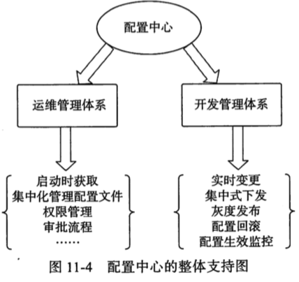

# SpringCloud Config 概述

SpringCloud Config 是一个集中化外部配置的分布式系统

由 服务端和客户端 组成,   **不依赖注册中心**

SpringCloud Config 支持多种存储配置信息的形式

目前主要有:

- jdbc
- valut
- native 
- svn 
- git  (默认)

## Git版本工作原理

- 配置客户端启动时会向服务端发起请求
- 服务端接收到客户端的请求后,根据配置的仓库地址,将 git 上的文件克隆到本地的一个临时目录中
- 服务端读取本地文件返回给客户端

这样做的好处是, 当 git 服务器故障或者网络请求异常时,保证服务端仍然可以正常工作

