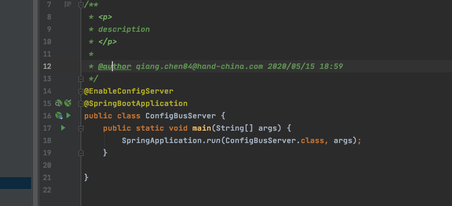
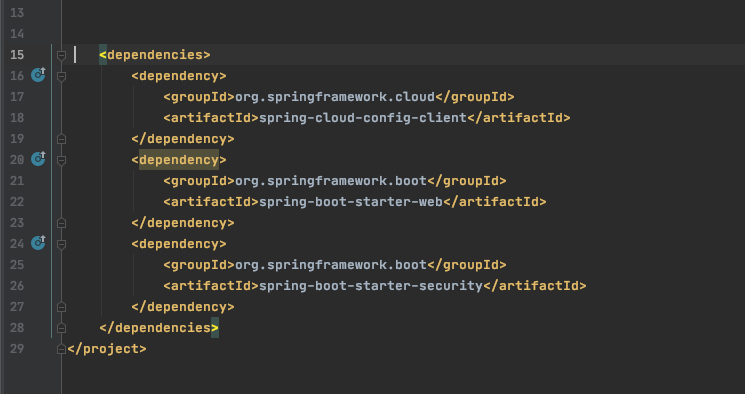
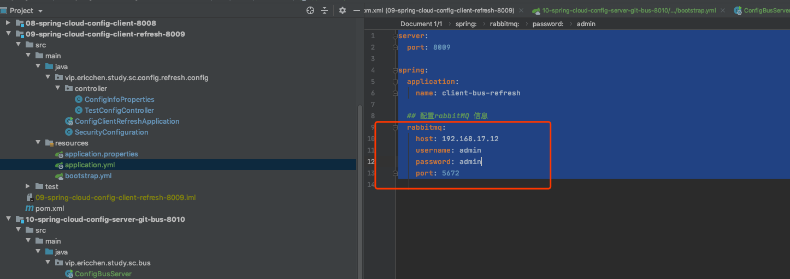

# 动态刷新

- 手动动态刷新
- 自动动态刷新

## 手动刷新

执行端点 /acturator/refresh 刷新客户端的信息

 [07-spring-cloud-config-client.md](../../04-spring-cloud-config/07-spring-cloud-config-client.md) 

## 自动刷新

#### 基于 Spring Cloud Bus 热刷新

通过 Spring Cloud Bus 在服务端执行断点

> /actuator/bus-refresh?destination=** 

刷新所有客户端,同时添加 webHook 配置对应的 ConfigServer的回调地址, 在 git提交 (pushs)后执行调用刷新

##### 整体流程图

1. 用户更新了配置文件信息,提交到 git
2. 通过 git web hook 机制回调到 配置文件服务器
3. 配置文件服务器 推送 配置,并通知具体的服务
4. 具体的服务 访问 配置文件服务器获取最新的配置并刷新上下文

#### 代码实例

pom.xml

bootstrap 配置

主要是配置 rabbitmq 的节点

#### 客户端

可以看到,没有添加 bus的依赖,但是如果配置上 rabbitmq 的配置,就会自动实现 mq 机制

## 