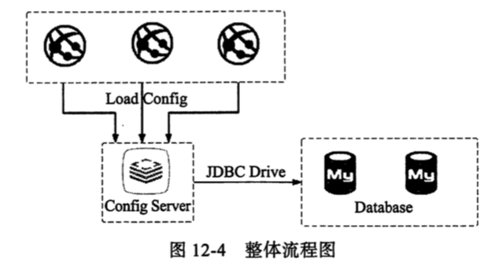

# 关系型数据库的实现



## 服务端

数据库

```java
-- 创建类型
CREATE TABLE `PROPERTIES` (
  `ID` int(11) NOT NULL AUTO_INCREMENT,
  `KEY` TEXT DEFAULT NULL,
  `VALUE` TEXT DEFAULT NULL,
  `APPLICATION` TEXT DEFAULT NULL,
  `PROFILE` TEXT DEFAULT NULL,
  `LABLE` TEXT DEFAULT NULL,
  PRIMARY KEY (`ID`)
) ENGINE=InnoDB AUTO_INCREMENT=3 DEFAULT CHARSET=utf8;

INSERT INTO `spring-cloud`.`properties` (`ID`, `KEY`, `VALUE`, `APPLICATION`, `PROFILE`, `LABLE`) VALUES ('3', 'cn.springcloud.book.config', 'I am the mysql configuration file from dev environment.', 'config-info', 'dev', 'master');
INSERT INTO `spring-cloud`.`properties` (`ID`, `KEY`, `VALUE`, `APPLICATION`, `PROFILE`, `LABLE`) VALUES ('4', 'cn.springcloud.book.config', 'I am the mysql configuration file from test environment.', 'config-info', 'test', 'master');
INSERT INTO `spring-cloud`.`properties` (`ID`, `KEY`, `VALUE`, `APPLICATION`, `PROFILE`, `LABLE`) VALUES ('5', 'cn.springcloud.book.config', 'I am the mysql configuration file from prod environment.', 'config-info', 'prod', 'master');

```

实际上是用数据库存储了 key,value 键值对,使用这个键值对的方式获取到对应的参数

#### pom

```xml
    <dependencies>
        <dependency>
            <groupId>org.springframework.cloud</groupId>
            <artifactId>spring-cloud-config-server</artifactId>
        </dependency>
        <dependency>
            <groupId>org.springframework.boot</groupId>
            <artifactId>spring-boot-starter-jdbc</artifactId>
        </dependency>
        <dependency>
            <groupId>mysql</groupId>
            <artifactId>mysql-connector-java</artifactId>
        </dependency>
    </dependencies>
```

- 引用了 SpringCloud Config Server 的依赖
- 引入了 Springboot 对 jdbc 的 starter
- 引入了 mysql 的引擎

#### 配置文件

```
server:
  port: 8013
spring:
  application:
    name: config-server-db
  cloud:
    config:
      server:
        jdbc:
          sql: SELECT `KEY`, `VALUE` FROM PROPERTIES WHERE application =? AND profile =? AND lable =?
      label: master
  profiles:
    active: jdbc

  ## 数据配置
  datasource:
    url: jdbc:mysql://127.0.0.1:3306/notes?useUnicode=true&characterEncoding=UTF-8
    username: root
    password: root
    driver-class-name: com.mysql.cj.jdbc.Driver
logging:
  level:
    org.springframework.jdbc.core: DEBUG
    org.springframework.jdbc.core.StatementCreatorUtils: Trace
```

值得注意的是,sql 语句直接写在了配置文件中, 通过 label , profile , application 实现配置的读取

## 客户端

#### pom

```xml
    <dependencies>
        <dependency>
            <groupId>org.springframework.cloud</groupId>
            <artifactId>spring-cloud-config-client</artifactId>
        </dependency>
    </dependencies>
```

#### 测试代码

```java
@RestController
@RequestMapping("configConsumer")
public class ConfigClientController {

    @Autowired
    private ConfigInfoProperties configInfoValue;

    @RequestMapping("/getConfigInfo")
    public String getConfigInfo() {
        return configInfoValue.getConfig();
    }
}
```


```java
@Component
@ConfigurationProperties(prefix = "cn.springcloud.book")
public class ConfigInfoProperties {

    private String config;

    public String getConfig() {
        return config;
    }

    public void setConfig(String config) {
        this.config = config;
    }
}

```

#### 配置文件

```
spring:
    cloud:
        config:
            label: master
            uri: http://localhost:8013
            name: config-info
            profile: dev
```

## 测试

