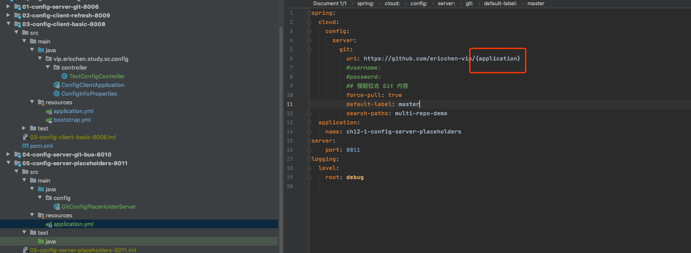
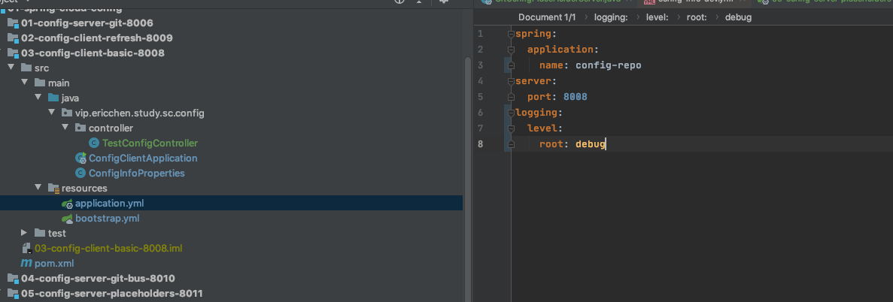
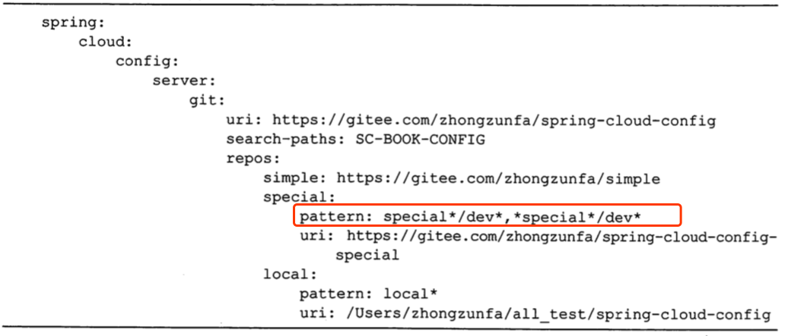
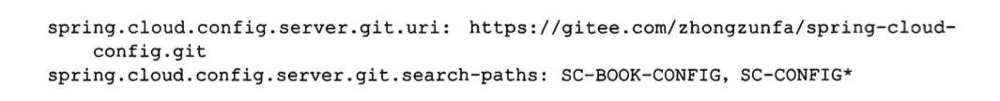
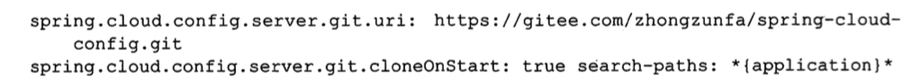

# 服务端配置详解

[TOC]

## git 多种配置

- Git 中的 URL 占位符
- 模式匹配和多个存储库
- 路径搜索占位符

### Git 中的 URL 占位符

Spring Cloud Config Server 支持占位符的使用,支持

- {application}
- {profile}
- {label}

这样在配置 url 的时候,通过占位符使用客户端应用名称来区分对应的仓库



比如客户端使用 config-repo 作为应用名,那么就会访问

```
ericchen-vip/config-repo/master/multi-repo-demo/config-repo.yml
```

目录下的这个配置文件




## 模式匹配和多个存储库

在application 和 profile 的名称上,Spring Cloud Server 还支持更加复杂的配置模式,可以使用通配符 {application}/{profile} 名称进行规则匹配,通过逗号分隔



- 使用{application}/{profile}匹配不上任何一个仓库时会使用默认的仓库进行匹配获取信息
- sping-cloud-config-simples 匹配的是 spring-cloud-config/* .仅能匹配应用名称为 spring-config-cloud-simple 的所有 profile 配置
- 对于local 仓库会匹配应用名为 local 开头的 Profiles

## 路径搜索占位符



上面截图的 properties 格式,上述配置中的 sc-book-config是匹配当前路径下面所有的配置文件信息

```
sc-config* 标识的是配置以前 sc-config 前缀的文件夹进行搜索所有配置文件
```



上述配置文件,使用占位符的形式进行目录搜索,这样可以根据不同的项目对应不同的配置文件进行路径配置,从而很好的划分文件

#### 值得注意的是

引号上要加上** 字符,否则不能识别, 此外还可以使用 `{search_path}`


