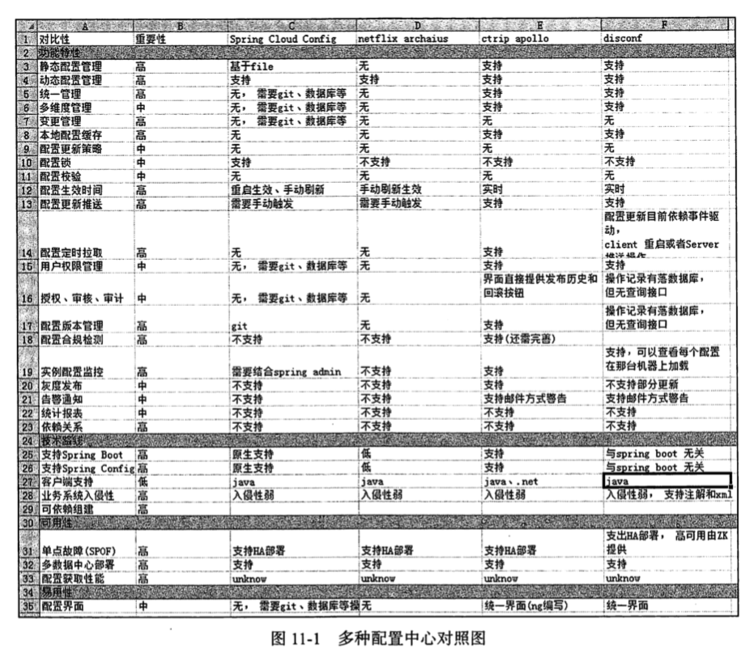
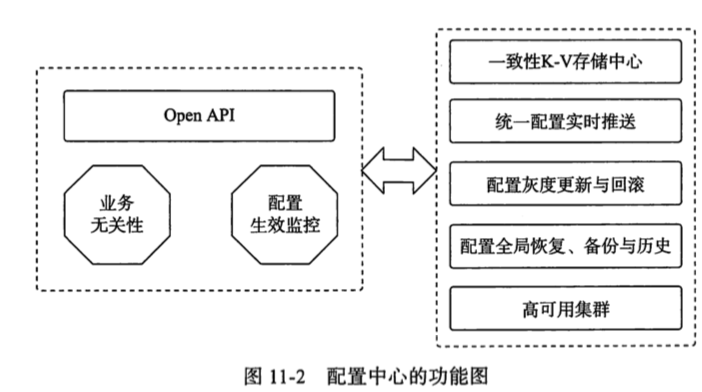
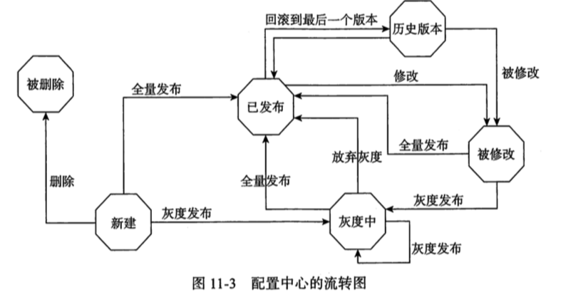

# Spring Cloud Config

[TOC]

Spring Cloud Config 是 SpringCloud 微服务体系中的配置中心,是微服务不可或缺的一部分

- 配置各种功能的开关
- 参数的配置
- 服务器的地址

配置修改后能够实时生效,灰度发布

- 分环境,分集群管理配置

等等全面的集中化管理,有利于系统配置和维护

## 为什么要有配置中心

集中式开发的时代,配置文件已经基本足够使用,因为那时候,配置的管理通常不会成为一个很大的问题

分布式系统中,部署在 N 台机器上,想去线上一台一台地重启机器肯定不靠谱,并且维护成本很高

**所以需要分布式的配置中心**

还有就是, 配置中心被用作集中管理不同的环境(Dev, Test,Stage,Prod)和不同集群的配置

### 配置中心概况

### 配置中心应该具备的功能

- Open API
- 业务无关性

- 配置生效监控
- 统一配置实时推送
- 配合灰度与更新
- 配置全局恢复,备份与历史
- 高可用集群

#### 配置中心流转图

- 运维管理体系
- 开发管理体系

