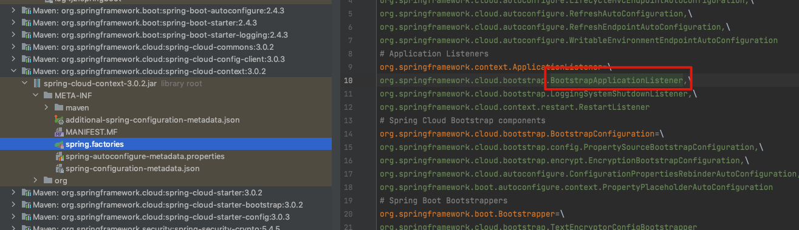
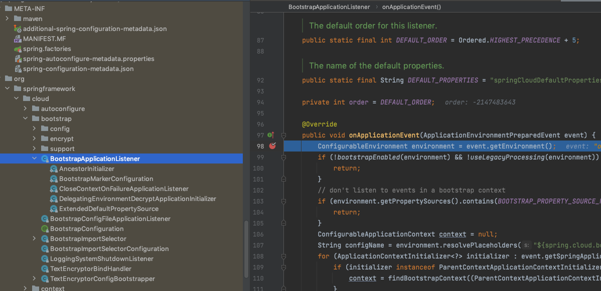
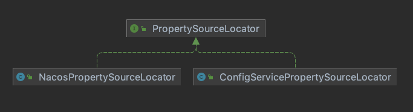

# 010-SpringCloudConfig配置初始化阶段

[TOC]

## 一言蔽之


- 使用配置中心必须先对配置中心的地址进行配置, 这个地址需要在配置文件里面配置
- SpringCloudBootstrap 阶段优先级高, 会先读取配置中心的配置, 这些配置在下一次正常的ApplicationContext启动时使用

#### 监听ApplicationEnvironmentPreparedEvent事件

```java
org.springframework.boot.SpringApplication#prepareEnvironment

	private ConfigurableEnvironment prepareEnvironment(SpringApplicationRunListeners listeners,
			DefaultBootstrapContext bootstrapContext, ApplicationArguments applicationArguments) {
		// Create and configure the environment
  // 创建环境并配置环境
		ConfigurableEnvironment environment = getOrCreateEnvironment();
		configureEnvironment(environment, applicationArguments.getSourceArgs());
		ConfigurationPropertySources.attach(environment);
  //通知所有的监听器, 环境准备好了, 
		listeners.environmentPrepared(bootstrapContext, environment);
		DefaultPropertiesPropertySource.moveToEnd(environment);
		configureAdditionalProfiles(environment);
		bindToSpringApplication(environment);
		if (!this.isCustomEnvironment) {
			environment = new EnvironmentConverter(getClassLoader()).convertEnvironmentIfNecessary(environment,
					deduceEnvironmentClass());
		}
		ConfigurationPropertySources.attach(environment);
		return environment;
	}
```

值得注意的是

1. spring-cloud-context模块内部的 META-INF/spring.factoies 添加了一个BootstrapApplicationListener



当环境初始化好后广播`ApplicationEnvironmentPreparedEvent`事件



## 监听具体逻辑

```java
@Override
public void onApplicationEvent(ApplicationEnvironmentPreparedEvent event) {
   ConfigurableEnvironment environment = event.getEnvironment();
  //判断是否启用Bootstrap , 配置文件 spring.cloud.bootstrap.enabled 可以关闭
   if (!bootstrapEnabled(environment) && !useLegacyProcessing(environment)) {
      return;
   }
   // don't listen to events in a bootstrap context
   if (environment.getPropertySources().contains(BOOTSTRAP_PROPERTY_SOURCE_NAME)) {
     //防止遍历两次
      return;
   }
   ConfigurableApplicationContext context = null;
   String configName = environment.resolvePlaceholders("${spring.cloud.bootstrap.name:bootstrap}");
   for (ApplicationContextInitializer<?> initializer : event.getSpringApplication().getInitializers()) {
      if (initializer instanceof ParentContextApplicationContextInitializer) {
         context = findBootstrapContext((ParentContextApplicationContextInitializer) initializer, configName);
        //遍历 ApplicationContextInitializer 初始化器, 只执行 ParentContextApplicationContextInitializer 
        // 有的开发者可能会用到单层甚至多层父子关系, 并且手动设置bootstrapApplication 作为parent
        // SpringApplicationBuilder#parent(ConfiguableApplicationContext), 其目的就是找到已经构造的boostrap ApplicationContext
      }
   }
   if (context == null) {
     //没有找到bootstrap ApplicationContext 则调用boostrapServiceContext 方法构建 bootstrap ApplicationContext
      context = bootstrapServiceContext(environment, event.getSpringApplication(), configName);
      event.getSpringApplication().addListeners(new CloseContextOnFailureApplicationListener(context));
   }

   apply(context, event.getSpringApplication(), environment);
}
```

## 构造bootstrapServiceContext

```java
	private ConfigurableApplicationContext bootstrapServiceContext(ConfigurableEnvironment environment,
			final SpringApplication application, String configName) {
		StandardEnvironment bootstrapEnvironment = new StandardEnvironment();
		MutablePropertySources bootstrapProperties = bootstrapEnvironment.getPropertySources();
		for (PropertySource<?> source : bootstrapProperties) {
			bootstrapProperties.remove(source.getName());
		}
		String configLocation = environment.resolvePlaceholders("${spring.cloud.bootstrap.location:}");
		String configAdditionalLocation = environment
				.resolvePlaceholders("${spring.cloud.bootstrap.additional-location:}");
		Map<String, Object> bootstrapMap = new HashMap<>();
		bootstrapMap.put("spring.config.name", configName);
		// if an app (or test) uses spring.main.web-application-type=reactive, bootstrap
		// will fail
		// force the environment to use none, because if though it is set below in the
		// builder
		// the environment overrides it
		bootstrapMap.put("spring.main.web-application-type", "none");
		if (StringUtils.hasText(configLocation)) {
			bootstrapMap.put("spring.config.location", configLocation);
		}
		if (StringUtils.hasText(configAdditionalLocation)) {
			bootstrapMap.put("spring.config.additional-location", configAdditionalLocation);
		}
    //添加一个名称为bootstrap 的PropertySource到 bootstrap ApplicationContext
		bootstrapProperties.addFirst(new MapPropertySource(BOOTSTRAP_PROPERTY_SOURCE_NAME, bootstrapMap));
		for (PropertySource<?> source : environment.getPropertySources()) {
			if (source instanceof StubPropertySource) {
				continue;
			}
			bootstrapProperties.addLast(source);
		}
		// TODO: is it possible or sensible to share a ResourceLoader?
		SpringApplicationBuilder builder = new SpringApplicationBuilder().profiles(environment.getActiveProfiles())
				.bannerMode(Mode.OFF).environment(bootstrapEnvironment)
				// Don't use the default properties in this builder
				.registerShutdownHook(false).logStartupInfo(false).web(WebApplicationType.NONE);
		final SpringApplication builderApplication = builder.application();
		if (builderApplication.getMainApplicationClass() == null) {
			// gh_425:
			// SpringApplication cannot deduce the MainApplicationClass here
			// if it is booted from SpringBootServletInitializer due to the
			// absense of the "main" method in stackTraces.
			// But luckily this method's second parameter "application" here
			// carries the real MainApplicationClass which has been explicitly
			// set by SpringBootServletInitializer itself already.
			builder.main(application.getMainApplicationClass());
		}
		if (environment.getPropertySources().contains("refreshArgs")) {
			// If we are doing a context refresh, really we only want to refresh the
			// Environment, and there are some toxic listeners (like the
			// LoggingApplicationListener) that affect global static state, so we need a
			// way to switch those off.
			builderApplication.setListeners(filterListeners(builderApplication.getListeners()));
		}
    //注册 BootstrapImportSelectorConfiguration 配置类, 这个配置类非常关键, 它会使用工厂加载机制找出key 为
// 找出所有的 org.springframework.cloud.bootstrap.BootstrapConfiguration
		builder.sources(BootstrapImportSelectorConfiguration.class);
		final ConfigurableApplicationContext context = builder.run();
		// gh-214 using spring.application.name=bootstrap to set the context id via
		// `ContextIdApplicationContextInitializer` prevents apps from getting the actual
		// spring.application.name
		// during the bootstrap phase.
		context.setId("bootstrap");
		// Make the bootstrap context a parent of the app context
		addAncestorInitializer(application, context);
		// It only has properties in it now that we don't want in the parent so remove
		// it (and it will be added back later)
		bootstrapProperties.remove(BOOTSTRAP_PROPERTY_SOURCE_NAME);
		mergeDefaultProperties(environment.getPropertySources(), bootstrapProperties);
		return context;
	}
```

## BootstrapImportSelectorConfiguration :找出所有的BootstrapConfiguration

spring-cloud-config-client-3.0.3.jar

```
org.springframework.cloud.bootstrap.BootstrapConfiguration=\
org.springframework.cloud.config.client.ConfigServiceBootstrapConfiguration,\
org.springframework.cloud.config.client.DiscoveryClientConfigServiceBootstrapConfiguration
```

spring-cloud-context-3.0.2.jar

```
# Spring Cloud Bootstrap components
org.springframework.cloud.bootstrap.BootstrapConfiguration=\
org.springframework.cloud.bootstrap.config.PropertySourceBootstrapConfiguration,\
org.springframework.cloud.bootstrap.encrypt.EncryptionBootstrapConfiguration,\
org.springframework.cloud.autoconfigure.ConfigurationPropertiesRebinderAutoConfiguration,\
org.springframework.boot.autoconfigure.context.PropertyPlaceholderAutoConfiguration
```

- PropertySourceBootstrapConfiguration : 内部会获取 PropertySourceLocator列表 用于架子配置中心的配置, 并封装到PropertySource, 之后将列表添加到Envoronment 里的PropertySource

## PropertySourceBootstrapConfiguration

```java
	private List<PropertySourceLocator> propertySourceLocators = new ArrayList<>();

@Override
	public void initialize(ConfigurableApplicationContext applicationContext) {
		List<PropertySource<?>> composite = new ArrayList<>();
		AnnotationAwareOrderComparator.sort(this.propertySourceLocators);
		boolean empty = true;
		ConfigurableEnvironment environment = applicationContext.getEnvironment();
		for (PropertySourceLocator locator : this.propertySourceLocators) {
      //调用后产生PropertySource
			Collection<PropertySource<?>> source = locator.locateCollection(environment);
			if (source == null || source.size() == 0) {
				continue;
			}
			List<PropertySource<?>> sourceList = new ArrayList<>();
			for (PropertySource<?> p : source) {
				if (p instanceof EnumerablePropertySource) {
					EnumerablePropertySource<?> enumerable = (EnumerablePropertySource<?>) p;
					sourceList.add(new BootstrapPropertySource<>(enumerable));
				}
				else {
					sourceList.add(new SimpleBootstrapPropertySource(p));
				}
			}
			logger.info("Located property source: " + sourceList);
			composite.addAll(sourceList);
			empty = false;
		}
		if (!empty) {
			MutablePropertySources propertySources = environment.getPropertySources();
			String logConfig = environment.resolvePlaceholders("${logging.config:}");
			LogFile logFile = LogFile.get(environment);
			for (PropertySource<?> p : environment.getPropertySources()) {
				if (p.getName().startsWith(BOOTSTRAP_PROPERTY_SOURCE_NAME)) {
          //先移除
					propertySources.remove(p.getName());
				}
			}
			insertPropertySources(propertySources, composite);
			reinitializeLoggingSystem(environment, logConfig, logFile);
			setLogLevels(applicationContext, environment);
			handleIncludedProfiles(environment);
		}
	}
```

## 图示




- NacosPropertySourceLocator : Nacos实现
- ConfigServicePropertySourceLocator : SpringCloudConifg