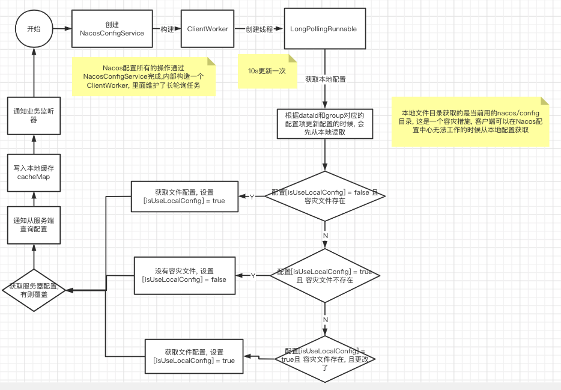

# 010-长轮询实现原理

[TOC]

## Nacos内部的配置动态刷新原理

- Nacos客户端有3个地方获取配置
  - 基于内存的缓存
  -  容灾文件本地缓存
  - 服务器获取
- 长轮询10s获取一次, 更新

通过客户端维护长轮询的任务, 定时拉取发生变更的配置, 然后将最新的数据推送到客户端的Listener的持有者, 长轮询实现源流


#### 长轮询的实现原理

Nacos配置所有的操作通过NacosConfigService完成,内部构造一个 ClientWorker, 里面维护了长轮询任务

com.alibaba.nacos.client.config.NacosConfigService

```java
    public NacosConfigService(Properties properties) throws NacosException {
        ValidatorUtils.checkInitParam(properties);
        String encodeTmp = properties.getProperty(PropertyKeyConst.ENCODE);
        if (StringUtils.isBlank(encodeTmp)) {
            this.encode = Constants.ENCODE;
        } else {
            this.encode = encodeTmp.trim();
        }
        initNamespace(properties);
        
        this.agent = new MetricsHttpAgent(new ServerHttpAgent(properties));
        this.agent.start();
      //构造一个ClientWorker里面维护了长轮询任务
        this.worker = new ClientWorker(this.agent, this.configFilterChainManager, properties);
    }
```

ClientWorker中维护了长轮询任务, 我们看一下

```java
    @SuppressWarnings("PMD.ThreadPoolCreationRule")
    public ClientWorker(final HttpAgent agent, final ConfigFilterChainManager configFilterChainManager,
            final Properties properties) {
        this.agent = agent;
        this.configFilterChainManager = configFilterChainManager;
        
        // Initialize the timeout parameter
        
        init(properties);
        
      //定时任务线程池,一个线程
        this.executor = Executors.newScheduledThreadPool(1, new ThreadFactory() {
            @Override
            public Thread newThread(Runnable r) {
                Thread t = new Thread(r);
                t.setName("com.alibaba.nacos.client.Worker." + agent.getName());
                t.setDaemon(true);
                return t;
            }
        });
        
      //初始化执行服务
        this.executorService = Executors
                .newScheduledThreadPool(Runtime.getRuntime().availableProcessors(), new ThreadFactory() {
                    @Override
                    public Thread newThread(Runnable r) {
                        Thread t = new Thread(r);
                        t.setName("com.alibaba.nacos.client.Worker.longPolling." + agent.getName());
                        t.setDaemon(true);
                        return t;
                    }
                });
        
      //固定时间执行,初始化1ms delay, 后续delay 10ms
        this.executor.scheduleWithFixedDelay(new Runnable() {
            @Override
            public void run() {
                try {
                    checkConfigInfo();
                } catch (Throwable e) {
                    LOGGER.error("[" + agent.getName() + "] [sub-check] rotate check error", e);
                }
            }
        }, 1L, 10L, TimeUnit.MILLISECONDS);
    }
```

## 核心任务:LongPollingRunnable

ClientWorker: 里面具体执行的方法 LongPollingRunnable

```java
/**
 * Check config info.
 */
public void checkConfigInfo() {
    // Dispatch taskes.
    int listenerSize = cacheMap.size();
    // Round up the longingTaskCount.
    int longingTaskCount = (int) Math.ceil(listenerSize / ParamUtil.getPerTaskConfigSize());
    if (longingTaskCount > currentLongingTaskCount) {
        for (int i = (int) currentLongingTaskCount; i < longingTaskCount; i++) {
            // The task list is no order.So it maybe has issues when changing.
            executorService.execute(new LongPollingRunnable(i));
        }
        currentLongingTaskCount = longingTaskCount;
    }
}
```

LongPollingRunnable , 长轮询polling的具体实现

```java
class LongPollingRunnable implements Runnable {
    
    private final int taskId;
    
    public LongPollingRunnable(int taskId) {
        this.taskId = taskId;
    }
    
    @Override
    public void run() {
        
        List<CacheData> cacheDatas = new ArrayList<CacheData>();
        List<String> inInitializingCacheList = new ArrayList<String>();
        try {
            // check failover config
             // cacheMap 中缓存了所有配置对应的dataId, group和 tenant
            for (CacheData cacheData : cacheMap.values()) {
                if (cacheData.getTaskId() == taskId) {
                    cacheDatas.add(cacheData);
                    try {
                      //根据dataId和group对应的配置项更新配置的时候, 会先从本地读取, 本地文件目录获取的是当前用的nacos/config 目录, 这是一个容灾措施, 客户端可以在Nacos配置中心无法工作的时候从本地配置获取
                        checkLocalConfig(cacheData);
                        if (cacheData.isUseLocalConfigInfo()) {
                            cacheData.checkListenerMd5();
                        }
                    } catch (Exception e) {
                        LOGGER.error("get local config info error", e);
                    }
                }
            }
		...
}

```




### 获取服务端的配置

```java
            // check server config 从服务器上获取变化的dataId
            List<String> changedGroupKeys = checkUpdateDataIds(cacheDatas, inInitializingCacheList);
            if (!CollectionUtils.isEmpty(changedGroupKeys)) {
                LOGGER.info("get changedGroupKeys:" + changedGroupKeys);
            }
            
            for (String groupKey : changedGroupKeys) {
                String[] key = GroupKey.parseKey(groupKey);
                String dataId = key[0];
                String group = key[1];
                String tenant = null;
                if (key.length == 3) {
                    tenant = key[2];
                }
                try {
                  //getServerConfig方法内部根据dataId从服务器端获取最新的配置信息, 然后将最新的配置信息存储到CacheData
                    String[] ct = getServerConfig(dataId, group, tenant, 3000L);
                    CacheData cache = cacheMap.get(GroupKey.getKeyTenant(dataId, group, tenant));
                    cache.setContent(ct[0]);
                    if (null != ct[1]) {
                        cache.setType(ct[1]);
                    }
                    LOGGER.info("[{}] [data-received] dataId={}, group={}, tenant={}, md5={}, content={}, type={}",
                            agent.getName(), dataId, group, tenant, cache.getMd5(),
                            ContentUtils.truncateContent(ct[0]), ct[1]);
                } catch (NacosException ioe) {
                    String message = String
                            .format("[%s] [get-update] get changed config exception. dataId=%s, group=%s, tenant=%s",
                                    agent.getName(), dataId, group, tenant);
                    LOGGER.error(message, ioe);
                }
            }
            for (CacheData cacheData : cacheDatas) {
                if (!cacheData.isInitializing() || inInitializingCacheList
                        .contains(GroupKey.getKeyTenant(cacheData.dataId, cacheData.group, cacheData.tenant))) {
                    cacheData.checkListenerMd5();
                    cacheData.setInitializing(false);
                }
            }
            inInitializingCacheList.clear();
            
            executorService.execute(this);
            
        } catch (Throwable e) {
            
            // If the rotation training task is abnormal, the next execution time of the task will be punished
            LOGGER.error("longPolling error : ", e);
            executorService.schedule(this, taskPenaltyTime, TimeUnit.MILLISECONDS);
        }
    }
}
```