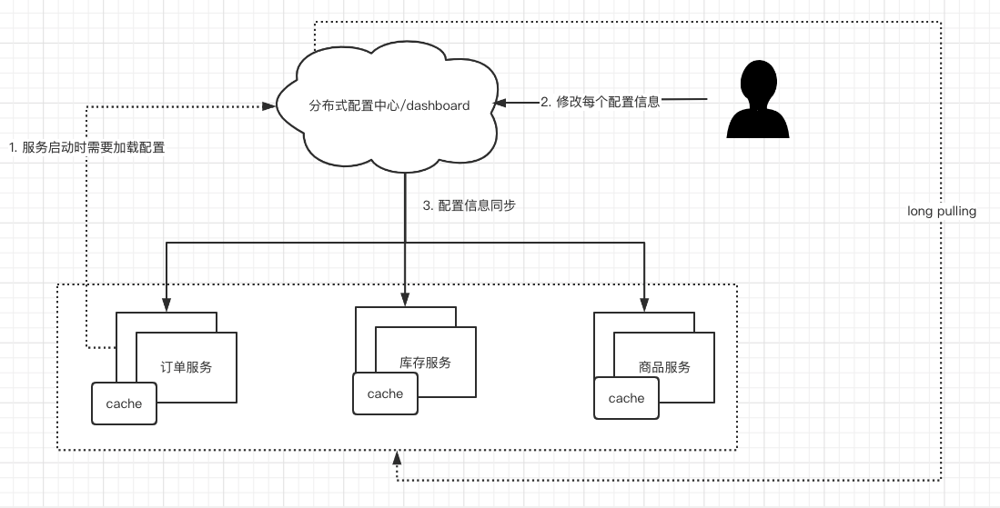

# 31-SpringCloud与配置中心中间件

[TOC]

## 配置中心背景概述

"统一所有配置格式" 是 SpringBoot 产生的背景之一, 每个SpringBoot应用的基本配置都会在resources目录下的application.properties 或者 application.yml 文件中

- 如何从配置中心获取配置
- 动态刷新配置后如何生效

## 为什么要有分布式配置中心

Spring Boot 所有的配置都是跟应用进行绑定的, 配置文件会被打包到JAR中跟随应用一起部署, 这样会有一系列问题:

1. 配置数据存在安全泄漏问题, 只要进入服务器或者容器内, 就可以查看所有的配置, 比如, **配置中存在数据库的连接信息, 会被直接泄漏**
2. 配置在应用启动后, 无法动态更新, 只能手动更新后再重启应用
3. 一个应用部署多份实例的时候, 需要维护多套配置, 容易造成数据不一致的情况
4. 配置没有管理方式, 如更新配置之后, 线上发生问题需要回滚, 必须手动将配置改回到老的配置

**为了解决这些问题, 我们需要一个配置中心**

1. 所有的配置都在配置中心内, 进入服务器或者容器内也无法知道配置信息
2. 配置数据从配置中心获取, 并动态修改后, 配置中心会推送新的配置数据到各个应用上
3. 所有的实例配置都从配置中心获取, 不存在数据不一致的问题
4. 配置中心只需要提供版本控制管理的功能即可, 在配置数据下发的过程中出现问题, 可以立马进行回滚到上一个版本

## 常见的配置中心解决方案

1. Alibaba Nacos
2. Apache Zookeeper
3. HashiCorp Consul
4. HashiCorp Vault
5. Baidu Disconf
6. Apoll 携程
7. Spring Cloud Config

