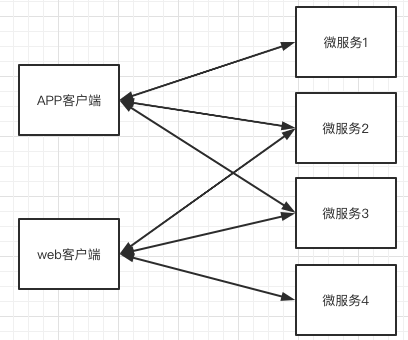

# 010-微服务为什么需要网关

[TOC]

## 为什么我们需要网关

网关在微服务体系中属于比较重要的一个模块, 如果没有网关的存在, 单体应用改造成微服务后服务调用的链路就会像

存在的问题

- 如果添加鉴权功能, 需要对每一个服务进行改造
- 跨域问题需要对每一个服务进行改造
- 流量控制需要对每一个服务进行改造
- 灰度发布, 动态路由需要对每一个服务进行改造
- 收集用户日志访问记录需要聚合各个服务里的数据
- 存在安全问题, 每个微服务暴露的Endpoint hi固定的, 客户端访问需要清除各个微服务真实的EndPoint

## 网关

上述问题我们可以通过网关来解决,有了网关之后

- 所有的流量全部先经过网关, 网关再转发给对应的微服务, 然后微服务返回结果给网关, 网关最终将结果展示给客户

目前业界的网关有

- Nginx , Apache, Kong 
- Netflix zuul
- Alibaba Tgngine
- SpringCloud Gateway