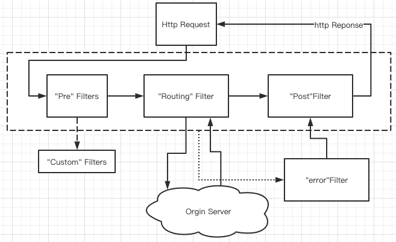

# 020-Zuul的Filter链

[TOC]

## 核心逻辑

## 

- 在PostFilter 抛出错之前,pre.route Filter 没有抛错,此时会走 ZuulException的逻辑(打印堆栈,返回 status=500 的 ERROR)
- 在 PostFilter 抛出错之前,pre,route Filter 已有抛错,此时不会打印堆栈信息,直接返回 status=500的 error 信息