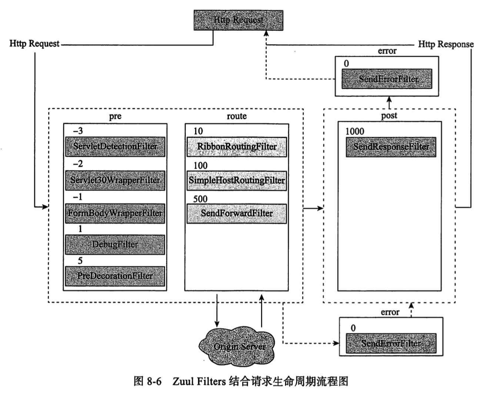

# 040-Zuul内置的Filter

[TOC]



## 


如果使用`@EnableZuulProxy` ,会默认开启上面的所有 Filter

如果使用`@EnableZuulServer` 将缺少`PreDecorationFilter`.`RibbonRoutingFilter`, `SimpleHostRoutingFilter`

可以通过配置文件关闭

```
zuul.<ClassName>.<FilterType>.disable=true
例如
zuul.SendErrorFilter.error.disable=true
```

