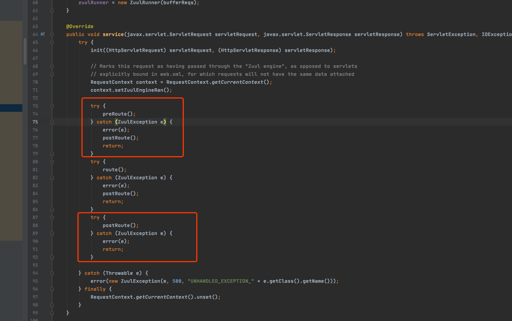
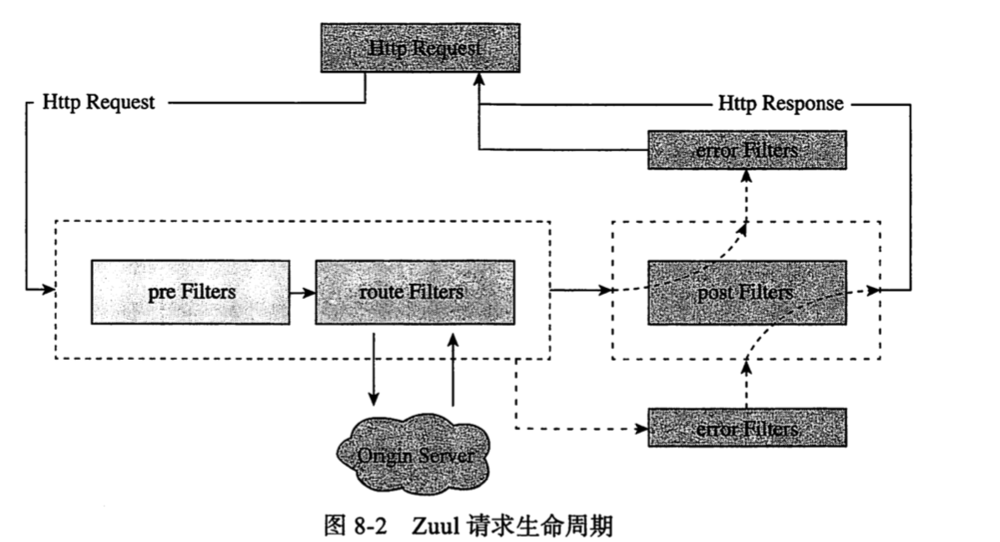
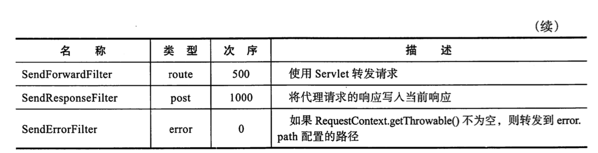

# Zuul  Filter 链

Zuul Filter 链是一系列配合工作的 Filter来实现的,他们能够在进行 Http 请求或者相应的时候执行相关操作

可以说,没有 Filter 链就没有 Zuul

- Filter 的类型

  - pre , 路由动作发生前
  - post , 路由动作发生后

- Filter 的执行顺序

  > 同一种类型的 Filter 可以通过 FilterOrder()方法来设定顺序

- Filter 的执行条件

  > Filter 运行锁需要的标准或者条件

- Filter 执行效果

  > 符合某个 Filter 执行条件,产生执行效果

#### 值得注意的是

Fitler 之间之间不通讯,通过一个 `RequestContext`来共享状态, 它的内部是用 ThreadLocal 实现的

## 核心逻辑

`com.netflix.zuul.http.ZuulServlet`



图示


上面这个图有失偏颇,理由是

- 在PostFilter 抛出错之前,pre.route Filter 没有抛错,此时会走 ZuulException的逻辑(打印堆栈,返回 status=500 的 ERROR)
- 在 PostFilter 抛出错之前,pre,route Filter 已有抛错,此时不会打印堆栈信息,直接返回 status=500的 error 信息

> 整个责任链的流程结束不只有 PostFilter<还有 ErrorFilter



## Zuul 的生命周期

- pre , 在 zuul 按照规则路由到下一级服务之前执行,可以加一些预处理,如认证,鉴权,限流等,都应该考虑这类 Filter
- route , zuul路由的执行者, 是 AppacheHttpClient 或者 Netfilx Ribbon 构建和发送原始 Http 请求的地方,目前已经支持 OKHttp
- post ,  这类 Filter 是在原服务返回结果或者异常信息发生之后执行的,如果需要对返回信息进行一定的处理,则在这里处理
- error,  整个生命周期如果发生异常,进入 error Filter

## Zuul 内置的 Filter




如果使用`@EnableZuulProxy` ,会默认开启上面的所有 Filter

如果使用`@EnableZuulServer` 将缺少`PreDecorationFilter`.`RibbonRoutingFilter`, `SimpleHostRoutingFilter`

可以通过配置文件关闭

```
zuul.<ClassName>.<FilterType>.disable=true
例如
zuul.SendErrorFilter.error.disable=true
```

