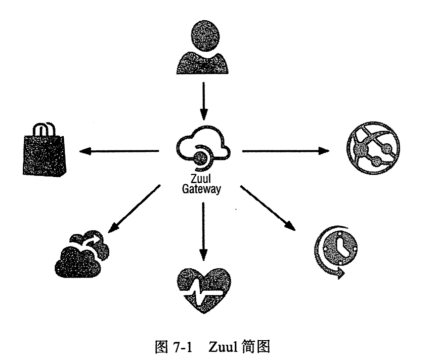

# SpringCloud Zuul 

## 是什么

Zuul 是 NetFlix 孵化的一个致力于网关解决方案的开元组件

Zuul 是从设备和网站到后端应用程序所有请求的前门,为内部服务提供了可配置的对外 URL 到服务的映射关系.基于 JVM 的后端路由器

## 能做什么

- 认证与鉴权
- 压力控制
- 金丝雀测试(灰度测试)
- 动态路由
- 负载削减
- 静态响应处理
- 主流流量管理

## 原理简介

语句 Serlvet 实现,本质上是一系列 Filter 锁构成的责任链,Zuul 的逻辑引擎与 Filter可用其他基于 JVM的语言编写,比如 Groovy

## 版本比较

2.0版本的改动比较 1.0是比较大的,考虑到整个生态的稳定性,2.0 使用了 Netty 性能更好

Pivotal 公司正在走 "去 NetFlix"化的路线,关于 SpringCloud GateWay 将会在未来替代掉 Zuul成为主流

