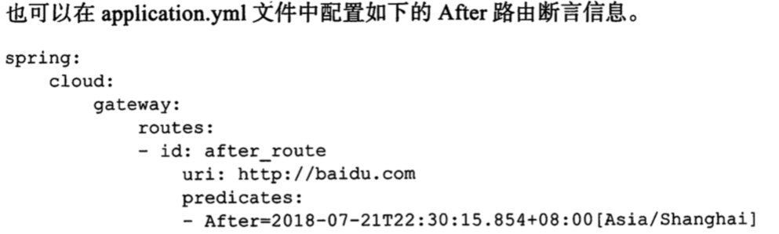
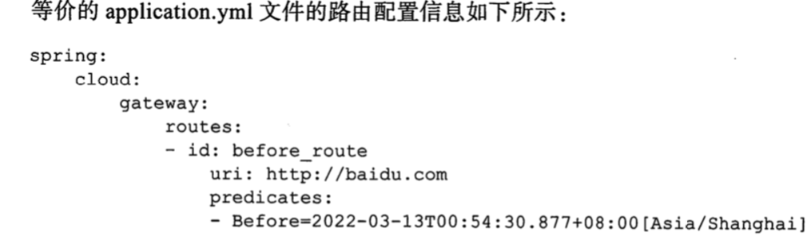
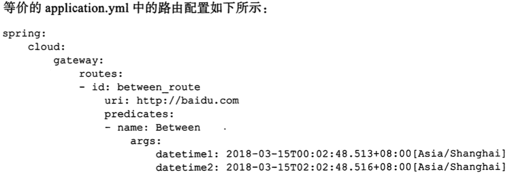
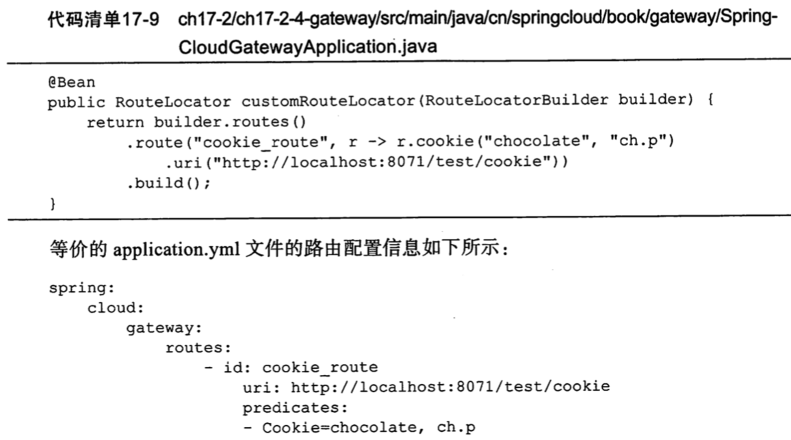
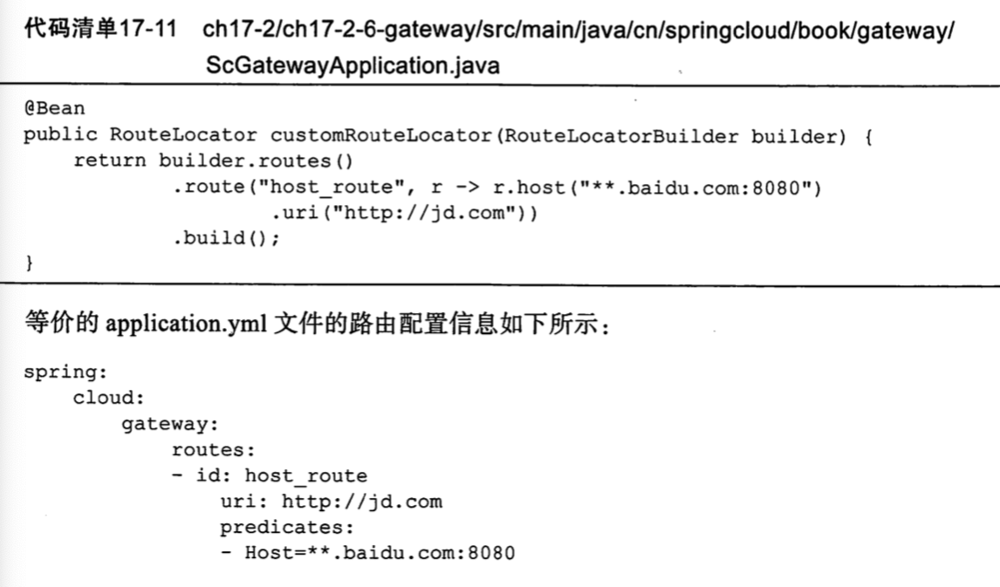
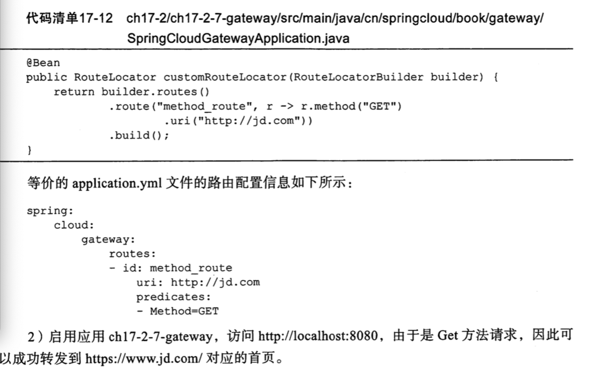
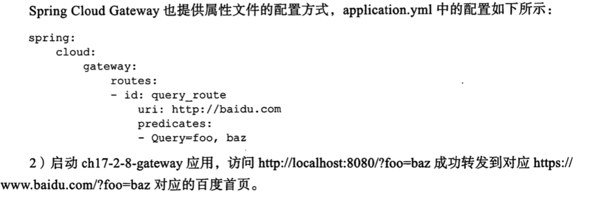
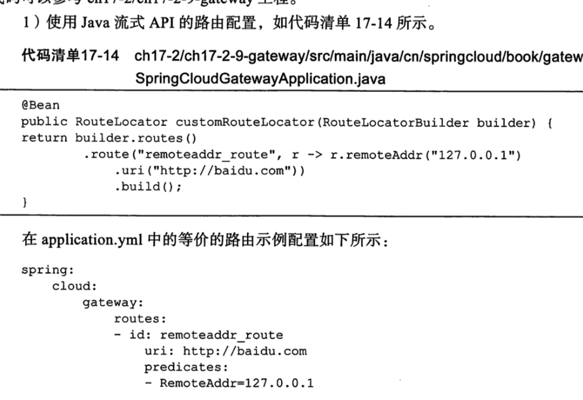

# gatway 的路由断言


SpringCloud Gateway 路由匹配功能以

- Spring WebFlux 中的 Handler Mapping 为基础实现的
- 路由断言工厂组成的
- 过滤器

## 什么是断言工厂,为什么要有断言工厂

当 HttpRequest 请求进入 Spring Cloud Gateway 的时候,网关中的路由断言工厂会根据配置的路由规则,对 Http Request 请求进行断言匹配

- 成功则进入下一步处理
- 失败则直接返回错误信息

为什么要有?

对请求的合法性先进行 true 或者 false的校验, 主要是组织不合法的请求

## 断言工厂

- After 路由断言工厂

  > 断言请求时间必须在规定的时间之后

- Before 路由断言工厂

  > 断言请求时间必须在规定的时间之前

- Between 路由断言工厂

  > 断言请求时间必须在固定的范围之内

- Cookile 路由断言工厂

  > 断言请求 cookile 中带的值

- Header路由断言工厂

  > 断言路由 header 中带的值

- Host 路由断言工厂

  > 断言请求中的 host 是给定的规则

- Method 路由断言工厂

  > 断言请求类型,例如 GET 或者 POST

- Query路由断言工厂

  > 断言请求参数是否和配置的一致

- RemoteAddr 断言工厂

  > 断言请求的远程 ip地址是否是规定的规则

### After 路由断言工厂

```java
    @Bean
    public RouteLocator customRouteLocator(RouteLocatorBuilder builder) {
        //生成比当前时间早一个小时的UTC时间
        ZonedDateTime minusTime = LocalDateTime.now().minusHours(1).atZone(ZoneId.systemDefault());
        return builder.routes()
                .route("after_route", r -> r.after(minusTime)
                        .uri("http://baidu.com"))
                .build();
    }
```



### Before 断言

断言请求时间必须在规定的时间之前

```
    @Bean
    public RouteLocator beforeRouteLocator(RouteLocatorBuilder builder) {

        ZonedDateTime datetime = LocalDateTime.now().plusDays(1).atZone(ZoneId.systemDefault());
        return builder.routes()
                .route("before_route", r -> r.before(datetime)
                        .uri("http://baidu.com"))

                .build();
    }
```



#### Between

```java
    @Bean
    public RouteLocator betweenRouteLocator(RouteLocatorBuilder builder) {

        ZonedDateTime datetime1 = LocalDateTime.now().minusDays(1).atZone(ZoneId.systemDefault());
        ZonedDateTime datetime2 = LocalDateTime.now().plusDays(1).atZone(ZoneId.systemDefault());
        return builder.routes()
                .route("between_route", r -> r.between(datetime1, datetime2)
                        .uri("http://baidu.com"))

                .build();
    }
```




### Cookile路由断言工厂

根据 cookie 名称对应的 key和 value ,当请求携带的 cookie和 Cookied断言工厂中配置的 cookie 一致,则路由 匹配成功,否则匹配不成功



### Header路由断言工厂

Header 路由断言工厂用于根据配置的 header 信息进行断言匹配路由,匹配成功进行转发,否则不进行转发


### Host路由断言工厂

Host 路由断言工厂根据配置的 Host , 对请求中的 Host 进行断言处理,断言成功则进行路由转发



### Method 路由断言工厂

Method 路由断言工厂会根据路由信息配置的 method 对请求方法是 get 或者 post 等进行断言匹配,匹配成功则进行转发,否则失败处理



### query路由断言工厂

Query 路由断言工厂会从请求中获取两个参数,将请求中参数和 Query断言路由中的配置进行匹配

```java
	@Bean
	public RouteLocator customRouteLocator(RouteLocatorBuilder builder) {
		return builder.routes()
				.route("query_route", r -> r.query("foo","baz")
						.uri("http://baidu.com"))
				.build();
	}

```

判断请求的参数里有没有,名为 foo, 值为 baz 的参数



### RemoteAddr 路由断言工厂

RemoteAddr 路由断言工厂配置一个 IPv4, 或者 ipv6 网段的字符串或者 ip, 当请求 ip 地址在网段之内和配置 ip 相同,则表示匹配成功

