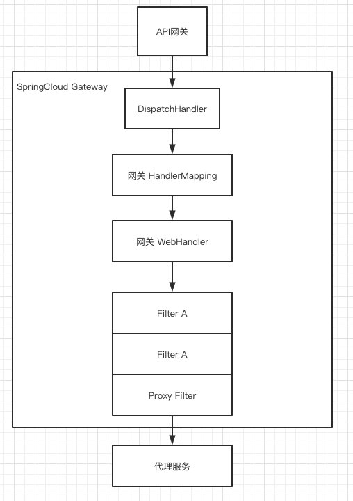

# 020-SpringCloudGateway执行流程

[TOC]

## 执行流程图示

## 

1. 请求发送到网关, DispatcherHandler 是 HTTP请求的中央分发器,将请求匹配到的相应的HandlerMapping
2. 请求与处理器之间有一个映射关系, 网关将会对请求进行路由, handler 此处会匹配到 RoutePredicateHandlerMapping , 以匹配请求所对应的 Route
3. 随后到达网关的Web处理器, 该WebHandler代理了一系列网关过滤器和全局过滤器实例, 如对请求或者相应的头部进行处理 (增加或者溢出某个头部
4. 最后，转发到具体的代理服务。

这里比较重要的功能点是路由的过滤和路由的定位，Spring Cloud Gateway提供了非常丰富的路由过滤器和路由断言。下面将会按照自上而下的顺序分析这部分的源码。

