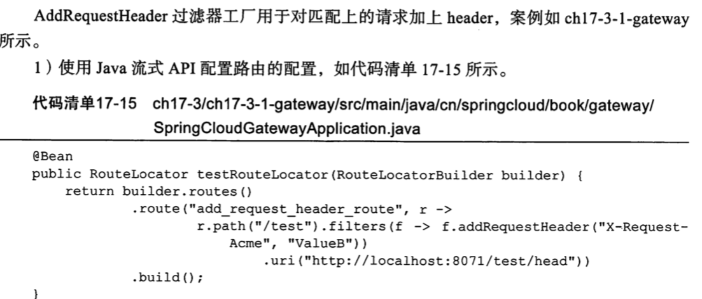
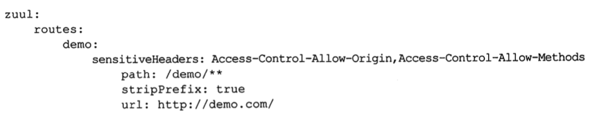
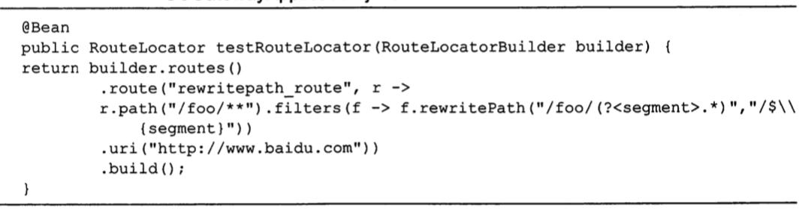
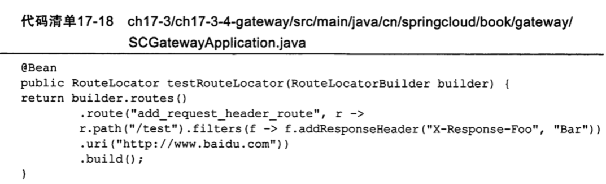
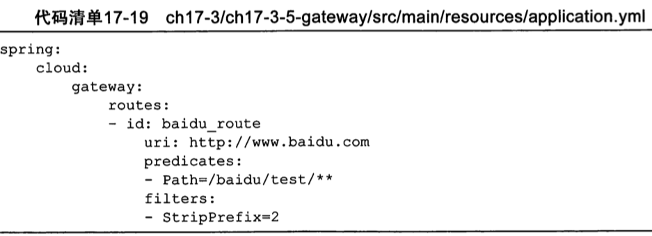
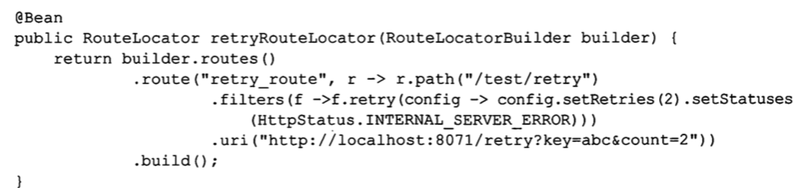
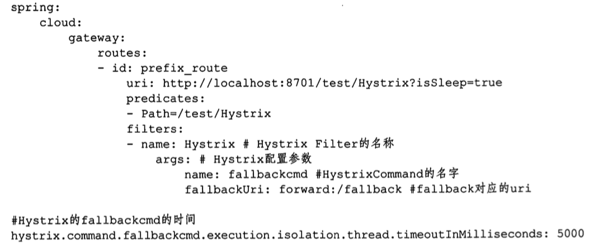

## GateWay 内置的 Filter

- Gateway FIlter

> Gateway Filter 是从 web Filter 复制过来的,相当于一个 Filter 过滤器,可以对访问的 URL过滤,进行横切处理(切面处理) ,应用场景包括超时,安全等

- Global Filter

> Spring Cloud Gateway 定义了 GlobalFIlter 接口,让我们可以自定义实现自己的 Global FIlter  , Global Filter 是一个全局 Filter ,作用于所有路由


内置的Filter 多达 20 多个,可以分为 7 类

- Header 
- Parameter 参数
- Path 路径
- Status 状态
- Redirect 转发
- Hystrix 熔断
- RateLimiter 限流

## 具体的 Filter

- AddRequestHeader 过滤器工厂

> 用于对匹配上的请求加上 header

- AddRequestParameter 过滤器

> 用于对匹配上的过滤器加上请求参数

- RewritePath 过滤器

> 重写 path 

- AddResponseHeader 过滤器

> 从网关返回的响应添加 Header

- StripPrefix 过滤器

> 去掉前缀,如 /demo/app/text 变为 /app/text

- Retry 过滤器

> 重试策略

- Hystrix 过滤器

> 服务降级

## demo

### AddRequestHeader



### AddRequestParameter

AddRequestParameter 过滤器作用是对匹配上的路由添加请求参数

```java
	@Bean
	public RouteLocator testRouteLocator(RouteLocatorBuilder builder) {
		return builder.routes()
				.route("add_request_parameter_route", r ->
						r.path("/addRequestParameter").filters(f -> f.addRequestParameter("example", "ValueB"))
								.uri("http://localhost:8071/test/addRequestParameter"))
				.build();
	}
```

### RewritePath

对path 进行重写

zuul中我们一般会使用 stripPrefix 来去除前缀



说明: 这里的 stripPrefix 默认为 true,也就是所有的/demo/xxxx 请求转发给 http://demo.com/xxx , 去除 demo 前缀



### AddResponseHeader过滤器

AddResponseHeader 过滤器作用是从网关返回的响应添加 Header



### StripPrefix 过滤器

StripPrefixGatewayFilterFactory 是一个对针对请求 url 前缀进行处理的 Filter



> /baidu/test/ 转到 https://www.baidu.com

### Retry 过滤器

网关作为所有请求流量的入口,网关读路由进行协议适配和协议转发处理的过程中,如果出现异常或网络抖动,为了保证后端服务请求的高可用,一般处理方式会对网络请求进行重试




### hystrix 过滤器

SpringCloud Gateway 对 hystrix 进行集成提供路由层面的服务熔断和降级,最简单的使用场景是当通过 SpringCloud Gateway 调用后端服务

当后端服务一直出现异常,服务不可用的状态,此时为了提高用户体验,就需要对服务降级,返回友好的提示消息,在白虎网关自身可用的同时保护后端的高可用

