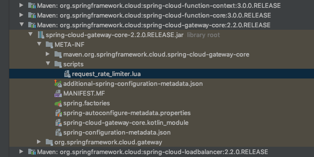

# Gatway 限流

## 限流概述

分布式保护系统的三个利器

- 缓存

> 缓存的目的是提升系统访问速度和增大系统处理的容量

- 降级

> 当服务出现问题或者影响到核心流程时,需要暂时将其屏蔽掉,等待高峰过去以后或者问题解决之后再打开

- 限流

> 限制一些场景的并发和请求量,如秒杀,抢购,写服务,等平凡复杂的查询

## 限流是什么

限流的目的是通过对并发访问进行限速或者对一个时间窗口内的请求进行限速来保护系统,一旦达到了限制速率则拒绝访问(重定向搭配错误也或者友好的展示页),排队或者等待


## 怎么限流

- 控制速率
- 控制并发

## 常见限流算法

- 令牌桶
- 漏桶
- 计数器

我们可以使用线程的库来实现,如 Guava 中的 RateLimiter, Bucket4J, RateLimitJ 都是基于令牌桶算法来实现限流的

## 代码实例

- 自定义过滤器限流
- gateway 内置过滤器限流
- 基于 CPU使用率限流

#### 自定义过滤器

```xml
        <!-- Bucket4j限流依赖-->
        <dependency>
            <groupId>com.github.vladimir-bukhtoyarov</groupId>
            <artifactId>bucket4j-core</artifactId>
            <version>4.0.0</version>
        </dependency>
```

实现类

```java
/**
 * <p>
 * 自定义过滤器进行限流
 * </p>
 *
 * @author EricChen 2020/06/16 19:40
 */
public class GatewayRateLimitFilterByIp implements GatewayFilter, Ordered {

    private final Logger log = LoggerFactory.getLogger(GatewayRateLimitFilterByIp.class);

    /**
     * 单机网关限流用一个ConcurrentHashMap来存储 bucket，
     * 如果是分布式集群限流的话，可以采用 Redis等分布式解决方案
     */
    private static final Map<String, Bucket> LOCAL_CACHE = new ConcurrentHashMap<>();

    /**
     * 桶的最大容量，即能装载 Token 的最大数量
     */
    int capacity;
    /**
     * 每次 Token 补充量
     */
    int refillTokens;
    /**
     * 补充 Token 的时间间隔
     */
    Duration refillDuration;

    public GatewayRateLimitFilterByIp() {
    }

    public GatewayRateLimitFilterByIp(int capacity, int refillTokens, Duration refillDuration) {
        this.capacity = capacity;
        this.refillTokens = refillTokens;
        this.refillDuration = refillDuration;
    }

    private Bucket createNewBucket() {
        Refill refill = Refill.of(refillTokens, refillDuration);
        Bandwidth limit = Bandwidth.classic(capacity, refill);
        return Bucket4j.builder().addLimit(limit).build();
    }

    @Override
    public Mono<Void> filter(ServerWebExchange exchange, GatewayFilterChain chain) {
        //获取 ip
        String ip = exchange.getRequest().getRemoteAddress().getAddress().getHostAddress();
        //获取桶
        Bucket bucket = LOCAL_CACHE.computeIfAbsent(ip, k -> createNewBucket());
        log.debug("IP:{} ,令牌通可用的Token数量:{} ", ip, bucket.getAvailableTokens());
        if (bucket.tryConsume(1)) {
            return chain.filter(exchange);
        } else {
            //当可用的令牌书为0是，进行限流返回429状态码
            exchange.getResponse().setStatusCode(HttpStatus.TOO_MANY_REQUESTS);
            return exchange.getResponse().setComplete();
        }
    }

    @Override
    public int getOrder() {
        return -1000;
    }

    public static Map<String, Bucket> getLocalCache() {
        return LOCAL_CACHE;
    }

    public int getCapacity() {
        return capacity;
    }

    public void setCapacity(int capacity) {
        this.capacity = capacity;
    }

    public int getRefillTokens() {
        return refillTokens;
    }

    public void setRefillTokens(int refillTokens) {
        this.refillTokens = refillTokens;
    }

    public Duration getRefillDuration() {
        return refillDuration;
    }

    public void setRefillDuration(Duration refillDuration) {
        this.refillDuration = refillDuration;
    }
}
```

增加配置

```
    @Bean
    public RouteLocator customerRouteLocator(RouteLocatorBuilder builder) {
        return builder.routes()
                .route(r -> r.path("/test/rateLimit")
                        .filters(f -> f.filter(new GatewayRateLimitFilterByIp(10, 1, Duration.ofSeconds(1))))
                        .uri("http://baidu.com")
                        .id("rateLimit_route")
                ).build();
    }
```

## gateway 内置过滤器

Spring Cloud Gateway 内置了一个名为 `RequestRateLimiterGatewayFilterFactory`的过滤器工厂



#### 配置文件

```yml
spring:
  application:
    name: ch18-6-1-gateway
  redis:
      host: localhost
      port: 6379
  cloud:
    gateway:
      routes:
        - id: rateLimit_route
          uri: http://localhost:8000/hello/rateLimit
          order: 0
          predicates:
            - Path=/test/rateLimit
          filters:
            #filter名称必须是RequestRateLimiter
            - name: RequestRateLimiter
              args:
                #使用SpEL按名称引用bean
                key-resolver: "#{@remoteAddrKeyResolver}"
                #允许用户每秒处理多少个请求
                redis-rate-limiter.replenishRate: 1
                #令牌桶的容量，允许在一秒钟内完成的最大请求数
                redis-rate-limiter.burstCapacity: 5

```

#### key 解析器

```
public class RemoteAddrKeyResolver implements KeyResolver {

    public static final String BEAN_NAME = "remoteAddrKeyResolver";

    @Override
    public Mono<String> resolve(ServerWebExchange exchange) {
        return Mono.just(exchange.getRequest().getRemoteAddress().getAddress().getHostAddress());
    }

}
```

```java
    @Bean(name = RemoteAddrKeyResolver.BEAN_NAME)
    public RemoteAddrKeyResolver remoteAddrKeyResolver() {
        return new RemoteAddrKeyResolver();
    }
```

## 基于CPU使用率的限流

在实际项目中,对网关进行限流时,需要考虑的因素比较多,例如

- 请求连接数
- 请求流量
- CPU 使用情况

来限流,我们可以是用 SpringBoot Actuator  提供的 Metrics 获取当前 CPU 的使用情况来限流

```java
/**
 * 根据CPU的使用情况限流
 * @author: xujin
 **/
@Component
public class GatewayRateLimitFilterByCpu implements GatewayFilter, Ordered {

    private final Logger log = LoggerFactory.getLogger(GatewayRateLimitFilterByCpu.class);

    @Autowired
    private MetricsEndpoint metricsEndpoint;

    private static final String METRIC_NAME = "system.cpu.usage";

    private static final double MAX_USAGE = 0.50D;

    @Override
    public Mono<Void> filter(ServerWebExchange exchange, GatewayFilterChain chain) {
        //获取网关所在机器的CPU使用情况
        Double systemCpuUsage = metricsEndpoint.metric(METRIC_NAME, null)
                .getMeasurements()
                .stream()
                .filter(Objects::nonNull)
                .findFirst()
                .map(MetricsEndpoint.Sample::getValue)
                .filter(Double::isFinite)
                .orElse(0.0D);

        boolean isOpenRateLimit = systemCpuUsage >MAX_USAGE;
        log.debug("system.cpu.usage: {}, isOpenRateLimit:{} ",systemCpuUsage , isOpenRateLimit);
        if (isOpenRateLimit) {
            //当CPU的使用超过设置的最大阀值开启限流
            exchange.getResponse().setStatusCode(HttpStatus.TOO_MANY_REQUESTS);
            return exchange.getResponse().setComplete();
        } else {
            return chain.filter(exchange);
        }
    }

    @Override
    public int getOrder() {
        return 0;
    }

}

```

