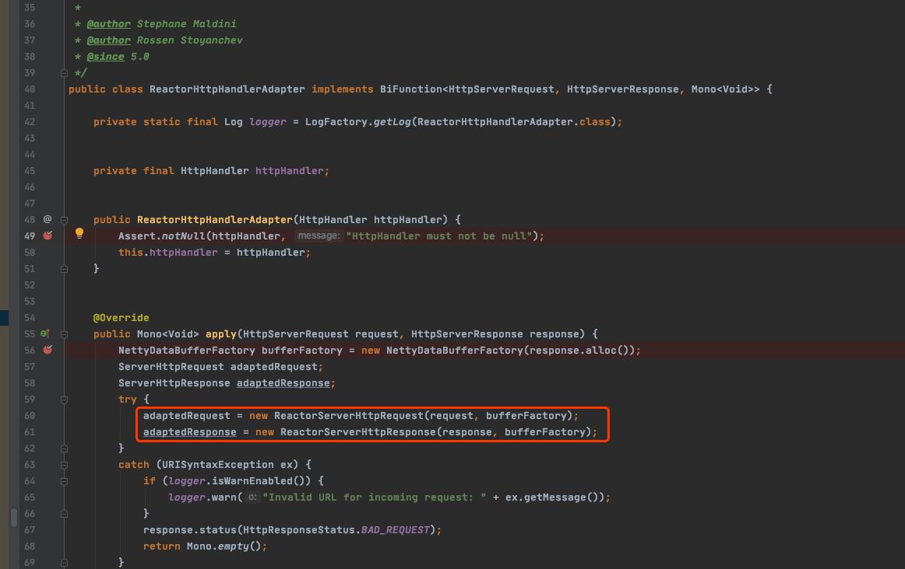
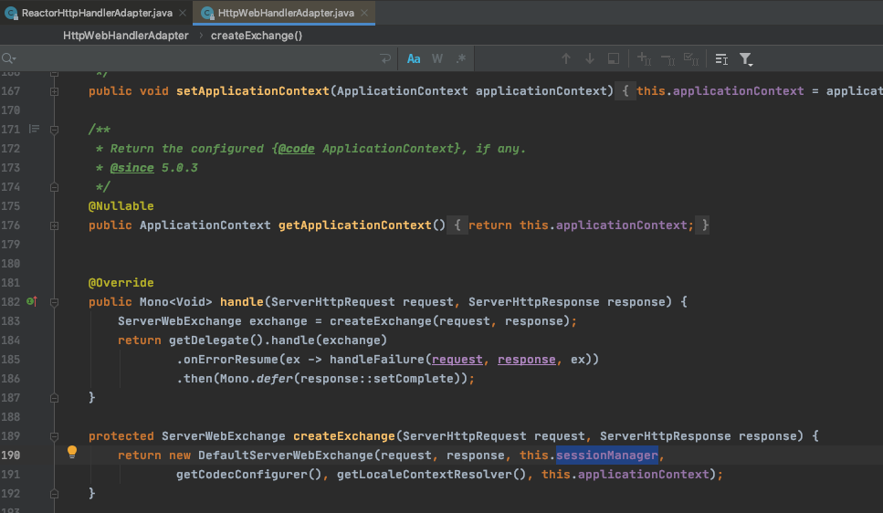

# gatway 中 ServerWebExchange 构建

不管是 zuul, sc gatway 还是基于 netty 的自研网关,都会对请求进来的 Request ,或者 Response 进行包装,转换提取为网关运行的上下文

**SpringCloud Gatway 中网关的上下文是 ServerWebExchange**

## 组装入口

> `ReactorHttpHandlerAdapter` 入口

次方法为 SpringCloud Gateway 请求入库方法,主要是吧收到的 HttpServerRequest 或者最终需要返回的 HttpServerResponse 包装转换为 

- ReactorServerHttpRequest
- ReactorServerHttpResponse

#### 构建 Spring Cloud Gateway 上下文

其中`createExchange`方法将 ServerHttpRequest 和 ServerHttpResponse 构建后才能默认的`DefaultServerWebExchange` 