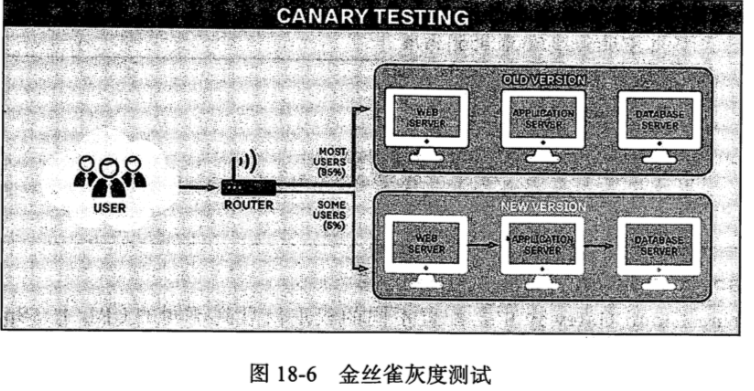
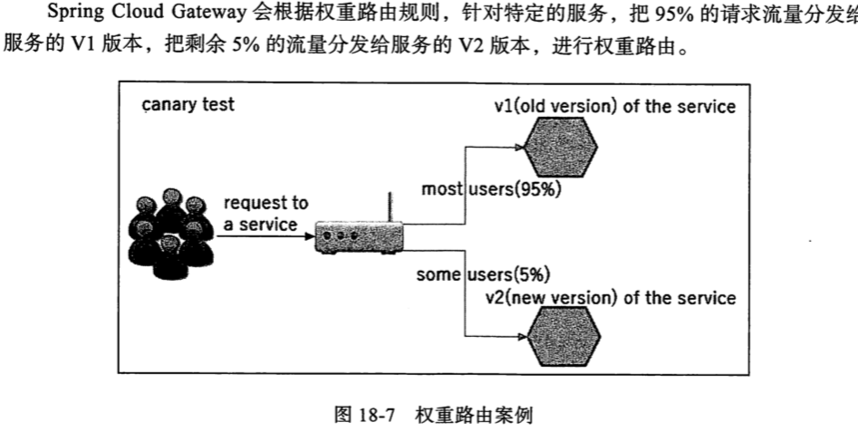
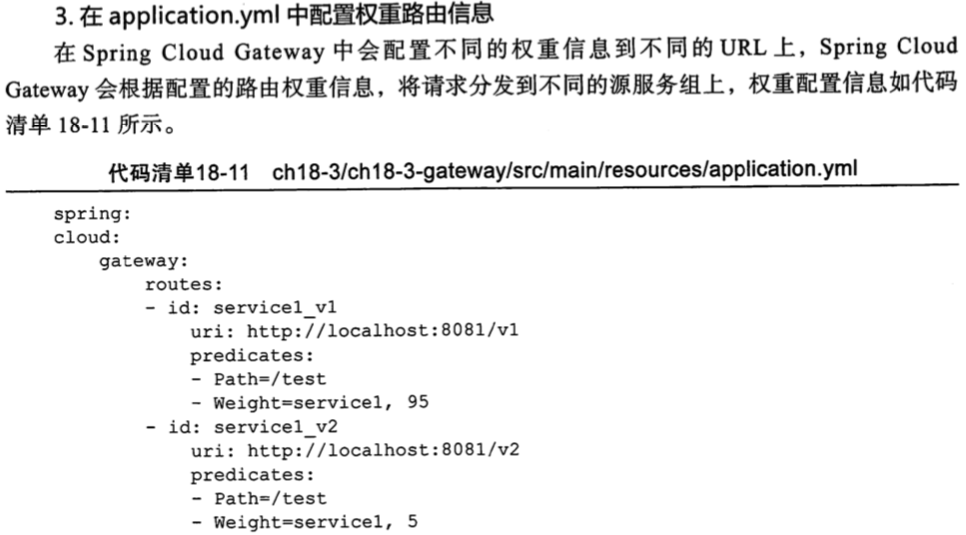

# 权重路由

`WeightRoutePredicateFactory`是一个路由断言工厂, 可以对 url 进行权重路由

## 权重路由的使用场景

当开发,测试的时候,或者线上发布,线上服务多版本控制的时候,需要对服务进行权重路由

比如

- 旧版本是 v1
- 新版本是 v2

在线上灰度的时候,需要通过网关动态实时推送路由权重信息,比如 95%的流量走服务 V1 版本, 5%的流量走服务 V2版本

> Weight=service1,5 路由权重