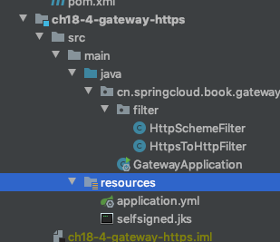
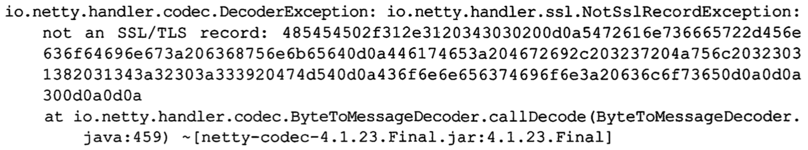
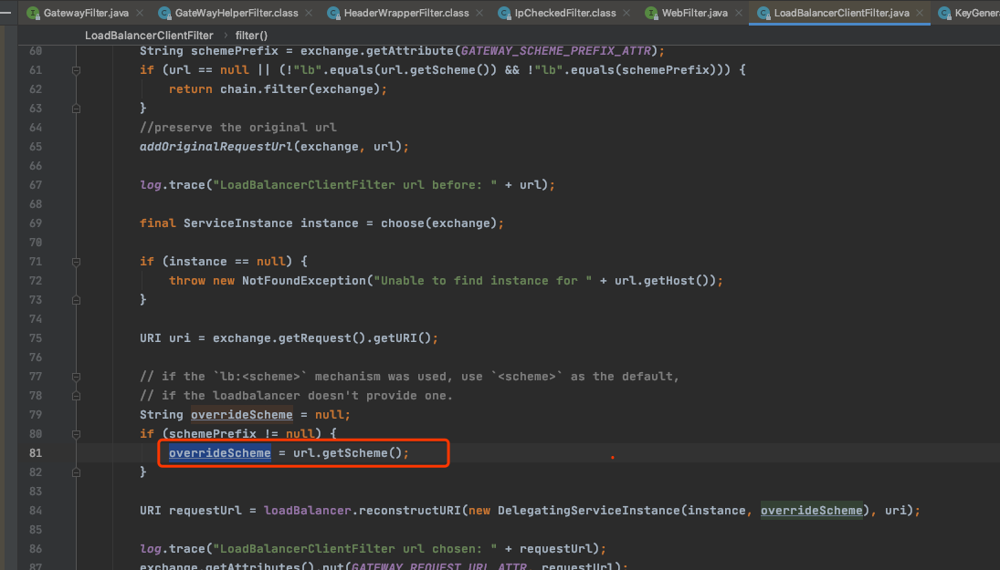

# GateWay Https 使用技巧

https常规的做法是 nginx 配置 SSL 证书,如果要用 SCGatway 来做 API 网关,需要进行配置,将 https 证书放到应用的类路径下面即可



```yml
server:
  ssl:
    key-alias: spring
    enabled: true
    key-password: spring
    key-store: classpath:selfsigned.jks
    key-store-type: JKS
    key-store-provider: SUN
    key-store-password: spring
```

配置证书相关的信息

当我们用 http 去访问 gateway 的时候



会报错,是因为通过 Gateway 进来的请求是 https,但是转发的请求是 http, 就会报`not an SSL/TLS record` 错误

## 源码

`LoadBalancerClientFilter`



可以看到发送的请求是根据 url 的 scheme 来判断的, 如果请求是 https, 那么它就会转发到 http

我们可以使用以下方式修改

- `LoadBalancerClientFilter`执行之前将 https 修改为 http
- `LoadBalancerClientFilter`执行之后将 https 修改为 http

执行之前修改

```java
/**
 * 在LoadBalancerClientFilter执行之前将Https修改为Http
 * https://github.com/spring-cloud/spring-cloud-gateway/issues/378
 */
@Component
public class HttpsToHttpFilter implements GlobalFilter, Ordered {

    private static final int HTTPS_TO_HTTP_FILTER_ORDER = 10099;

    @Override
    public Mono<Void> filter(ServerWebExchange exchange, GatewayFilterChain chain) {
        URI originalUri = exchange.getRequest().getURI();
        ServerHttpRequest request = exchange.getRequest();
        ServerHttpRequest.Builder mutate = request.mutate();
        String forwardedUri = request.getURI().toString();
        if (forwardedUri != null && forwardedUri.startsWith("https")) {
            try {
                URI mutatedUri = new URI("http",
                        originalUri.getUserInfo(),
                        originalUri.getHost(),
                        originalUri.getPort(),
                        originalUri.getPath(),
                        originalUri.getQuery(),
                        originalUri.getFragment());
                mutate.uri(mutatedUri);
            } catch (Exception e) {
                throw new IllegalStateException(e.getMessage(), e);
            }
        }
        ServerHttpRequest build = mutate.build();
        return chain.filter(exchange.mutate().request(build).build());
    }

    /**
     * 由于LoadBalancerClientFilter的order是10100，
     * 要在LoadBalancerClientFilter执行之前将Https修改为Http，需要设置
     * order为10099
     * @return
     */
    @Override
    public int getOrder() {
        return HTTPS_TO_HTTP_FILTER_ORDER;
    }
}

```

#### 执行之后修改

```
/**
 * 在LoadBalancerClientFilter执行之后将Https修改为http
 */
@Component
public class HttpSchemeFilter implements GlobalFilter, Ordered {

    private static final int HTTPS_TO_HTTP_FILTER_ORDER = 10101;


    @Override
    public Mono<Void> filter(ServerWebExchange exchange, GatewayFilterChain chain) {
        Object uriObj = exchange.getAttributes().get(GATEWAY_REQUEST_URL_ATTR);
        if (uriObj != null) {
            URI uri = (URI) uriObj;
            uri = this.upgradeConnection(uri, "http");
            exchange.getAttributes().put(GATEWAY_REQUEST_URL_ATTR, uri);
        }
        return chain.filter(exchange);
    }

    private URI upgradeConnection(URI uri, String scheme) {
        UriComponentsBuilder uriComponentsBuilder = UriComponentsBuilder.fromUri(uri).scheme(scheme);
        if (uri.getRawQuery() != null) {
            // When building the URI, UriComponentsBuilder verify the allowed characters and does not
            // support the '+' so we replace it for its equivalent '%20'.
            // See issue https://jira.spring.io/browse/SPR-10172
            uriComponentsBuilder.replaceQuery(uri.getRawQuery().replace("+", "%20"));
        }
        return uriComponentsBuilder.build(true).toUri();
    }

    /**
     * 由于LoadBalancerClientFilter的order是10100，
     * 所以设置HttpSchemeFilter的的order是10101,
     * 在LoadBalancerClientFilter之后将https修改为http
     * @return
     */
    @Override
    public int getOrder() {
        return HTTPS_TO_HTTP_FILTER_ORDER;
    }
}

```

