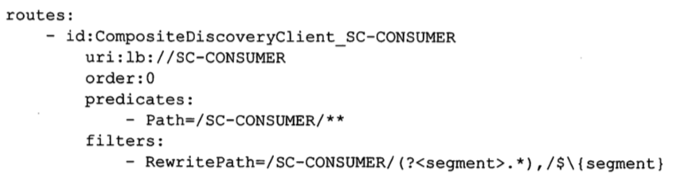

# Gateway 服务发现路由

Spring Cloud Gateway 在不同的注册中心下差异

- eureka

> 访问网关的 URL 是 http://Gateway_HOST:Gateway_PORT/大写的service_id/*
>
> 服务名默认必须是大写,否则会抛404 错误,如果服务名要小写访问
>
> `spring.cloud.gateway.discovery.loactor.lowerCaseServiceId=true`配置解决

- zookeeper 

> 服务名默认小写

- consul  

>服务名默认小写

## 配置

```
spring:
  application:
    name: sc-gateway-server
  cloud:
    gateway:
      discovery:
        locator:
          enabled: true # 是否与服务发现组件结合使用,通过 serviceId 转发到具体的服务实例
          lowerCaseServiceId: true # 当注册中心为 Eureka 时,设置为 true 标识开启用小写 serviceId 进行基于服务路由的转发
```


