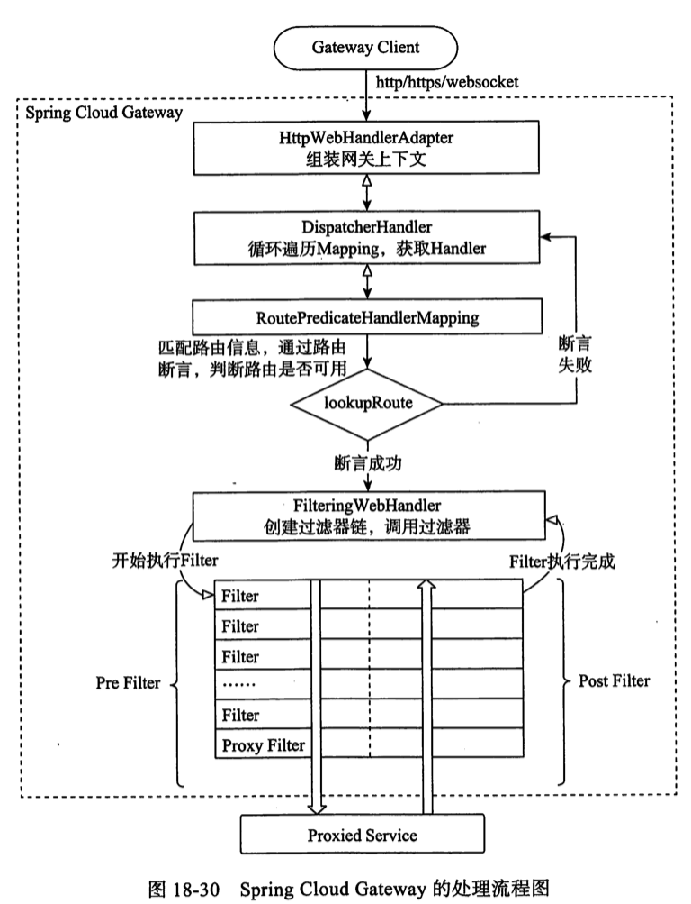

# 处理流程

- `HttpWebHandlerAdapter` : 构建组装网关请求的上下文
- `DispactherHandler`: 所有请求的分发处理器,负责分发请求到对应的处理器
- `RoutePredicateHandlerMapping`: 路由断言处理器映射器,用于路由的查找,以及找到路由后返回对应的 `WebHandler`, `DispactcherHandler`,会依次遍历`HandlerMapping`集合进行处理
- `FilteringWebHandler`:创建过滤器链,使用 Filter 链路处理请求,`RoutePredicateHandlerMapping` 找到路由后返回对应的 `FilteringWebHandler`后对请求进行处理,FilteringWebHandler 负责组装`Filter`链表并调用 Filter 处理请求

