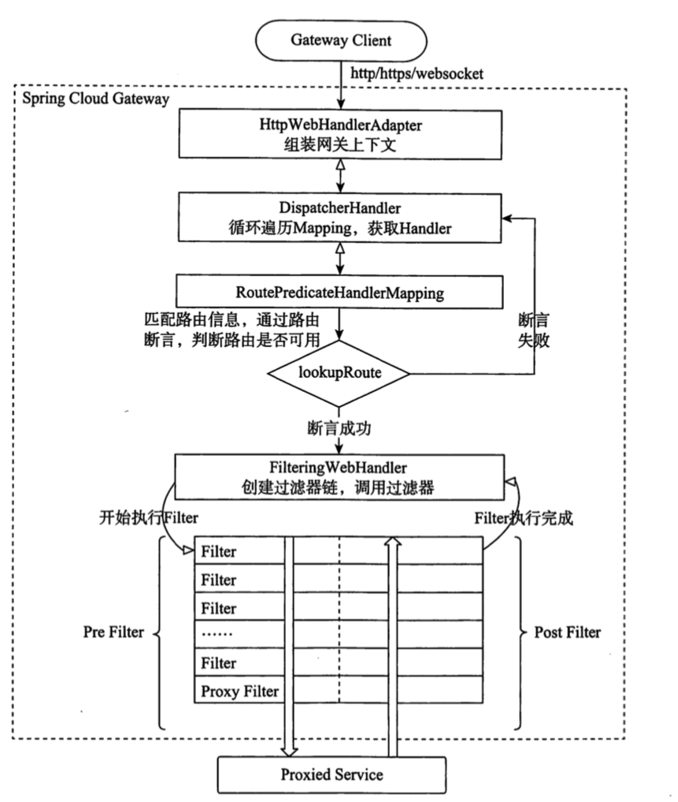
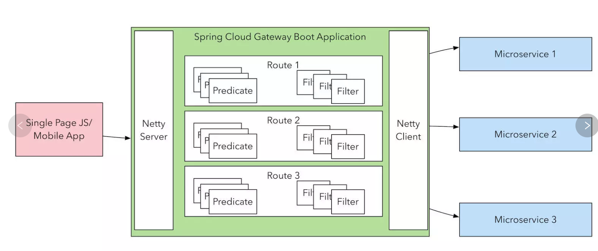

# Spring Cloud Gateway

- Spring 5.0
- SpringBoot 2.0
- Project Reactor 

Spring Cloud Gateway 

## 是什么

- 分布式系统网关

> - 协议适配
> - 协议转发
> - 安全策略(WAF)
> - 防刷
> - 流量
> - 监控日志

一般来说,网关提供 API 全托管服务,丰富的 API管理功能,辅助企业管理大规模 API ,以降低成本和安全风险

网关对外暴露 URL 或者接口信息 , 统称为路由信息

## 怎么工作的


- 客户端发送请求到 `springCloud gataway`
- 如果 `gateway handler mapping` 映射能够匹配这个请求到一个路由,就会发送到 `Gatway Web Handler`
- `Gatway Web Handler` 发送这请求到 fitler 链(过滤器被虚线分隔的原因是，过滤器可能在发送代理请求之前或之后执行逻辑。)
- 执行所有`pre`筛选器逻辑，然后发出代理请求。发出代理请求后，将执行`post`筛选器逻辑。
- 发送到指定路由




> 先走断言,断言成功了才走 filter


## 核心概念



#### 路由(route)

路由是网关最基础的部分,路由信息组成

- 一个 ID

- 一个目的 URL

- 一组断言工厂

  > 如果断言为真,则说明请求的 url 和配置的路由匹配

- 一组 Filter

#### 断言 Predicate

Java8 中的断言函数, SC gatway 项目中的断言函数输入类型是 Spring5.0框架中的 `ServerWebExchange` 

> 有了断言,我们可以断言 Http Request 中的任何信息,比如请求头和参数

#### 过滤器 Filter 

一个标准的 Spring WebFilter , SC Gatway 中的 filter 分为两类

- GatwayFilter

> 网关类型的filter

- GlobalFilter

>  全局 filter ,所有的请求都会被拦截

## 如何使用

## 添加依赖

```xml
<dependency>
    <groupId>org.springframework.cloud</groupId>
    <artifactId>spring-cloud-starter-gateway</artifactId>
</dependency>
```

引入依赖后的开关,默认是开启的

```properties
spring.cloud.gateway.enabled=false
```

不要引入`spring-boot-starter-web` 会有冲突

**Spring Cloud Gateway使用的是Spring Boot和`Spring Webflux`提供的Netty底层环境，不能和传统的Servlet容器一起使用，也不能打包成一个WAR包。**


