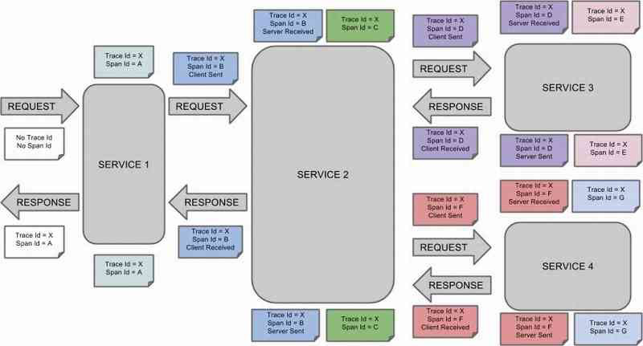
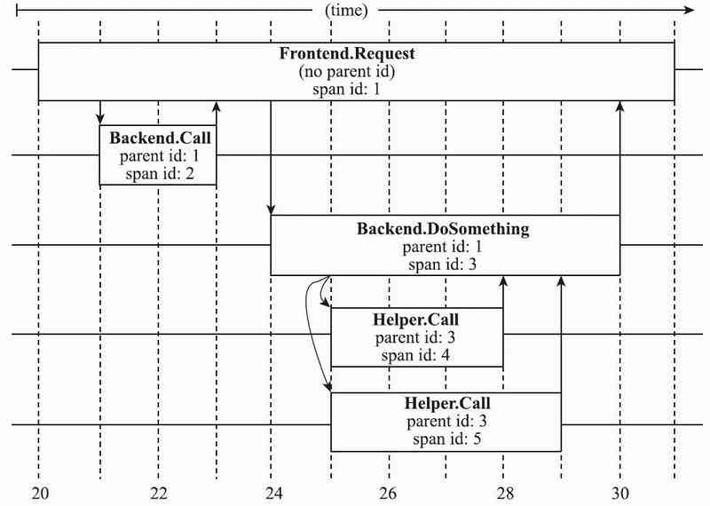
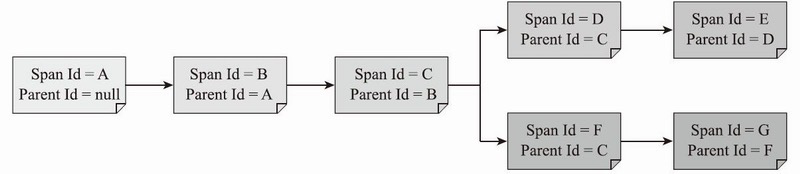

# 041-基础术语详解

[TOC]

## 基础概念

Span。基本工作单元，一次链路调用(可以是发起RPC和写DB等操作，没有特定的限制)创建一个Span，通过一个64位ID标识它，使用UUID较为方便。Span中还有其他的数据，例如描述信息、时间戳、键值对的(注解)tag信息和parent-id等，其中parent-id可以表示Span调用链路来源。

- Trace。类似于树结构的Span集合，表示一条调用链路，存在唯一标识。
- 注解(Annotation)。用来记录请求特定事件的相关信息(例如时间)，通常包含四个注解信息：
  - CS：Client Sent，表示客户端发起请求。
  - SR：Server Received，表示服务端收到请求。
  - SS：Server Send，表示服务端完成处理，并将结果发送给客户端。
  - CR：Client Received，表示客户端获取到服务端返回信息。

### 1.Trace

一系列Span组成的树形结构 , 简而言之就是一次调用请求

- 客户端请求SERVICE 1，SERVICE 1 调用SERVICE 2，

- 在SERVICE 2中又调用了SERVICE 3和SERVICE 4，最终由SERVICE 1将请求的响应结果返回给客户端。在这一次调用链中，请求拥有唯一的表示TraceId=X。
  

通过Span Id区分不同的Span，图中展示了A到G共计7个Span。

- 一条链路通过Trace Id唯一标识，Span标识所发起的请求信息。树节点是整个架构的基本单元，而每一个节点又是对Span的引用。

节点之间的连线表示Span和它的父Span直接的关系。虽然Span在日志文件中只是简单地代表Span的开始和结束时间，他们在整个树形结构中却是相对独立的。

- Trace Id = X
- Span Id = D
- Client Sent

如上的信息表明了当前Span的Trace Id设为X，Span Id设为D，并且表明发生了客户端发起请求的事件。

### 2. Span

Span是基本工作单元 ,  比如发送一次RPC请求就是一个新的Span,

- Span 通过一个64位的唯一标识, 还有描述, 事件事件戳, 标签, 调用它的SpanId, 处理器ID(一般是ip)

- 第一个span是 Root Span , 它的ID和 trace ID的值是一样的

下图展示了Span之间的父子关系，根节点为A，子节点B设置自己的父节点为A，依次向下延伸。

### 3. 注解

用来记录请求特定事件的相关信息(例如时间)，通常包含四个注解信息：

- CS：Client Sent，表示客户端发起请求。
- SR：Server Received，表示服务端收到请求。
- SS：Server Send，表示服务端完成处理，并将结果发送给客户端。
- CR：Client Received，表示客户端获取到服务端返回信息。

自动探针不需要修改应用程序源代码，探针埋点对应用开发者来说近乎透明。Dapper还允许应用程序开发人员在Dapper跟踪的过程中添加额外的信息，以监控更高级别的系统行为，或帮助调试问题。

