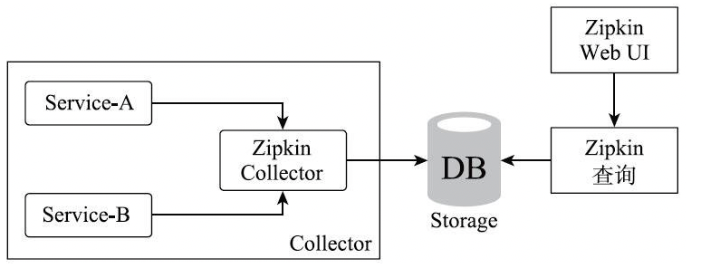

# 010-什么是Zipkin

[TOC]

## 1 什么是Zipkin

Zipkin是一个分布式的链路追踪系统。

## 2 Zipkin有什么用

在定位微服务架构中的问题时，Zipkin有助于收集所需的时序数据。

Zipkin主要涉及几个组件：

- Collector(收集agent的数据)
- Storage(存储)
- Web UI(图形化界面)

Collector收集agent的数据有两种方式：

- HTTP调用
- MQ(消息中间件)通信。

Zipkin客户端服务默认是通过HTTP方式发送链路追踪信息到Zipkin Collector，

- HTTP方式是同步调用，对原有请求会产生一些影响；
- MQ通信则是使用异步方式收集链路调用信息，虽有一定的延时，但是总体性能较高

## 两种方式

-  [020-使用HTTP与Zipkin对接.md](020-使用HTTP与Zipkin对接.md) 
-  [030-使用MQ与Zipkin对接.md](030-使用MQ与Zipkin对接.md) 

## 