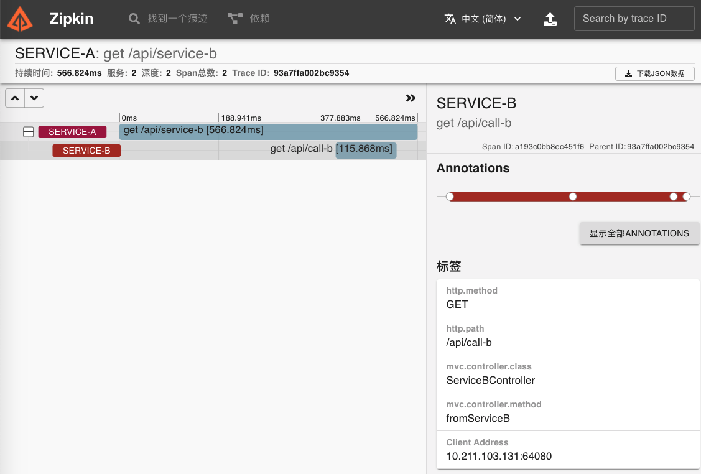

# 020-使用HTTP与Zipkin对接

[TOC]

## Zipkin Server

zipkin-server是一个Spring Boot应用程序，打包为一个可执行的jar。https://github.com/openzipkin/brave-example

```shell
$ curl -sSL https://zipkin.io/quickstart.sh | bash -s
$ java -jar zipkin.jar
```


通过如上的脚本，即可启动一个Zipkin Server。Span存储方式和Collector是可配置的。

默认情况下，存储位于内存中，采用Http Collector的方式进行数据收集，并且在端口9411上进行侦听。

Zipkin UI提供了图形化展示链路调用情况以及服务之间的依赖。为了让示例简单，Zipkin Server采用默认的内存数据库。

## Zipkin Client改造

首先，需要在依赖中加入Sleuth的Zipkin包，如下所示：

```xml
〈dependency〉
		〈groupId〉org.springframework.cloud〈/groupId〉
    〈artifactId〉spring-cloud-starter-zipkin〈/artifactId〉
〈/dependency〉
```

其次，配置文件中，增加Zipkin Server的配置信息，如下所示：

```yaml
spring:
    sleuth:
        sampler:
            probability: ${ZIPKIN_RATE:1}
    zipkin:
        base-url: http://localhost:9411
```

配置中设置了请求的采集率。当使用Zipkin时，通过设置spring.sleuth.sampler.probability配置导出Span的概率(默认值：0.1，即10%)。

默认值可能会让你觉得Sleuth不工作，因为它省略了一些Span；另外配置中还设置了通过HTTP方式发送到Zipkin的地址。

## 调用结果展示

步骤如下：

- 相继启动Eureka Server、Zipkin Server以及两个客户端服务Service-A/B。
- 交叉访问A/B服务的接口，如下所示：

http://localhost:9002/api/service-b：通过服务A调用服务B；
http://localhost:9003/api/service-a：通过服务B调用服务A



## 不足之处

需要注意的是，如果客户端服务的配置不设置采样率，即spring.sleuth.sampler.probability使用默认的10%采样率时，可能刷新几次并不会看到任何数据。如果调大此值为1，信息收集就会更及时。

但是当这样调整后，会发现REST接口调用速度比0.1的情况下慢了很多，即使在10%的采样率下，多次刷新客户端服务的接口，会发现对同一个请求的两次耗时信息相差非常大。如果去掉spring-cloud-sleuth后再进行测试，并没有这种情况，因此使用HTTP调用方式追踪服务调用链路会给业务程序性能带来一定的影响。

## 发送流程

客户端向zipkin-server程序发送数据使用的是HTTP的方式通信，每次发送时涉及连接和发送过程；

- 当zipkin-server程序关闭或者重启过程中，会出现发送的数据丢失，这是因为客户端通过HTTP的方式与zipkin-server通信。
- 针对上述问题，需要进行相应的改进。
  - 首先，客户端数据的发送尽量减少业务线程的时间消耗，采用异步等方式发送所收集的信息；
  - 其次，客户端与zipkin-server之间增加缓存类的中间件，例如Redis、MQ等，在zipkin-server程序挂掉或重启过程中，客户端依旧可以正常发送自己收集的信息。

