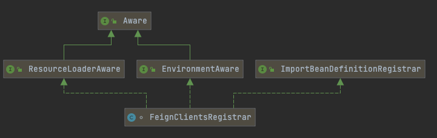

# 010-FeignClientsRegisterar

[TOC]

## 一言蔽之             


## @EnableFeignClients基础原理

@EnableFeignClients的基本作用就像是OpenFeign的开关一样，一切OpenFeign的相关操作都是从它开始的。

@EnableFeignClients有三个作用

- 一是引入FeignClientsRegistrar；
- 二是指定扫描FeignClient的包信息，就是指定FeignClient接口类所在的包名；
- 三是指定FeignClient接口类的自定义配置类。@EnableFeignClients注解的定义如下所示：

```java
//EnableFeignClients.java
@Retention(RetentionPolicy.RUNTIME)
@Target(ElementType.TYPE)
@Documented
//ImportBeanDefinitionRegistrar的子类,用于处理@FeignClient注解
@Import(FeignClientsRegistrar.class)
public @interface EnableFeignClients {
    // 下面三个函数都是为了指定需要扫描的包
    String[] value() default {};
    String[] basePackages() default {};
    Class〈?>[] basePackageClasses() default {};
    // 指定自定义feign client的自定义配置，可以配置Decoder、Encoder和Contract等组件,
  	//FeignClientsConfiguration是默认的配置类
    Class〈?>[] defaultConfiguration() default {};
    // 指定被@FeignClient修饰的类，如果不为空，那么路径自动检测机制会被关闭
  	Class〈?>[] clients() default {};
}
```

上面的代码中，FeignClientsRegistrar是ImportBeanDefinitionRegistrar的子类，Spring用ImportBeanDefinitionRegistrar来动态注册BeanDefinition。

相关知识点:  [090-Spring-enabed模块注解.md](../../../../02-spring-framework-documentation/017-Spring注解/090-Spring-enabed模块注解.md) 

## FeignClientsRegistrar

OpenFeign通过FeignClientsRegistrar来处理@FeignClient修饰的FeignClient接口类，将这些接口类的BeanDefinition注册到Spring容器中，这样就可以使用@Autowired等方式来自动装载这些FeignClient接口类的Bean实例。

FeignClientsRegistrar的部分代码如下所示：



- Spring用ImportBeanDefinitionRegistrar来动态注册BeanDefinition

## FeignClientsRegistrar源码

```java
//FeignClientsRegistrar.java
class FeignClientsRegistrar implements ImportBeanDefinitionRegistrar,ResourceLoaderAware, BeanClassLoaderAware, EnvironmentAware {
    ...
    @Override
    public void registerBeanDefinitions(AnnotationMetadata metadata, BeanDefinitionRegistry registry) {
        //从EnableFeignClients的属性值来构建Feign的自定义Configuration进行注册
        registerDefaultConfiguration(metadata, registry);
        //扫描package，注册被@FeignClient修饰的接口类的Bean信息
        registerFeignClients(metadata, registry);
    }
    ...
}
```

FeignClientsRegistrar的registerBeanDefinitions方法主要做了两个事情，

- 一是注册@EnableFeignClients提供的自定义配置类中的相关Bean实例
- 二是根据@EnableFeignClients提供的包信息扫描@FeignClient注解修饰的FeignCleint接口类，然后进行Bean实例注册。

### feign客户端注册器-注册默认配置阶段-registerDefaultConfiguration

-  [011-feign客户端注册器-注册默认FeignClient-BeanDefinition-registerDefaultConfiguration.md](011-feign客户端注册器-注册默认FeignClient-BeanDefinition-registerDefaultConfiguration.md) 

### feign客户端扫描注册类信息-registerFeignClients

-  [020-feign客户端扫描类信息-registerFeignClients.md](020-feign客户端扫描类信息-registerFeignClients.md) 


