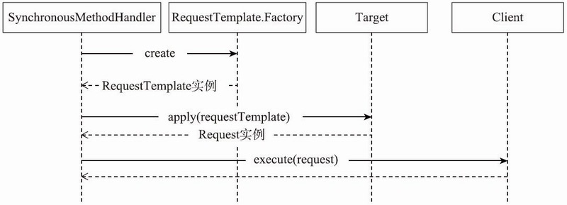

# 060-函数调用和网络请求

[TOC]

## 函数调用流程

在配置和实例生成结束之后，就可以直接使用FeignClient接口类的实例，调用它的函数来发送网络请求。

在调用其函数的过程中，由于设置了MethodHandler，所以最终函数调用会执行SynchronousMethodHandler的invoke方法。

在该方法中，OpenFeign会将函数的实际参数值与之前生成的RequestTemplate进行结合，然后发送网络请求。

下图是OpenFeign发送网络请求时几个关键类的交互流程图，大概分为三个阶段：

- 一是将函数实际参数值添加到RequestTemplate中；
- 二是调用Target生成具体的Request对象；
- 三是调用Client来发送网络请求，然后将Response转化为对象进行返回。



invoke方法的代码如下所示：

```java
//SynchronousMethodHandler.java
final class SynchronousMethodHandler implements MethodHandler {
    public Object invoke(Object[] argv) throws Throwable {
        //根据函数参数创建RequestTemplate实例，buildTemplateFromArgs是RequestTemplate.
          Factory接口的实例，在当前状况下是
        //BuildTemplateByResolvingArgs类的实例
        RequestTemplate template = buildTemplateFromArgs.create(argv);
        Retryer retryer = this.retryer.clone();
        while (true) {
            try {
                return executeAndDecode(template);
            } catch (RetryableException e) {
                retryer.continueOrPropagate(e);
                if (logLevel != Logger.Level.NONE) {
                    logger.logRetry(metadata.configKey(), logLevel);
                }
                continue;;
            }
        }
    }
}
```

如上代码所示，SynchronousMethodHandler的invoke方法先创建了RequestTemplate对象。

在该对象的创建过程中，使用到之前收集的函数信息MethodMetadata。

- 遍历MethodMetadata中参数相关的indexToName，然后根据索引从invoke的参数数组中获得对应的值，将其填入对应的键值对中。然后依次处理查询和头部相关的参数值。
- invoke方法调用RequestTemplate.Factory的create方法创建RequestTemplate对象，代码如下所示：

```java
//RequestTemplate.Factory
public RequestTemplate create(Object[] argv) {
    RequestTemplate mutable = new RequestTemplate(metadata.template());
    //设置URL
        if (metadata.urlIndex() != null) {
        int urlIndex = metadata.urlIndex();
        checkArgument(argv[urlIndex] != null, "URI parameter %s was null", urlIndex);
        mutable.insert(0, String.valueOf(argv[urlIndex]));
    }
    Map<String, Object> varBuilder = new LinkedHashMap<String, Object>();
    //遍历MethodMetadata中所有关于参数的索引及其对应名称的配置信息
    for (Entry<Integer, Collection<String>> entry : metadata.indexToName().entrySet()) {
    int i = entry.getKey();
    //entry.getKey就是参数的索引
    Object value = argv[entry.getKey()];
    if (value != null) { // Null values are skipped.
        //indexToExpander保存着将各种类型参数的值转换为string类型的Expander转换器
        if (indexToExpander.containsKey(i)) {
        //将value值转换为string
        value = expandElements(indexToExpander.get(i), value);
        }
        for (String name : entry.getValue()) {
        varBuilder.put(name, value);
        }
    }
    RequestTemplate template = resolve(argv, mutable, varBuilder);
    //设置queryMap参数
    if (metadata.queryMapIndex() != null) {
    template = addQueryMapQueryParameters((Map<String, Object>) argv[metadata.queryMapIndex()], template);
    }
    //设置headersMap参数
    if (metadata.headerMapIndex() != null) {
    template = addHeaderMapHeaders((Map<String, Object>) argv[metadata.headerMapIndex()], template);
    }
    return template;
}
```

resolve首先会替换URL中的pathValues，然后对URL进行编码，接着将所有头部信息进行转化，最后处理请求的Body数据，如下所示：

```java
//RequestTemplate.Factory
RequestTemplate resolve(Map<String, ?> unencoded, Map<String, Boolean> alreadyEncoded) {
    //替换query数值，将{queryVariable}替换成实际值
    replaceQueryValues(unencoded, alreadyEncoded);
    Map<String, String> encoded = new LinkedHashMap<String, String>();
    //把所有的参数都进行编码
    for (Entry<String, ?> entry : unencoded.entrySet()) {
        final String key = entry.getKey();
        final Object objectValue = entry.getValue();
        String encodedValue = encodeValueIfNotEncoded(key, objectValue, alreadyEncoded);
        encoded.put(key, encodedValue);
    }
    //编码url
    String resolvedUrl = expand(url.toString(), encoded).replace("+", "%20");
    if (decodeSlash) {
        resolvedUrl = resolvedUrl.replace("%2F", "/");
    }
    
    ", "/");
    }
    url = new StringBuilder(resolvedUrl);
    Map<String, Collection<String>> resolvedHeaders = new LinkedHashMap<String, Collection<String>>();
    //将头部都进行串行化
    for (String field : headers.keySet()) {
        Collection<String> resolvedValues = new ArrayList<String>();
        for (String value : valuesOrEmpty(headers, field)) {
            String resolved = expand(value, unencoded);
            resolvedValues.add(resolved);
        }
        resolvedHeaders.put(field, resolvedValues);
    }
    headers.clear();
    headers.putAll(resolvedHeaders);
    //处理body
    if (bodyTemplate != null) {
        body(urlDecode(expand(bodyTemplate, encoded)));
    }
    return this;
}
```

executeAndDecode方法会根据RequestTemplate生成Request对象，然后交给Client实例发送网络请求，最后返回对应的函数返回类型的实例。executeAndDecode方法的具体实现如下所示：

```java
//SynchronousMethodHandler.java
Object executeAndDecode(RequestTemplate template) throws Throwable {
    //根据RequestTemplate生成Request
    Request request = targetRequest(template);
    Response response;
    //client发送网络请求，client可能为okhttpclient和apacheClient
    try {
        response = client.execute(request, options);
        response.toBuilder().request(request).build();
    } catch (IOException e) {
        //...
    }
    try {
        //如果response的类型就是函数返回类型，那么可以直接返回
        if (Response.class == metadata.returnType()) {
            if (response.body() == null) {
                return response;
            }
            // 设置body
            byte[] bodyData = Util.toByteArray(response.body().asInputStream());
            return response.toBuilder().body(bodyData).build();
          }
        } catch (IOException e) {
            //...
    }
}
```

