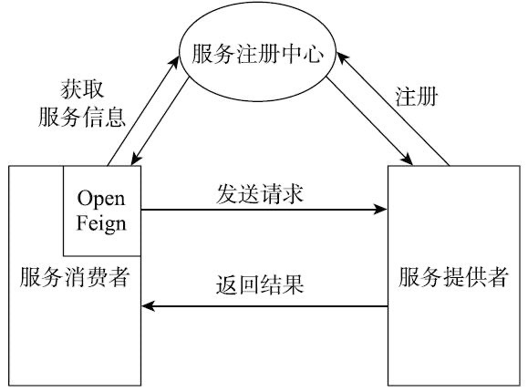

# 010-open-feign的基础介绍

OpenFeign是一个声明式RESTful网络请求客户端。OpenFeign会根据带有注解的函数信息构建出网络请求的模板，在发送网络请求之前，OpenFeign会将函数的参数值设置到这些请求模板中。虽然OpenFeign只能支持基于文本的网络请求，但是它可以极大简化网络请求的实现，方便编程人员快速构建自己的网络请求应用。

## OpenFeign的应用架构

如图5-1所示，使用OpenFeign的Spring应用架构一般分为三个部分，分别为服务注册中心、服务提供者和服务消费者。

- 服务提供者向服务注册中心注册自己

- 服务消费者通过OpenFeign发送请求时
- OpenFeign会向服务注册中心获取关于服务提供者的信息，然后再向服务提供者发送网络请求。
  

## Openfeign的大体步骤

OpenFeign可以通过多种方式进行自定义配置，配置的变化会导致接口类初始化时使用不同的Bean实例，从而控制OpenFeign的相关行为，比如说网络请求的编解码、压缩和日志处理。

可以说，了解OpenFeign配置和实例初始化的流程与原理对于我们学习和使用OpenFeign有着至关重要的作用，而且Spring Cloud的所有项目的配置和实例初始化过程的原理基本相同，了解了OpenFeign的原理，就可以触类旁通，一通百通了。

> 

1. [注册FeignClient配置类和FeignClient BeanDefinition](#注册FeignClient配置类和FeignClient BeanDefinition)
2. [实例化Feign上下文对象FeignContext](#实例化Feign上下文对象FeignContext)
3. [创建Feign.builder对象](#创建Feign.builder对象)
4. [生成负载均衡代理类](#生成负载均衡代理类)
5. [生成默认代理类](#生成默认代理类)
6. [注入到spring容器](#注入到spring容器)

## 注册FeignClient配置类和FeignClient BeanDefinition

 [011-注册FeignClient配置类和FeignClient-BeanDefinition.md](011-注册FeignClient配置类和FeignClient-BeanDefinition.md) 

## 实例化Feign上下文对象FeignContext

 [012-实例化Feign上下文对象FeignContext.md](012-实例化Feign上下文对象FeignContext.md) 

## 创建Feign.builder对象

 [013-创建Feign.builder对象.md](013-创建Feign.builder对象.md) 

## 生成负载均衡代理类

 [014-生成负载均衡代理类.md](014-生成负载均衡代理类.md) 

## 生成默认代理类

理解了第四步的逻辑，生成默认代理类就很容易理解了，唯一不同点就是`client`的实现类为`loadBalanceClient`。

> 注意：不管是哪种代理类，最终发起请求还是由`Feign.Default`中的`execute`方法完成，默认使用`HttpUrlConnection`实现。

## 注入到spring容器

## 总结：通过`spring refresh()`方法，触发`FeignClientFactoryBean.getObject()`方法获得了代理类，然后完成注入`spring`容器的过程。该实现方式同`Dubbo`的实现方式类似，有兴趣的可以自行研究噢。