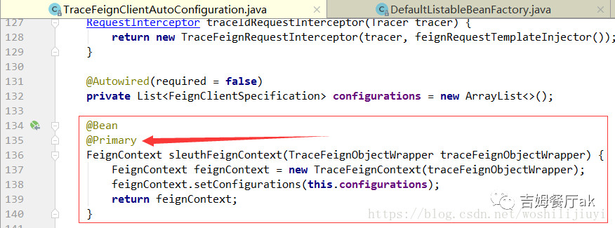

## 实例化Feign上下文对象FeignContext

上述方法中第一行便是实例化`FeignContext`：

```
FeignContext context = applicationContext.getBean(FeignContext.class);
```

获取`FeignContext`对象，如果没有实例化，则主动实例化，如下：

```java
@Configuration
@ConditionalOnClass(Feign.class)
public class FeignAutoConfiguration {

    @Autowired(required = false)
    private List<FeignClientSpecification> configurations = new ArrayList<>();

    @Bean
    public HasFeatures feignFeature() {
        return HasFeatures.namedFeature("Feign", Feign.class);
    }

    @Bean
    public FeignContext feignContext() {
        FeignContext context = new FeignContext();
        //将feign的配置类设置到feign的容器当中
        context.setConfigurations(this.configurations);
        return context;
    }
}
```

可以看到feign的配置类设置到feign的容器当中，而集合中的元素 正是上面我们提到的两处调用`registerClientConfiguration`方法添加进去的，前后呼应。

然而，当我们引入了`sleuth`之后，获取的`feignContext`却是`TraceFeignClientAutoConfiguration`中配置的实例`sleuthFeignContext`:



可以看到上面创建了一个`TraceFeignContext`实例，因为该对象继承`FeignContext`，同时又加了`@Primary`注解，所以在上面第2步中通过类型获取:
`applicationContext.getBean(FeignContext.class);`，最终拿到的是`TraceFeignContext`。

## 