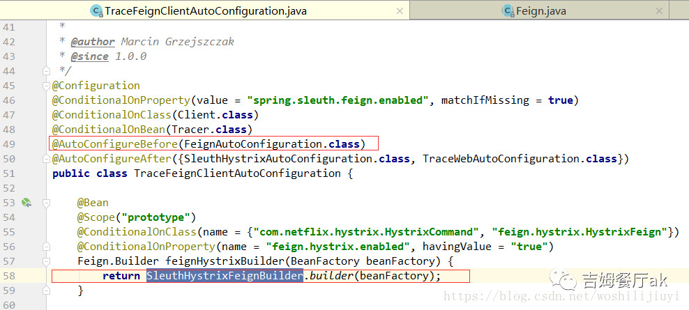

# 创建Feign.builder对象

继续跟进该方法：

```java
Feign.Builder builder = feign(context);
protected Feign.Builder feign(FeignContext context) {
        Logger logger = getOptional(context, Logger.class);

        if (logger == null) {
            logger = new Slf4jLogger(this.type);
        }

        // 1、构造 Feign.Builder
        Feign.Builder builder = get(context, Feign.Builder.class)
                // required values
                .logger(logger)
                .encoder(get(context, Encoder.class))
                .decoder(get(context, Decoder.class))
                .contract(get(context, Contract.class));


        // 2、设置重试策略，log等组件

         //设置log级别
        Logger.Level level = getOptional(context, Logger.Level.class);
        if (level != null) {
            builder.logLevel(level);
        }
        //设置重试策略
        Retryer retryer = getOptional(context, Retryer.class);
        if (retryer != null) {
            builder.retryer(retryer);
        }
        //feign的错误code解析接口
        ErrorDecoder errorDecoder = getOptional(context, ErrorDecoder.class);
        if (errorDecoder != null) {
            builder.errorDecoder(errorDecoder);
        }
        //超时时间设置，连接超时时间：connectTimeout默认10s，请求请求超时时间：readTimeout默认60s
        Request.Options options = getOptional(context, Request.Options.class);
        if (options != null) {
            builder.options(options);
        }
        //拦截器设置，可以看出拦截器也是可以针对单独的feignClient设置
        Map<String, RequestInterceptor> requestInterceptors = context.getInstances(
                this.name, RequestInterceptor.class);
        if (requestInterceptors != null) {
            builder.requestInterceptors(requestInterceptors.values());
        }

        if (decode404) {
            builder.decode404();
        }

        return builder;
    }
```

上述代码有两处逻辑，分别来看：

#### `Feign.Builder builder = get(context, Feign.Builder.class)` ，又会有以下三种情况：

1. 单独使用Feign，没有引入 `sleuth`、`hystrix`：

```java
    @Bean
    @Scope("prototype")
    @ConditionalOnMissingBean
    public Feign.Builder feignBuilder(Retryer retryer) {
        return Feign.builder().retryer(retryer);
    }
```

2. 引入了`hystrix`,没有引入`sleuth`:
   通过加载`FeignClientsConfiguration`的配置创建`HystrixFeign`的静态内部类：`HystrixFeign.Builder`

```java
    @Configuration
    @ConditionalOnClass({ HystrixCommand.class, HystrixFeign.class })
    protected static class HystrixFeignConfiguration {
        @Bean
        @Scope("prototype")
        @ConditionalOnMissingBean
        @ConditionalOnProperty(name = "feign.hystrix.enabled", matchIfMissing = false)
        public Feign.Builder feignHystrixBuilder() {
            return HystrixFeign.builder();
        }
    }
```

3. 同时引入`hystrix` 和 `sleuth`:
   加载`TraceFeignClientAutoConfiguration`的配置创建：`HystrixFeign.Builder`：



注意：

- `TraceFeignClientAutoConfiguration`的配置类加载一定是在`FeignClientsConfiguration`之前（先加载先生效），而`FeignClientsConfiguration`加载是通过`FeignAutoConfiguration`完成的，所以上图中引入了条件注解：

  ```java
  @AutoConfigureBefore({FeignAutoConfiguration.class})
  ```

- 创建的`builder`对象和第二种情况一下，只是做了一层包装：

```java
 final class SleuthFeignBuilder {

    private SleuthFeignBuilder() {}

    static Feign.Builder builder(Tracer tracer, HttpTraceKeysInjector keysInjector) {
        return HystrixFeign.builder()
                //各组件`client，retryer，decoder`进行增强，装饰器模式。
                .client(new TraceFeignClient(tracer, keysInjector))
                .retryer(new TraceFeignRetryer(tracer))
                .decoder(new TraceFeignDecoder(tracer))
                .errorDecoder(new TraceFeignErrorDecoder(tracer));
    }
}
```

#### 设置重试策略，log等组件

Feign.builder在获取之后又分别指定了重试策略，日志级别，错误代码code等，在上一步中调用`SleuthFeignBuilder.build()`时已经设置过默认值了，这里为什么要重复设置呢？

我们跟进去get()方法，一探究竟：

```java
  protected <T> T get(FeignContext context, Class<T> type) {
        //根据name，也就是服务名称来生成builder
        T instance = context.getInstance(this.name, type);
        if (instance == null) {
            throw new IllegalStateException("No bean found of type " + type + " for "
                    + this.name);
        }
        return instance;
    }
    public <T> T getInstance(String name, Class<T> type) {
        //这里获取AnnotationConfigApplicationContext容器
        AnnotationConfigApplicationContext context = getContext(name);
        if (BeanFactoryUtils.beanNamesForTypeIncludingAncestors(context,
                type).length > 0) {
            return context.getBean(type);
        }
        return null;
    }

    private Map<String, AnnotationConfigApplicationContext> contexts = new ConcurrentHashMap<>();

    protected AnnotationConfigApplicationContext getContext(String name) {
        if (!this.contexts.containsKey(name)) {
            synchronized (this.contexts) {
                if (!this.contexts.containsKey(name)) {
                    //这里创建容器createContext(name)
                    this.contexts.put(name, createContext(name));
                }
            }
        }
        return this.contexts.get(name);
    }
```

重点来了，上述代码将FeignContext做了缓存，每个服务对应一个FeignContext，服务名作为key。
继续跟进`createContext(name)`方法：

```
protected AnnotationConfigApplicationContext createContext(String name) {
        //注意：这里的容器并不是spring的容器，而是每次都重新创建一个
        AnnotationConfigApplicationContext context = new AnnotationConfigApplicationContext();
        //加载每个服务对应的配置类
        if (this.configurations.containsKey(name)) {
            for (Class<?> configuration : this.configurations.get(name)
                    .getConfiguration()) {
                context.register(configuration);
            }
        }
        //加载启动类@EnableFeignClients注解指定的配置类
        for (Map.Entry<String, C> entry : this.configurations.entrySet()) {
            if (entry.getKey().startsWith("default.")) {
                for (Class<?> configuration : entry.getValue().getConfiguration()) {
                    context.register(configuration);
                }
            }
        }
        //注册默认的配置类：FeignClientsConfiguration
        context.register(PropertyPlaceholderAutoConfiguration.class,
                this.defaultConfigType);
        context.getEnvironment().getPropertySources().addFirst(new MapPropertySource(
                this.propertySourceName,
                Collections.<String, Object> singletonMap(this.propertyName, name)));
        if (this.parent != null) {
            // Uses Environment from parent as well as beans
            context.setParent(this.parent);
        }
        //刷新容器
        context.refresh();
        return context;
    }
```

可以看到上述AnnotationConfigApplicationContext容器并非spring容器，只是利用了spring刷新容器的方法来实例化配置类，以服务名作为key，配置隔离。

**重点来了，上面加载配置的顺序为：**

- **先加载每个服务的配置类**
- **然后加载启动类注解上的配置类**
- **最后加载默认的配置类。**

**这样做有什么好处？ spring刷新容器的方法也是对所有的bean进行了缓存，如果已经创建，则不再实例化。所以优先选取每个FeignClient的配置类，最后默认的配置类兜底。**

所以这也证明了`sleuth`的配置一定在`feign`的配置类之前加载。
至此，`FeignBuilder`构造流程结束。