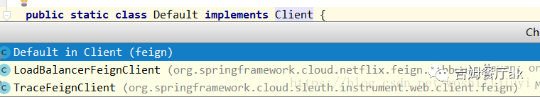
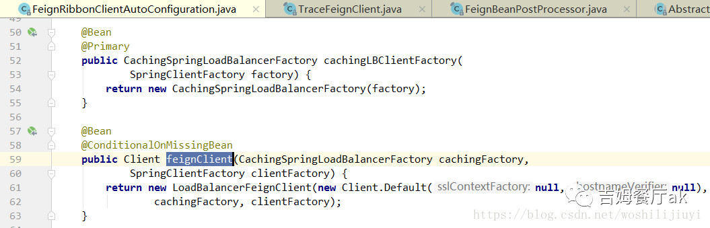

# 生成负载均衡代理类

再贴一下生成代理类的入口：

```java
//判断url是否为空 
if (!StringUtils.hasText(this.url)) {
  //......
  return loadBalance(builder, context, new HardCodedTarget<>(this.type,
                                                             this.name, url));
}
//......
return targeter.target(this, builder, context, new HardCodedTarget<>(
  this.type, this.name, url));
```

这里有个重要判断：判断FeignClient声明的url是否为空，来判断具体要生成的代理类。如下：
这么做有什么意义？

- 如果为空，则默认走Ribbon代理，也就是这个入口，会有加载ribbon的处理。
  `@FeignClient("MyFeignClient")`
- 如果不为空，指定url，则走默认生成代理类的方式，也就是所谓的硬编码。
  `@FeignClient(value = "MyFeignClient",url = "http://localhost:8081")`
  这样处理方便开发人员进行测试，无需关注注册中心，直接http调用，是个不错的开发小技巧。

> 生产环境也可以用上述第二种方式，指定域名的方式。

我们跟进`loadBalance`方法：

------

```
    protected <T> T loadBalance(Feign.Builder builder, FeignContext context,
            HardCodedTarget<T> target) {
        //获得FeignClient
        Client client = getOptional(context, Client.class);
        if (client != null) {
            builder.client(client);
            return targeter.target(this, builder, context, target);
        }
        throw new IllegalStateException(
                "No Feign Client for loadBalancing defined. Did you forget to include spring-cloud-starter-ribbon?");
    }
```

`Client client = getOptional(context, Client.class);`这里会从`FeignContext`上下文中获取`Client`对象，该对象有三种实例，具体是哪个实现呢？



这里又会有三种情况：

- 没有整合`ribbon`、`sleuth`：
  获取默认的`Client`：`Default`实例。

- 整合了`ribbon`,没有整合`sleuth`:
  获取`LoadBalanceFeignClient`实例。



- 整合了`ribbon` 和 `sleuth`:
  会获取`TraceFeignClient`实例，该实例是对`LoadBalanceFeignClient`的一种包装，实现方式通过`BeanPostProcessor`实现：`FeignBeanPostProcessor`中定义了包装逻辑：

```
  @Override
    public Object postProcessBeforeInitialization(Object bean, String beanName)
            throws BeansException {
        return this.traceFeignObjectWrapper.wrap(bean);
    }
```

通过`wrap`方法最终返回`TraceFeignClient`实例。

继续回到主流程，先来看下`Targeter`接口：

```
interface Targeter {
        <T> T target(FeignClientFactoryBean factory, Feign.Builder feign, FeignContext context,
                HardCodedTarget<T> target);
    }
```

该对象定义在`FeignClientFactoryBean`静静态代码块中：

```java
    private static final Targeter targeter;

    static {
        Targeter targeterToUse;
        //判断类路径是否引入了hystrixFeign
        if (ClassUtils.isPresent("feign.hystrix.HystrixFeign",
                FeignClientFactoryBean.class.getClassLoader())) {
            targeterToUse = new HystrixTargeter();
        }
        else {
            targeterToUse = new DefaultTargeter();
        }
        targeter = targeterToUse;
    }
```

这里会初始化`Targeter`，该类是生成feign代理类的工具类，有两种实现，正是上面的`HystrixTargeter`,`DefaultTargeter`。
因为我们引入了`hystrix`，所以`Targeter`实现类为`HystrixTargeter`。我们继续跟进`targeter.target`方法：

```java
  public <T> T target(Target<T> target) {
      return build().newInstance(target);
    }
```

上面通过`build()`方法获取生成代理类的工具类`ReflectiveFeign`，再通过`newInstance`正式创建代理类。
继续跟进：

```java
    public Feign build() {
      SynchronousMethodHandler.Factory synchronousMethodHandlerFactory =
          new SynchronousMethodHandler.Factory(client, retryer, requestInterceptors, logger,
                                               logLevel, decode404);
      ParseHandlersByName handlersByName =
          new ParseHandlersByName(contract, options, encoder, decoder,
                                  errorDecoder, synchronousMethodHandlerFactory);
      return new ReflectiveFeign(handlersByName, invocationHandlerFactory);
    }
```

这里会创建Feign的方法工厂`synchronousMethodHandlerFactory`,`Feign`通过该工厂为每个方法创建一个`methodHandler`，每个`methodHandler`中包含Feign对应的配置：`retryer`、`requestInterceptors`等。

继续跟进`newInstance`方法：

```java
 public <T> T newInstance(Target<T> target) {
     //创建所有的 MethodHandler
    Map<String, MethodHandler> nameToHandler = targetToHandlersByName.apply(target);
    Map<Method, MethodHandler> methodToHandler = new LinkedHashMap<Method, MethodHandler>();
    List<DefaultMethodHandler> defaultMethodHandlers = new LinkedList<DefaultMethodHandler>();

    for (Method method : target.type().getMethods()) {
      if (method.getDeclaringClass() == Object.class) {
        continue;
       //判断是否启用默认handler
      } else if(Util.isDefault(method)) {
        DefaultMethodHandler handler = new DefaultMethodHandler(method);
        defaultMethodHandlers.add(handler);
        methodToHandler.put(method, handler);
      } else {
        methodToHandler.put(method, nameToHandler.get(Feign.configKey(target.type(), method)));
      }
    }
    //创建InvocationHandler，接收请求，转发到methodHandler
    InvocationHandler handler = factory.create(target, methodToHandler);
    //生成代理类
    T proxy = (T) Proxy.newProxyInstance(target.type().getClassLoader(), new Class<?>[]{target.type()}, handler);

   //将默认方法绑定到代理类
    for(DefaultMethodHandler defaultMethodHandler : defaultMethodHandlers) {
      defaultMethodHandler.bindTo(proxy);
    }
    return proxy;
  }
```

`InvocationHandler`最终创建的实例为`HystrixInvocationHandler`，核心方法如下：

```java
 HystrixCommand<Object> hystrixCommand = new HystrixCommand<Object>(setter) {
      @Override
      protected Object run() throws Exception {
        try {
          return HystrixInvocationHandler.this.dispatch.get(method).invoke(args);
        } catch (Exception e) {
          throw e;
        } catch (Throwable t) {
          throw (Error) t;
        }
      }

      @Override
      protected Object getFallback() {
      //......
      }
    };
```

整个流程：Feign调用方发起请求，发送至hystrix的HystrixInvocationHandler，通过服务名称，找到对应方法的methodHandler，methodHandler中封装了loadBalanceClient、retryer、RequestInterceptor等组件，如果引入了sleuth,这几个组件均是sleuth的包装类。然后通过以上组件构造`http`请求完成整个过程。