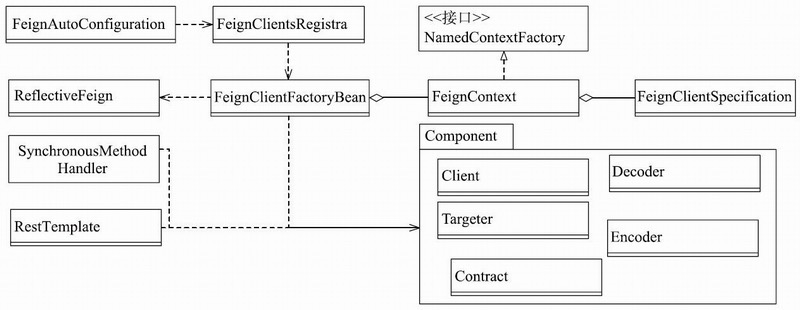

# open-feign-FeignServiceClient源码分析

OpenFeign相关的关键类图，其中比较重要的类为

- [FeignClientFactoryBean](#FeignClientFactoryBean)
- [FeignContext](#FeignContext)
- [SynchronousMethodHandler](#SynchronousMethodHandler)

## FeignClientFactoryBean

FeignClientFactoryBean是创建@FeignClient修饰的接口类Bean实例的工厂类；

## FeignContext

FeignContext是配置组件的上下文环境，保存着相关组件的不同实例，这些实例由不同的FeignConfiguration配置类构造出来；

## SynchronousMethodHandler

SynchronousMethodHandler是MethodHandler的子类，可以在FeignClient相应方法被调用时发送网络请求，然后再将请求响应转化为函数返回值进行输出。

## 关键类图

## 关键构建流程

## 注册过程

- [动态注册BeanDefinition](021-动态注册BeanDefinition.md) 
- [实例初始化](022-实例初始化.md) 
- [函数调用和网络请求](023-函数调用和网络请求.md) 

