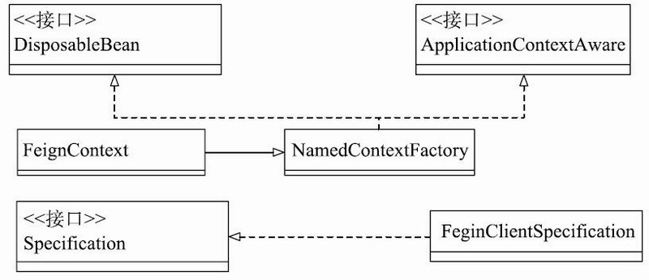

# 021-动态注册BeanDefinition


## 简介

OpenFeign可以通过多种方式进行自定义配置，配置的变化会导致接口类初始化时使用不同的Bean实例，从而控制OpenFeign的相关行为，比如说网络请求的编解码、压缩和日志处理。

可以说，了解OpenFeign配置和实例初始化的流程与原理对于我们学习和使用OpenFeign有着至关重要的作用，而且Spring Cloud的所有项目的配置和实例初始化过程的原理基本相同，了解了OpenFeign的原理，就可以触类旁通，一通百通了。

## EnableFeignClients注解

```java
@Retention(RetentionPolicy.RUNTIME)
@Target(ElementType.TYPE)
@Documented
@Import(FeignClientsRegistrar.class)
public @interface EnableFeignClients {

	/**
	 * 指定扫描的包
	 */
	String[] value() default {};
	String[] basePackages() default {};
	Class<?>[] basePackageClasses() default {};

	/**
	 * 指定FeignClient 的自定义配置, 可以配置 Decoder, Encoder 和 Contract 等组件
	 */
	Class<?>[] defaultConfiguration() default {};

	/**
	 * 指定被@FeignClient修饰的类，如果不为空，那么路径自动检测机制会被关闭
	 */
	Class<?>[] clients() default {};

}

```

值得注意的是

```
@Import(FeignClientsRegistrar.class)
```

SpringCloud 都是采用这个套路, 通过 Import 导入注册器

FeignClientsRegistrar是ImportBeanDefinitionRegistrar的子类，Spring用ImportBeanDefinitionRegistrar来动态注册BeanDefinition。

OpenFeign通过FeignClientsRegistrar来处理@FeignClient修饰的FeignClient接口类，将这些接口类的BeanDefinition注册到Spring容器中，这样就可以使用@Autowired等方式来自动装载这些FeignClient接口类的Bean实例。FeignClientsRegistrar的部分代码如下所示：

```java
//FeignClientsRegistrar.java
class FeignClientsRegistrar implements ImportBeanDefinitionRegistrar,
        ResourceLoaderAware, BeanClassLoaderAware, EnvironmentAware {
    ...
    @Override
    public void registerBeanDefinitions(AnnotationMetadata metadata,
        BeanDefinitionRegistry registry) {
        //从EnableFeignClients的属性值来构建Feign的自定义Configuration进行注册
        registerDefaultConfiguration(metadata, registry);
        //扫描package，注册被@FeignClient修饰的接口类的Bean信息
        registerFeignClients(metadata, registry);
    }
    ...
}
```

- 一是注册@EnableFeignClients提供的自定义配置类中的相关Bean实例
- 二是根据@EnableFeignClients提供的包信息扫描@FeignClient注解修饰的FeignCleint接口类，然后进行Bean实例注册。

@EnableFeignClients的自定义配置类是被@Configuration注解修饰的配置类，它会提供一系列组装FeignClient的各类组件实例。这些组件包括：Client、Targeter、Decoder、Encoder和Contract等。接下来看看registerDefaultConfiguration的代码实现，如下所示：

```java
//FeignClientsRegistrar.java
private void registerDefaultConfiguration(AnnotationMetadata metadata,
            BeanDefinitionRegistry registry) {
    //获取到metadata中关于EnableFeignClients的属性值键值对
    Map〈String, Object〉 defaultAttrs = metadata
            .getAnnotationAttributes(EnableFeignClients.class.getName(), true);
    // 如果EnableFeignClients配置了defaultConfiguration类，那么才进行下一步操作，如果没有，
       会使用默认的FeignConfiguration
    if (defaultAttrs != null && defaultAttrs.containsKey("defaultConfiguration")) {
        String name;
        if (metadata.hasEnclosingClass()) {
            name = "default." + metadata.getEnclosingClassName();
        }
        else {
            name = "default." + metadata.getClassName();
        }
        registerClientConfiguration(registry, name,
                defaultAttrs.get("defaultConfiguration"));
    }
}
```

如上述代码所示，registerDefaultConfiguration方法会判断@EnableFeignClients注解是否设置了defaultConfiguration属性。如果有，则将调用registerClientConfiguration方法，进行BeanDefinitionRegistry的注册。registerClientConfiguration方法的代码如下所示。

```java
// FeignClientsRegistrar.java
private void registerClientConfiguration(BeanDefinitionRegistry registry, Object name,
    Object configuration) {
    // 使用BeanDefinitionBuilder来生成BeanDefinition，并注册到registry上
    BeanDefinitionBuilder builder = BeanDefinitionBuilder
        .genericBeanDefinition(FeignClientSpecification.class);
    builder.addConstructorArgValue(name);
    builder.addConstructorArgValue(configuration);
    registry.registerBeanDefinition(
        name + "." + FeignClientSpecification.class.getSimpleName(),
        builder.getBeanDefinition());
}
```

BeanDefinitionRegistry是Spring框架中用于动态注册BeanDefinition信息的接口，调用其registerBeanDefinition方法可以将BeanDefinition注册到Spring容器中，其中name属性就是注册BeanDefinition的名称。

FeignClientSpecification类实现了NamedContextFactory.Specification接口，它是OpenFeign组件实例化的重要一环，它持有自定义配置类提供的组件实例，供OpenFeign使用。

**Spring Cloud框架使用NamedContextFactory创建一系列的运行上下文(ApplicationContext)，来让对应的Specification在这些上下文中创建实例对象。**

这样使得各个子上下文中的实例对象相互独立，互不影响，可以方便地通过子上下文管理一系列不同的实例对象。NamedContextFactory有三个功能，

- 一是创建AnnotationConfigApplicationContext子上下文
- 二是在子上下文中创建并获取Bean实例
- 三是当子上下文消亡时清除其中的Bean实例。

在OpenFeign中，FeignContext继承了NamedContextFactory，用于存储各类OpenFeign的组件实例。图5-4就是FeginContext的相关类图。

## FeignAutoConfiguration

FeignAutoConfiguration是OpenFeign的自动配置类，它会提供FeignContext实例。并且将之前注册的FeignClientSpecification通过setConfigurations方法设置给FeignContext实例。这里处理了默认配置类FeignClientsConfiguration和自定义配置类的替换问题。

- 如果FeignClientsRegistrar没有注册自定义配置类，那么configurations将不包含FeignClientSpecification对象，否则会在setConfigurations方法中进行默认配置类的替换。
- FeignAutoConfiguration的相关代码如下所示：

```java
//FeignAutoConfiguration.java
@Autowired(required = false)
private List〈FeignClientSpecification〉 configurations = new ArrayList〈〉();
@Bean
public FeignContext feignContext() {
    FeignContext context = new FeignContext();
    context.setConfigurations(this.configurations);
    return context;
}
//FeignContext.java
public class FeignContext extends NamedContextFactory〈FeignClientSpecification〉 {
    public FeignContext() {
        //将默认的FeignClientConfiguration作为参数传递给构造函数
        super(FeignClientsConfiguration.class, "feign", "feign.client.name");
    }
}
```

NamedContextFactory是FeignContext的父类，其createContext方法会创建具有名称的Spring的AnnotationConfigApplicationContext实例作为当前上下文的子上下文。这些AnnotationConfigApplicationContext实例可以管理OpenFeign组件的不同实例。NamedContextFactory的实现如下代码所示：

```java
//NamedContextFactory.java
protected AnnotationConfigApplicationContext createContext(String name) {
    AnnotationConfigApplicationContext context = new AnnotationConfigApplicationContext();
    //获取该name所对应的configuration,如果有的话，就注册都子context中
    if (this.configurations.containsKey(name)) {
        for (Class〈?〉 configuration : this.configurations.get(name)
                .getConfiguration()) {
            context.register(configuration);
        }
    }
    // 注册default的Configuration，也就是FeignClientsRegistrar类的registerDefaultConfiguration
       方法中注册的Configuration
    for (Map.Entry〈String, C〉 entry : this.configurations.entrySet()) {
        if (entry.getKey().startsWith("default.")) {
            for (Class〈?〉 configuration : entry.getValue().getConfiguration()) {
                context.register(configuration);
            }
        }
    }
    // 注册PropertyPlaceholderAutoConfiguration和FeignClientsConfiguration配置类
    context.register(PropertyPlaceholderAutoConfiguration.class,
            this.defaultConfigType);
    // 设置子context的Environment的propertySource属性源
    // propertySourceName = feign; propertyName = feign.client.name
    context.getEnvironment().getPropertySources().addFirst(new MapPropertySource(
            this.propertySourceName,
            Collections.〈String, Object〉 singletonMap(this.propertyName, name)));
    // 所有context的parent都相同，这样的话，一些相同的Bean可以通过parent context来获取
    if (this.parent != null) {
        context.setParent(this.parent);
    }
    context.setDisplayName(generateDisplayName(name));
    context.refresh();
    return context;
}


```



而由于NamedContextFactory实现了DisposableBean接口，当NamedContextFactory实例消亡时，Spring框架会调用其destroy方法，清除掉自己创建的所有子上下文和自身包含的所有组件实例。NamedContextFactory的destroy方法如下所示：

```java
//NamedContextFactory.java
@Override
public void destroy() {
    Collection〈AnnotationConfigApplicationContext〉 values = this.contexts.values();
    for(AnnotationConfigApplicationContext context : values) {
        context.close();
    this.contexts.clear();
}
```


NamedContextFactory会创建出AnnotationConfigApplicationContext实例，并以name作为唯一标识，然后每个AnnotationConfigApplicationContext实例都会注册部分配置类，从而可以给出一系列的基于配置类生成的组件实例，这样就可以基于name来管理一系列的组件实例，为不同的FeignClient准备不同配置组件实例，比如说Decoder、Encoder等。我们会在后续的讲解中详细介绍配置类Bean实例的获取。

## 扫描类信息

FeignClientsRegistrar做的第二件事情是扫描指定包下的类文件，注册@FeignClient注解修饰的接口类信息，如下所示：

```java
//FeignClientsRegistrar.java
public void registerFeignClients(AnnotationMetadata metadata,
        BeanDefinitionRegistry registry) {
    //生成自定义的ClassPathScanningProvider
    ClassPathScanningCandidateComponentProvider scanner = getScanner();
    scanner.setResourceLoader(this.resourceLoader);
    Set〈String〉 basePackages;
    //获取EnableFeignClients所有属性的键值对
    Map〈String, Object〉 attrs = metadata
            .getAnnotationAttributes(EnableFeignClients.class.getName());
    //依照Annotation来进行TypeFilter，只会扫描出被FeignClient修饰的类
    AnnotationTypeFilter annotationTypeFilter = new AnnotationTypeFilter(
            FeignClient.class);
    final Class〈?〉[] clients = attrs == null ? null
            : (Class〈?〉[]) attrs.get("clients");
    //如果没有设置clients属性，那么需要扫描basePackage，所以设置了AnnotationTypeFilter,
           并且去获取basePackage
    if (clients == null || clients.length == 0) {
        scanner.addIncludeFilter(annotationTypeFilter);
        basePackages = getBasePackages(metadata);
    }
    //代码有删减，遍历上述过程中获取的basePackages列表
    for (String basePackage : basePackages) {
        //获取basepackage下的所有BeanDefinition

Set〈BeanDefinition〉 candidateComponents = scanner
                .findCandidateComponents(basePackage);
        for (BeanDefinition candidateComponent : candidateComponents) {
            if (candidateComponent instanceof AnnotatedBeanDefinition) {
                AnnotatedBeanDefinition beanDefinition = (AnnotatedBeanDefinition) candidateComponent;
                AnnotationMetadata annotationMetadata = beanDefinition.getMetadata();
                //从这些BeanDefinition中获取FeignClient的属性值
                Map〈String, Object〉 attributes = annotationMetadata
                        .getAnnotationAttributes(
                                FeignClient.class.getCanonicalName());
                String name = getClientName(attributes);
                //对单独某个FeignClient的configuration进行配置
                registerClientConfiguration(registry, name,
                        attributes.get("configuration"));
                //注册FeignClient的BeanDefinition
                registerFeignClient(registry, annotationMetadata, attributes);
            }
        }
    }
}
```

如上述代码所示，FeignClientsRegistrar的registerFeignClients方法依据@EnableFeignClients的属性获取要扫描的包路径信息，然后获取这些包下所有被@FeignClient注解修饰的接口类的BeanDefinition，最后调用registerFeignClient动态注册BeanDefinition。
registerFeignClients方法中有一些细节值得认真学习，有利于加深了解Spring框架。首先是如何自定义Spring类扫描器，即如何使用ClassPathScanningCandidateComponentProvider和各类TypeFilter。
OpenFeign使用了AnnotationTypeFilter，来过滤出被@FeignClient修饰的类，getScanner方法的具体实现如下所示：

```java
//FeignClientsRegistrar.java
protected ClassPathScanningCandidateComponentProvider getScanner() {
    return new ClassPathScanningCandidateComponentProvider(false, this.environment) {
        @Override
        protected boolean isCandidateComponent(AnnotatedBeanDefinition beanDefinition) {
            boolean isCandidate = false;
            //判断beanDefinition是否为内部类，否则直接返回false
            if (beanDefinition.getMetadata().isIndependent()) {
                //判断是否为接口类，所实现的接口只有一个，并且该接口是Annotation。否则直接
                       返回true
                if (!beanDefinition.getMetadata().isAnnotation()) {
                    isCandidate = true;
                }
            }
            return isCandidate;
        }
    };
}
```


ClassPathScanningCandidateComponentProvider的作用是遍历指定路径的包下的所有类。

比如指定包路径为com/test/openfeign，它会找出com.test.openfeign包下所有的类，将所有的类封装成Resource接口集合。

Resource接口是Spring对资源的封装，有

- FileSystemResource、
- ClassPathResource、
- UrlResource等多种实现。

接着ClassPathScanningCandidateComponentProvider类会遍历Resource集合，通过includeFilters和excludeFilters两种过滤器进行过滤操作。

includeFilters和excludeFilters是TypeFilter接口类型实例的集合，TypeFilter接口是一个用于判断类型是否满足要求的类型过滤器。

- excludeFilters中只要有一个TypeFilter满足条件，这个Resource就会被过滤掉；
- 而includeFilters中只要有一个TypeFilter满足条件，这个Resource就不会被过滤。
- 如果一个Resource没有被过滤，它会被转换成ScannedGenericBeanDefinition添加到BeanDefinition集合中。