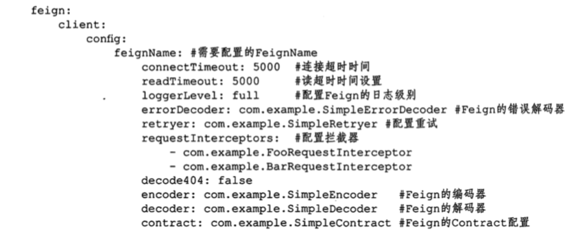

# feign的注解配置

[TOC]

## 源码

```java
@Target(ElementType.TYPE)
@Retention(RetentionPolicy.RUNTIME)
@Documented
public @interface FeignClient {
	@AliasFor("name")
	String value() default "";

	@AliasFor("value")
	String name() default "";
	String qualifier() default "";
	String url() default "";
	boolean decode404() default false;
	Class<?>[] configuration() default {};
	Class<?> fallback() default void.class;
	Class<?> fallbackFactory() default void.class;
	String path() default "";
	boolean primary() default true;
}

```

- **@Target(ElementType.TYPE)** 元注解,标识 FeignClient 注解的作用目标在接口上

| 配置项            | 说明                                                         | 备注                                                         |
| ----------------- | ------------------------------------------------------------ | ------------------------------------------------------------ |
| value             | 指定 FeignClient 的名称,一般为微服务名称                     | 如用户微服务的 user                                          |
| **name**          | 指定 FeignClient 的名称,一般为微服务名称                     | 如果项目上使用了 Ribbon,name 属性会作为微服务的名称,用于服务发现 |
| qualifer          | springBean 名称, 方便别的 Bean 使用@Qualifer 以名称注入      | 在同名情况下,方便其他 Bean 注入                              |
| url               | url 一般用于调试,可以手动指定`@feignClient` 调用的地址       | 具体的协议,可以自由配置                                      |
| **decode404**     | 当发生 404 错误时,如果该字段为 true, 会调用 decoder 进行解码,否则抛出 FeignException | 默认为 false, 不抛出 FeignException                          |
| **configuration** | Feign 配置类,可以自定义 Feign 的 Encoder , Decoder , LogLevel , Contract | 在 openFeign 中已经默认提供,不再需要我们自己编写             |
| **fallback**      | 定义容错的处理类,当调用远程接口失败或者超时时,会调用对应皆苦的容错逻辑,fallback 指定的类必须实现@FeignClient 标记的接口 | 指定 hystrix 降级的服务类                                    |
| fallbackFactory   | 工厂类, 用于生成 fallback 类示例, 通过这个属性我们可以实现每个接口通用的容错逻辑,减少重复代码 | 定义降级工厂                                                 |
| **path**          | 定义当前 FeignClient 的统一前缀                              |                                                              |
| primary           | 对外部注入是否设置当前 Bean 为首要的 Bean @Primary           | 默认值为 true                                                |

## OpenFeignAutoConifguration

- OpenFeign 的编码器 SpringEncoder
- 解码器 OptionalDecoder 这个类时一个代理,实际上使用的是 ResponseEntityDecoder 
- 协议 SpringMvcContract 

```java
@Configuration(proxyBeanMethods = false)
public class FeignClientsConfiguration {
 

	@Bean
	@ConditionalOnMissingBean
	public Decoder feignDecoder() {
		return new OptionalDecoder(
				new ResponseEntityDecoder(new SpringDecoder(this.messageConverters)));
	}

	@Bean
	@ConditionalOnMissingBean
	@ConditionalOnMissingClass("org.springframework.data.domain.Pageable")
	public Encoder feignEncoder() {
    //使用的是 SpringMVC 消息转换工厂处理
		return new SpringEncoder(this.messageConverters);
	}

	@Bean
	@ConditionalOnMissingBean
	public Contract feignContract(ConversionService feignConversionService) {
    //
		return new SpringMvcContract(this.parameterProcessors, feignConversionService);
	}

	....

}

```

## Feign 的常用配置

