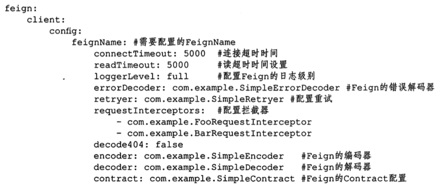
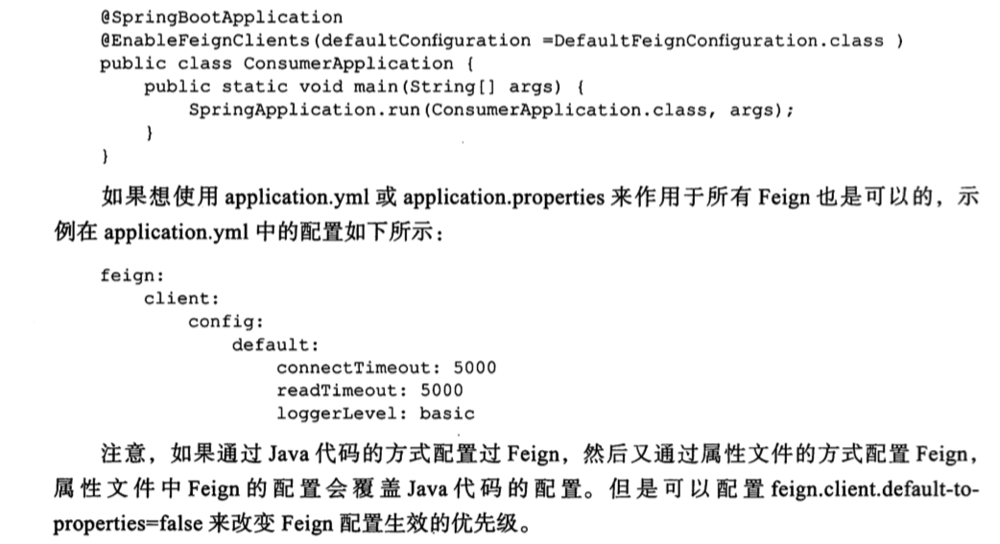

# 支持文件属性配置

## 对单个指定特定名称的 Feign进行配置

@FeignClient 的配置信息可以通过 appliacation.properties 或者 applicaton.yml 来配置, application.yml 实例配置信息如下

## 作用于所有 Feign 的配置方式

`@EnableFeignClients`注释上有个 defaultConfiguration 属性,我们可以将默认配置写成一个类,比如这个配置类叫 DefaultFeignConfiguration.java ,在主程序的启动入口用 defaultConfiguration 来引用配置

